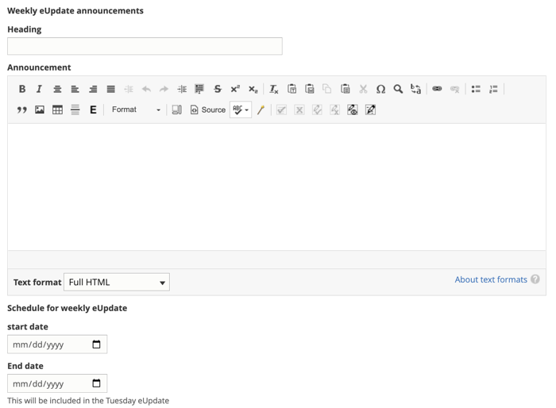
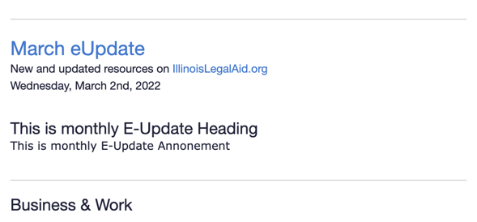

==========================
Announcements in eUpdates
==========================

ILAO staff can make announcements in our eUpdates using a `configuration form <https://www.illinoislegalaid.org/admin/config/services/mailchimp/announcements>`_ found under Configuration -> Web services -> Mailchimp -> Announcements.

Creating an announcement
==========================
This supports separate announcements for the weekly eUpdate (which is the default for advocate members) and the monthly eUpdate (which is the default for pro bono and community members).

For each type of announcement:

* Add the heading
* Add the body text in the WYSIWYG
* Add a start date
* Add an end date

The system will only include the announcement if the eUpdate date falls within the start and end date ranges. For example, the March 8, 2022 Tuesday eUpdate would include an announcement when the start date was March 7, March 8 but not March 9 or when the end date was March 8 or March 9 but not March 7.

In the eUpdate
================

The announcement will be added at the top of the eUpdate above the legal content section. The heading will display first, then the body. A horizontal line will be added beneath.

