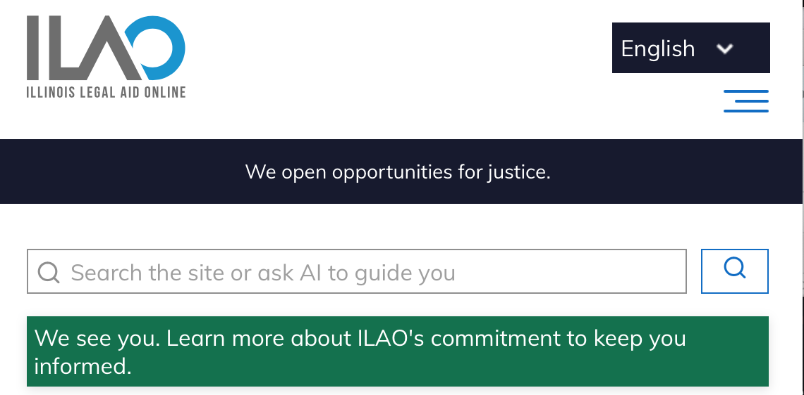

========================
Header basic blocks
========================

Banner blocks are those that appear in the header region on pages. 

Only one header block should appear on any given page. **Please check your placement as a user to ensure that only one block appears.** 

Create a new block
=======================

To create a heading banner:

* Go to Structure => Block layout => Custom block library
* Add custom block
* Select basic
* Enter a block description; this is what appears in the block library as the name of the block.
* Enter the body. Use the styles below to provide the correct styling.
* **DO NOT** add an image.

Place the block on the page
=============================

Place the block by going to Structure => Block Layout

** Be sure to uncheck "Display title"**

Visibility
------------
All heading blocks should be restricted to specific pages. In the example below, the block is tagged to show on the Divorce easy form, the Getting a divorce guide, a node with node ID 12345 and the home page.

Region & Class
-------------------

* Add the block to the Header section on the block layout page by clicking Place block.
* The block must be ordered just above the disabled blocks to keep the block from interfering with menus, site slogan blocks.
* Set the block CSS class to ilao-banner-block to cause it to display correctly full-width.

.. image:: ../assets/header-block-config.png

Styles
=====================

Grey background with wide margins
------------------------------------

This is typically used for donation and fundraising.

This is the code used in the header banner to provide the correct style.

.. code-block:: html
   
   

   

   Text goes here
   

   

   
It is possible to embed an image in the header such as: 

.. code-block:: html

   

   Text here

   
.. note::  We added a minimum height to the div that is just slightly larger than the height of the image. 

Warning style
----------------
This code has a yellow background with minimal padding, resulting in a narrower block. 

.. code-block:: html

   

    

    Your text goes here
    

    

    

Danger style
----------------
This code has a red background with minimal padding, resulting in a narrower block. The paragraph text is set to white to improve contrast.

.. code-block:: html

   

    

        Alert: The law has changed and this form is no longer good. We will have a new version on February 1
    

    

Neutral or positive style
---------------------------

This code has our neutral/positive dark green background with minimal padding, resulting in a narrower block. The paragraph text is set to white to improve contrast.

.. code-block:: html

    

    

        We see you. Learn more about ILAO's commitment to keep you informed.
    

    

.. note:: We are working at adding support for Font Awesome icons like the warning symbol in these banners.

