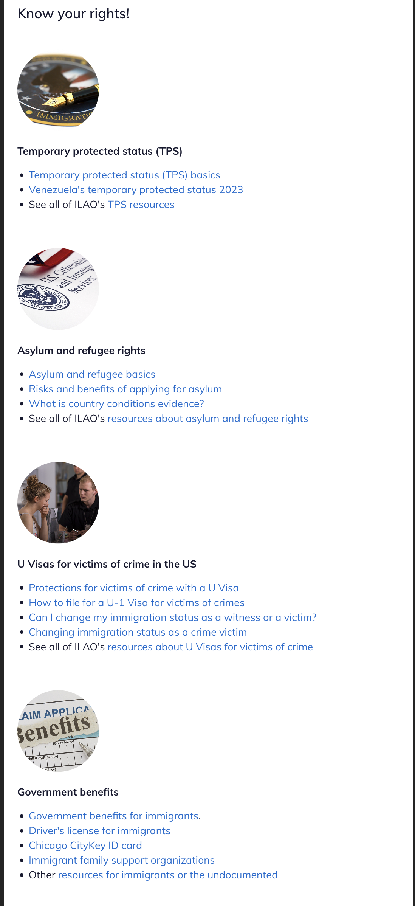

======================================
6 column grid in legal content
======================================

The 6 column grid option in legal content allows one to add landing page-like features within legal content. This was done to eliminate the need to do this as a basic page (which lacks the metatags, inclusion in navigation, and search indexing that legal content includes).

On desktop, it uses the same two column layout as other content with the left sidebar of Get Legal Help, Forms, and Learn More.

While it is named 6 grid layout, it will handle any number of grid items. On desktop, these will display 3 across. On mobile, it will display sequentially.

Content that includes a 6 grid layout will be treated as a text article by default. For more information on using the 6 grid layout, see the Basic Page documentation.
