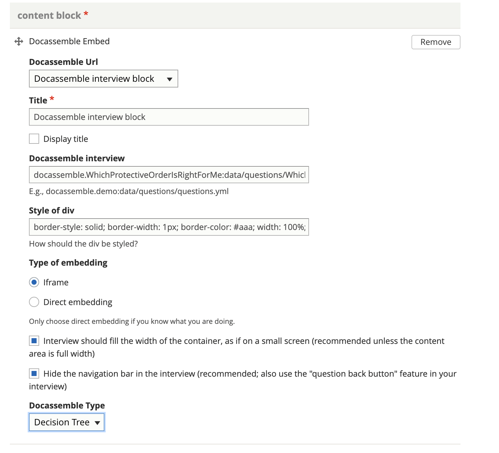
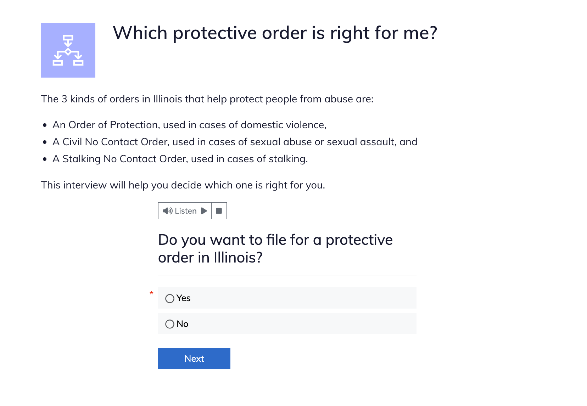

============================
Docassemble Embed
============================

.. note:: Embedded docassemble interviews are used primariy for decision trees and are tagged as such in their primary content format.

Master configuration
========================

The master configuration applies to all embeddeded Docassemble interviews. It includes 3 components:

* Docassemble server url. This url should not include an ending /
* A default style for the embedded interview
* A link to a Bootstrap CSS url on the docassemble server

These are configuration variables. When changed on production, let Gwen know so she can ensure the developers back-port the configuration so that it is not overwritten in future deployments.

Creating an embeded docassemble
================================

To embed a Docassemble interview, add a content block of type "Docassemble Embed"

Then:

* Leave the default docassemble URL and title
* Ensure display title is not checked
* Enter the .yml file name in the following format: docassemble.[package name]:data/questions/[interview name].yml
* You can change the default style of the div if needed
* Check iframe as the type of embedding
* Check the two boxes for full width and navigation bar
* Select the content type: Decision tree or Easy Form. When selected, this will set the primary content type correctly.

You can add other content block types ahead of or after the embedded interview, for example adding a text block to introduce the interview.

.. note:: Direct Embed is not supported at this time. It is unclear if the hide the navigation bar has any impact when using the iframe option.

Viewing an embedded Docassemble interview
===========================================

Embedded docassemble interviews have the flowchart icon in light purple.

.. note:: In the image above, the text is in a separate text article block placed above the embedded interview.
