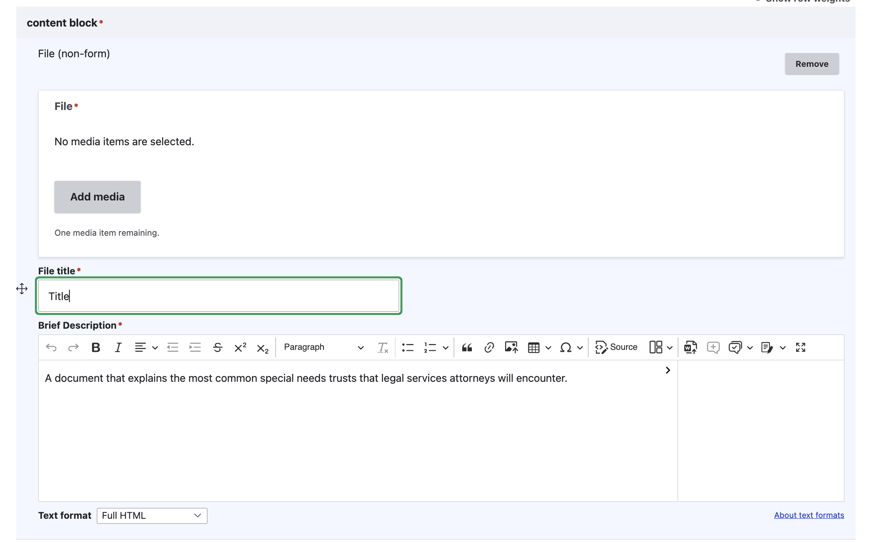
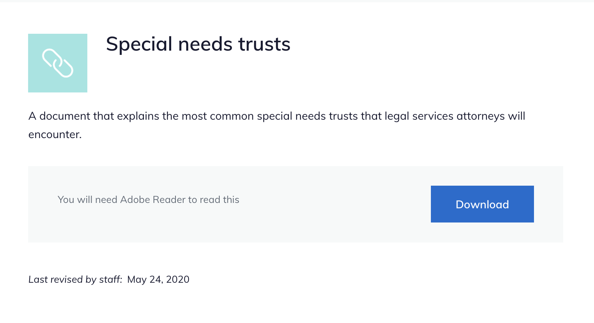

=========================
File content
=========================

The file content type is used for files uploaded to our website (other than to blank forms; those should use the static form block).

.. warning:: Our preference is to link to files on other websites rather than downloading and posting on our website whenever possible.

.. note::
   We use the file content type rather than linking directly to an uploaded file so that:

  * We can provide website visitors more context about why we are providing the file via a landing page
  * We can track the revision history to ensure that the file is appropriate, approved, and tracable over time and across different staff
  * We can update links that are used in multiple articles more easily if the file location changes.

Creating file content
=======================

To create file content, add a "File (non-form)" content block.

Provide:

* the file using the media library
* a file title
* A description. This will provide text for the page.

Viewing file content
=====================

When viewed, the description appears above the file block.

The file block contains the text "You will need [x] to read this" and a Download button.

