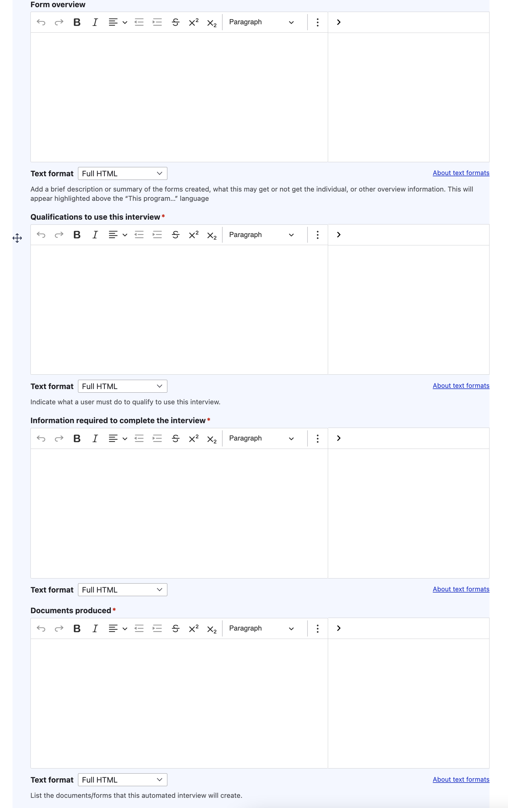

======================
Easy Forms
======================

Each Easy Form must have an Automated Document block in Legal Content. Any legal content with an automated document block will be considered an Easy Form **regardless of other blocks included on the page.**

Creating an Easy Form
=======================

To create an Easy form, add the Automated document block.

Provide:

* the link to the interview. This may be on LHI or on our Docassemble server.
* Whether the program is mobile optimized are not. HotDocs-based interviews are not mobile-optimized. If an interview is mobile-optimized, a mobile friendly icon will appear on the page. If an interview is not, a laptop image will appear instead.
* Interview language. This is the language of the actual program used to generate the court forms. Court forms currently always render only in English.
* Document type. Does this interview result in court forms, letter, or something else?

.. image:: ../assets/easy-form-guide-link.png

If you want to promote a specific Guide that contains supplementary information an individual should read alongside completing the form interview, add it here. This should be used instead of adding "Learn about [x]" within the WYSIWYG fields.

Provide:
* A brief form overview. This should be used instead of adding a separate text block. This overview will appear above any boilerplate and should explain to a website visitor what the program and/or forms will do for them.
* Qualifications to use this interview. This is a space to add any eligibility requirements to use the interview.
* Information required to complete the interview. This should include whatever information the individual should have available before starting the interview.
* Documents produced. This should be a list of documents the program may produce.

* Whether to include statewide forms information. Yes should only be marked for AOIC-approved statewide forms. When this is set to yes:

  * Whether to specify a direct link to use
  * Whether to direct someone to the AIOC site

* Time estimate - minimum number of minutes to complete to a maximum number of minutes to complete.
* Whether the individual can stop and save their answers and return later.

Viewing an Easy Form landing page
===================================

Easy forms are identified with a light green form icon and the Easy form label

When the form interview is provided and a Guide link is included, it appears first:

The website then provides a set of boilerplate language:

   This program will help you prepare your documents. It will ask you questions and you will enter your answers. At the end of the program, you will get a completed set of[form type] with instructions that you can save and print.

Form completion time: [minimum time] minutes to [maximum time] minutes

You [will/will not] be able to save your work in the middle of the program.

This program will help you avoid mistakes when filling out the court forms. Your case could be delayed if there are errors in your forms. [if AOIC forms] you want to download and print a PDF version, visit the the Illinois Courts Standardized State Forms website.[endif] Use Adobe Reader to fill in the PDF forms.

The button below takes you to another website to complete the guided interview. Learn more about Easy Forms.

[When the interview language is English]
The interview and forms are in English.

[When the interview is not English]
This interview is in [interview language] will produce English-language forms.

Following this, each WYSIWYG section renders:

* Qualifications are under the heading "Can I use this program"
* Information needed is under the heading "What do I need first"
* Documents produced is under the heading "What documents will this create?"

Easy forms have the standard sidebar elements.
