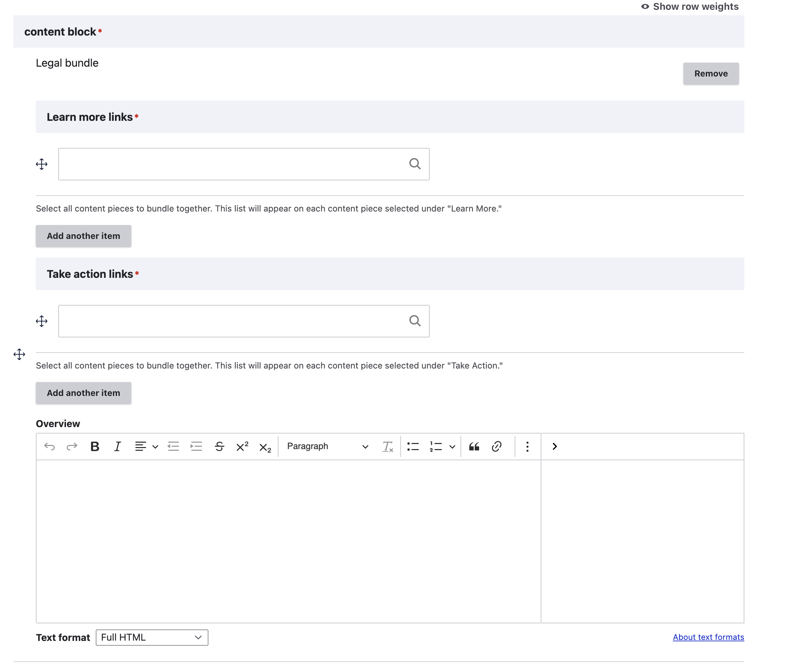

========================
Legal bundles or Guides
========================

The Guide is a defined legal content type that must include:

* An overview
* At least one or more related articles ("Learn more")
* At least one or more related how-tos ("Take action")

Creating a Guide
=================

When creating a guide, it should have no other content blocks on the page.

The overview should provide the basic information someone experiencing the legal issue might face.

The Learn More section should include links to:

* Text articles
* Videos
* Other content that is not Easy forms or How-to content

The Take Action section should include links to:

* How-to content
* Easy forms
* Other forms

.. note:: It is preferable to not include forms in the Take Action as the forms block will automatcially populate with the forms but occasionally, the form may be the only take action option.

Titles
----------

We have gotten away from the style guide on Guide titles. Guide titles should be one of the following:

Understanding [x]
[x] basics

For example:

Understanding divorce
Unemployment benefits basics
Understanding orders of protection
Eviction basics (Eviction basics for landlords and Understanding eviction as a tenant are also good Guide titles).

Viewing a Guide
=================

In navigation:

* Guides appear based on any custom ordering and page views in the primary category pages.
* Guides appear under "Learn your rights" on the secondary category pages. They are prioritized first.

Guides are identified on the site with a light blue book icon and Guide label.

Guides contain no special elements or boilerplate language.

Guides only include the standard set of sidebar elements (but see the next section on how those are populated).

How Guides interact with Learn More and Take Action content
=============================================================

**When a piece of legal content is included as a "Learn more" or "Take action" in exactly one Guide**, a "Big picture" block appears on the page for that referenced content. For example the `How can my landlord give me an eviction notice?<https://www.illinoislegalaid.org/legal-information/how-can-my-landlord-give-me-eviction-notice>`_ is included only in the Understanding eviction as a tenant guide, so the Big Picture block appears.

The Big Picture block includes a snippet from the Guide's overview and a link back to the Guide.

**When a piece of legal content is included in more than one Guide:**

* There is no Big Picture block
* All take action articles from all Guides are included in the Take action block
* All learn more articles from all Guides are included in the Learn more block

For example, the Written eviction notices is included in multiple Guides, so the combined list of articles (cleared of duplicates) for Take action and Learn more are listed.

