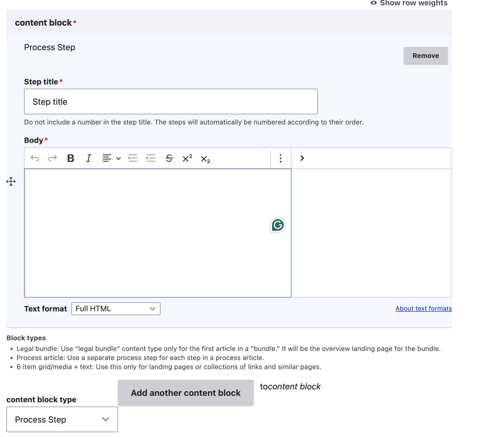

======================
How-to legal content
======================

A How-to is defined as any piece of legal content that contains at least one process content block. It is possible, and not uncommon, to see a How-to with a mix of text blocks and process steps.

Creating a How-to
====================

How-tos contain one or more process step content blocks.

* Many how-tos start with a text block that provide a brief overview.
* Each step in the process should be broken into its own process step block. Each process step then has:

  * A title. The step title should be a specific action.
  * A body. This should contain the information someone needs to complete the step.

Known problems and limitations
---------------------------------

How-tos were designed primarily for linear processes. They were not designed with the idea of multiple pathways or options, and as such, over time, workarounds and less than ideal solutions have been hacked together.

Where possible, it is preferred to separate out different options into individual How-tos and combine them as part of a single guide to maintain that linear process flow. They will then appear in the same take action block.

For example, Responding to an eviction case has 3 different options; each option is its own Process Step. This results in bad heading structure on desktop and difficulty in re-using the process steps in any other application.

Another example, in situations where the individual can either win or lose a case, the next step varies. The current system requires "work arounds" to accommodate.

.. todo:: Improve the How-to content type to be more flexible when there are alternatives and more complex pathways.

Viewing a How-to
===================

How-tos have a light purple book icon and a "How-to" label

Process steps are numbered sequentially in the Legal How-to content.

Example 1: A piece of legal content has a text block, followed by 3 process steps. The viewer will see:

[Text block]
1. Step title
[Body]
2. Step title
[Body]
3. Step title
[Body]

Example 2: A piece of legal content has a text block, followed by 2 process steps, followed by another text block, followed by 2 more steps. The viewer will see:

[Text block]
1. Step title
[Body]
2. Step title
[Body]
[Text block]
3. Step title
[Body]
4. Step title
[Body]

.. note:: The numbering does not restart and can not be hidden or removed at this time.

Sidebar
-------
The sidebar has the standard blocks. When a How-to is included in exactly one Guide, it will have the Big picture block.

