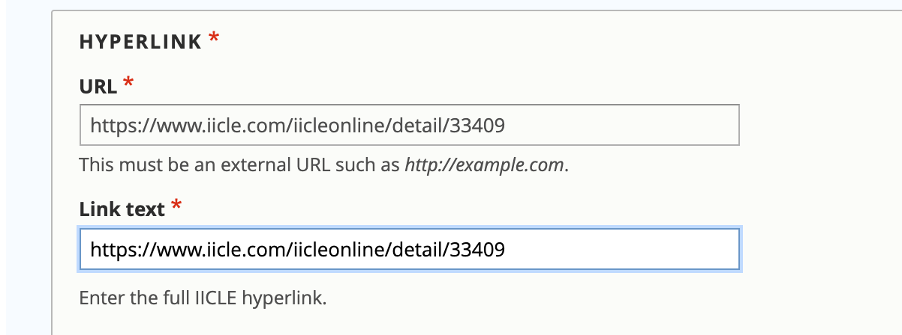
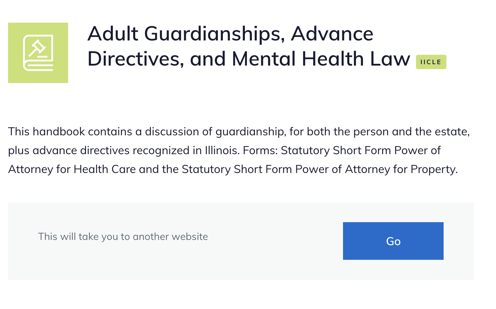

===============
IICLE Content
===============

Creating an IICLE landing page
=================================
.. warning::
   IICLE content must be added using the IICLE content paragraph block and not the link paragraph block to ensure that the content access rules are enforced. Per our contract, IICLE content is limited to approved, logged in legal aid members.

IICLE relies on a proxy server on our end to pull the pages from IICLE into our website. IICLE content should be added:

* using the IICLE content paragraph block
* with a link that contains no query parameters (for example ?itemID=123)
* with a link that begins with https://www.iicle.com
* with a link that does not use https://www.illinoislegalaid.org/?proxy

.. note:: IICLEs should have primary and second level categories that match their substantive topic. They should not be tagged to "Lawyer resources," "IICLE Library" or other similar terms.

..note:: IICLE content should always be marked with an Advanced content level.

Viewing an IICLE
===================

IICLEs have a green-yellow book icon with a gavel and an IICLE tag.

Legal aid members can access IICLEs

* via the IICLE library
* in their topic pages
* on secondary topic pages, they are listed in the "Resources for lawyers" section.

When the individual clicks "Go," this will fetch the IICLE content over the proxy server. The url then changes to reference the proxy: https://www.illinoislegalaid.org/proxy?request=https://www.iicle.com/IicleOnline/Detail/34470 for example.

IICLE pages have the Learn more block. They are never included in Guides and so do not have Take action blocks.
