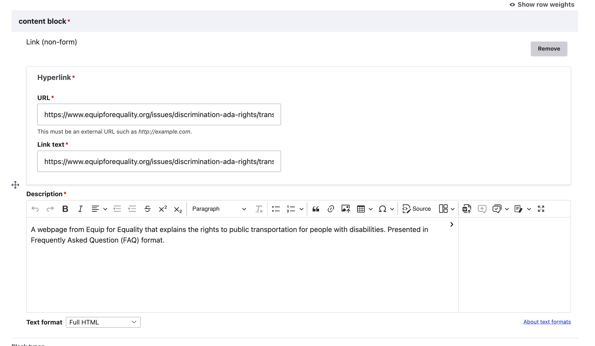
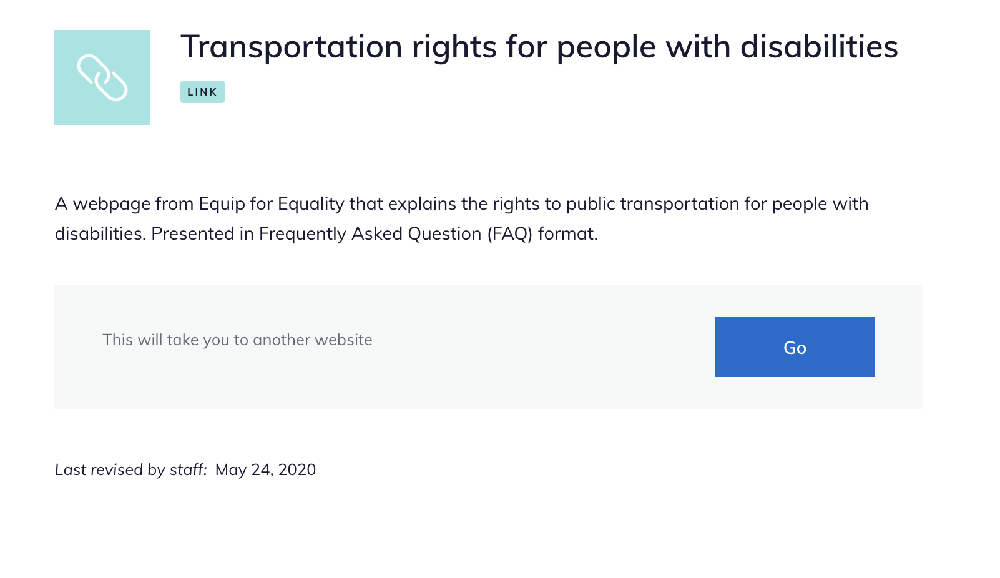

======================
Link content
======================

The link content type is used for links to other websites (other than to blank forms; those should use the static form block).

.. note::
   We use the link content type rather than linking directly to 3rd party websites within content so that:

  * We can provide website visitors more context about why we are linking to the site via a landing page
  * We can track the revision history to ensure that the links are appropriate, approved, and tracable over time and across different staff
  * We can update links that are used in multiple articles more easily if the link changes.

Creating link content
=======================

To create link content, add a "Link (non-form)" content block.

Provide:

* the complete URL of the link
* link text; this will populate the title, so should be descriptive for screen readers (not the URL as in this screenshot)
* A description. This will provide text for the page.

Viewing link content
=====================

When viewed, the description appears above the link block.

The link block contains the text "This will take you to another website" and a Go button.

