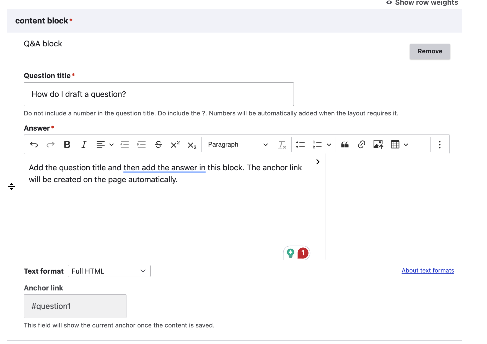
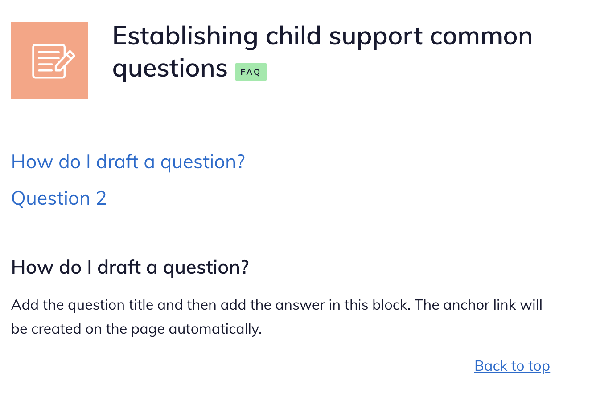
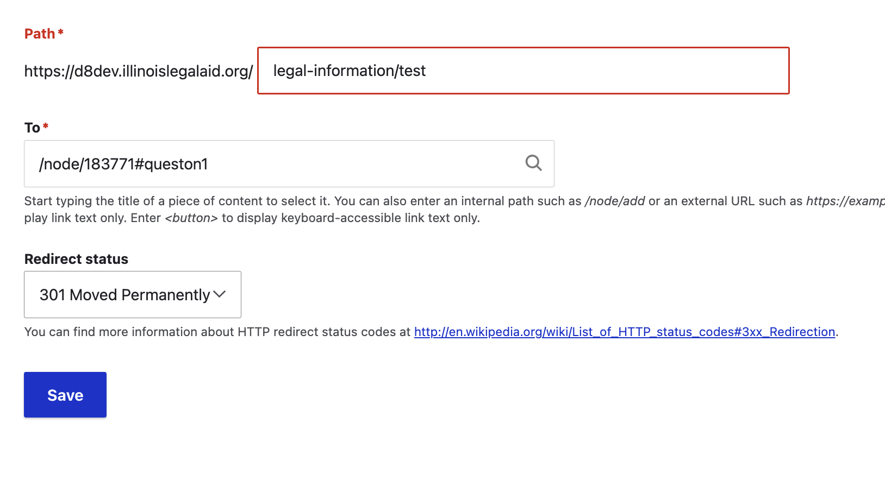

====================
Q & A content block
====================

The Q&A block is used to create FAQ content. Each individual question/answer pair should have its own Q&A block.

To create a Q&A block
=========================

* Add a question title. Titles should have a question mark at the end and should not be numbered. Any numbering will be added in the front-end interface, depending on the delivery channel.
* Add the answer.

  * Answers should only use Headings 4 and below. Heading 3 is reserved for the question title.
  * When writing the answer, it should be written so that it "stands alone," so that if a single question/answer is delivered to a user, the answer still makes sense without all of the other questions.
  * Acronyms used should be explained in each question/answer every time.

* The anchor link will populate automatically when the content is created.

.. note:: if the title changes, currently the anchor link will also change. We have a ticket in the backlog to prevent the anchor link from changing once initially created to avoid breaking anchor tag links.

Viewing a Q&A block
======================

When a piece of legal content contains a Q&A block (and does not contain an automated document, IICLE, or video), it will be considered an "FAQ" and will have the dark orange pen & paper icon and the FAQ label.

The page will automatically create a table of contents at the top and include anchor tags back to the top after each question.

.. note:: Usability testing is pending on the style and placement of this TOC.

Using anchor tags in other articles
======================================

Where we used to link to standalone articles that answered a specific question, we can now link to the specific answer by adding the anchor link to the end of the url. For example, if I want to link to Question 1 in an article, I would find the FAQ, which might result in a url of "/node/183771" and then paste #question1 to the end of the url.

Using anchor tags in redirects
================================

When redirecting existing content that is a standalone question to the FAQ, the preference is to redirect to the deep link.

Interaction with Guides
==========================

If an FAQ is included in the Learn More of a Guide, the Big Picture and Take Action blocks will appear on the FAQ page and the FAQ will appear on the Learn More for the Guide and related How-tos

.. note:: We need to fix the Learn more block to not include the FAQ node when the FAQ is being viewed.

.. note:: This is likely to change as we do usability testing and refine the interface for the revised content model.

