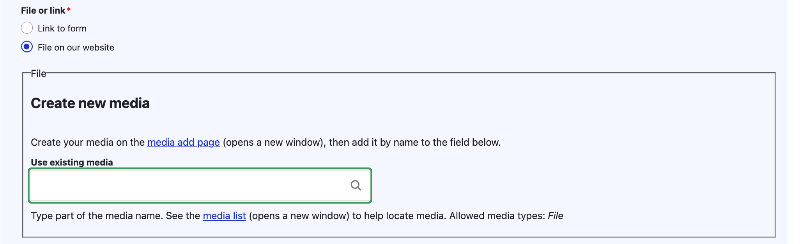

=====================
Blank forms
=====================

The "static form" content type is used for any form that is not an ILAO Easy Form. This includes links to forms on other websites and PDF or Word document files uploaded to our website.

.. note::
   We use the static form content type rather than linking directly to 3rd party forms within content so that:

  * We can provide website visitors more context about a form via a landing page
  * We can track the revision history to ensure that the forms we upload or link to are appropriate, approved, and tracable over time and across different staff
  * We can update links that are used in multiple articles more easily if the form link changes.

Creating a blank (static) form
================================

First, select whether the form is located on the website or on another website. If it is on our site (or will be uploaded to our site), select "File on our website"; otherwise, select "Link to form"

Link to form
-------------

* Provide the full URL of the form link. Ideally, this will take the user directly to the form.
* Provide link text.

File on our website
--------------------------

If the form has already been uploaded to our website, you can use the "Use existing media" field to link to it.

If the form has not already been loaded, use the media add page to add the form first.

Additional information
-------------------------

.. warning:: A ticket is pending to make the form overview field and related guide fields display to website visitors as well as to re-order the page to match the Easy Form layout.

If you want to promote a specific Guide that contains supplementary information an individual should read alongside completing the form interview, add it here. This should be used instead of adding "Learn about [x]" within the WYSIWYG fields.

Provide:

* A brief form overview. This should be used instead of adding a separate text block. This overview will appear at the top of the article and should explain to a website visitor what the program and/or forms will do for them.
* Qualifications to use the form. This is a space to add any eligibility requirements to use the form.
* Information required to complete the form. This should include whatever information the individual should have available before starting the form.

.. note:: form name is not used and will be removed in a future iteration.

Viewing a blank (static) form
=================================

Static forms display based on whether they are downloadable or a link on another site.

Download
============

Blank forms hosted on our website display with a pink download link and Form download label.

There is a download button, along with "You will need [Adobe Acrobat] "

The Can I use this form? and What do I need first? appear underneath the button.

Forms on other websites
=========================

Blank forms hosted on another website display with a pink download link and Form link label.

There is a go button, along with "This will take you to another website" text

The Can I use this form? and What do I need first? appear underneath the button.

