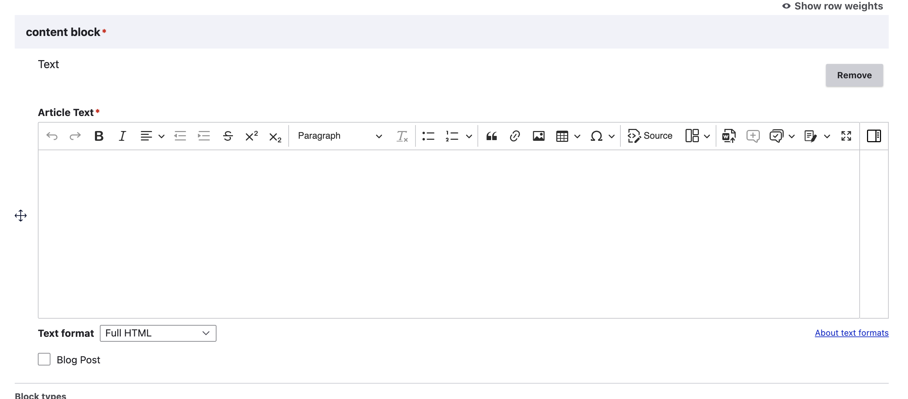

=============================
Articles (Text articles)
=============================

An article is the most basic form of legal content. If a piece of legal content does not fall into any other category, it will be classified as an "Article."

Creating an article
======================
An article is just a single WYSIWYG field.

.. todo:: Remove the blog post single select as we no longer have a blog.-

Viewing an article
=====================
In navigation:

* Articles appear based on any custom ordering and page views in the primary category pages.
* Articles appear under "Other resources for the public" or "Resources for lawyers" on the secondary category pages depending on the content level.

Articles are identified on the site with an orange document label. They do not have an identifing label on the page.

Articles contain no special elements or boilerplate language.

Articles only include the standard set of sidebar elements (but see the next section on how those are populated) except that they will show a "Big picture" block when they are part of exactly one Guide.
