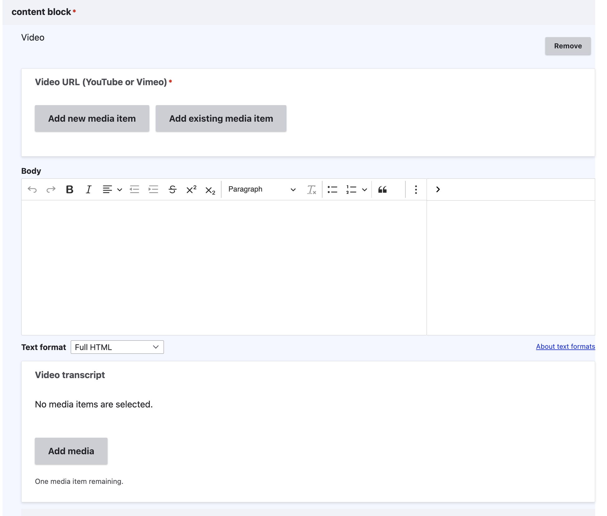
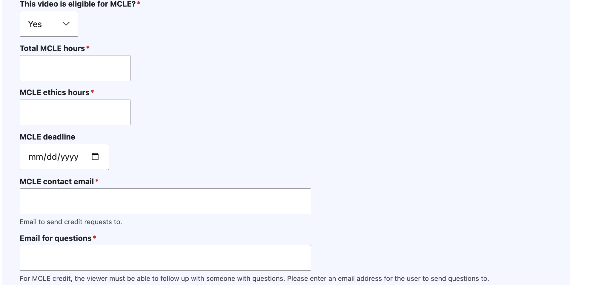
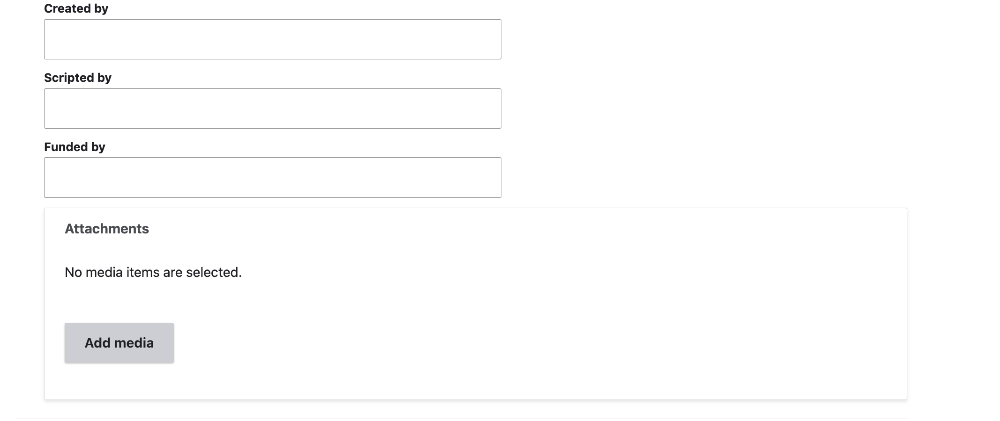
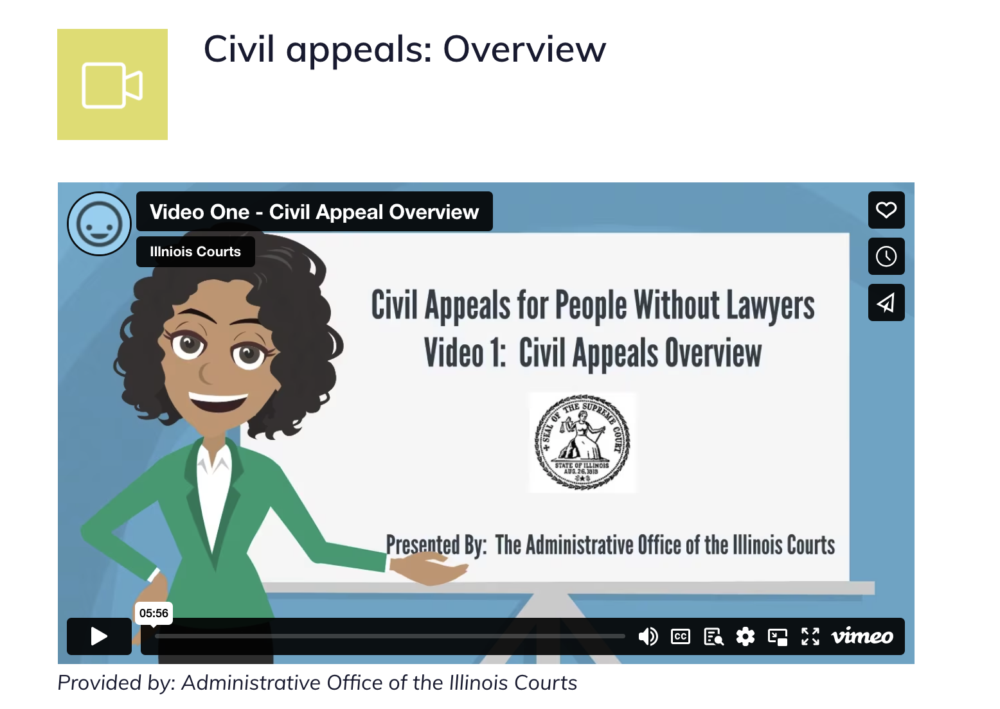

==============
Video content
==============

.. note:: When a piece of content contains a video block (and does not contain an automated document block), it is given a primary content format of "video" regardless of what other types of content blocks may be included.

Creating a video block
=================================

.. note:: Videos should be posted on ILAO's YouTube channel first. Vimeo links are also supported.

To add a new video, click "Add new media item" and give the video a name and add the YouTube link. If the video already exists on the website, you can click "Add existing media item" instead.

* Add a body. This is optional but can be used to provide an overview of the video, link to related videos, or other narrative.
* Upload a transcript if the video is not closed-captioned.

.. warning:: Accessibility standards require that videos be closed-captioned. If that is impossible, please upload a transcript.

MCLE information
-------------------

.. warning:: Select "Yes" only if:

* the archived video is eligible for MCLE credit
* there is an organization contact willing to process requests for credit from the organization providing the video
* one or more of the presenters is willing to have their email address used to ask questions.

If you select yes:

* Set the total number of hours
* Set the total number of ethics hours
* Set the deadline. Most videos expire 2 years from the date they were created.

Additional optional information
---------------------------------

Optionally, you can include information on who funded, scripted, or created a video.

You can also upload documents to "attach" to the video. This is preferred for items like presentation slides, handouts, and other documents that should not be created as legal content.

Viewing video content
=======================

Video content displays with a yellow-green video icon. There is no video label.

Any body appears beneath the video. Any information related to MCLE, attachments, presenters or funding/created/scripted sources appear beneath that, along with any attachments.

