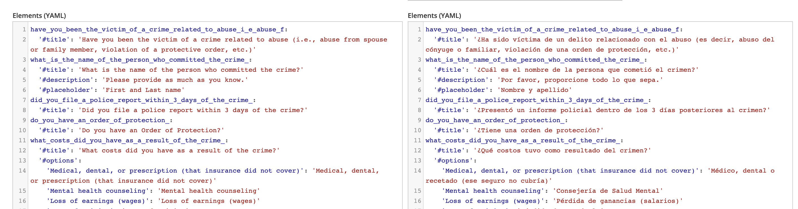

==========================
Webforms Translation
==========================

Webforms are considered "configuration" entities. Legal content, for example, is considered "content" and is translated via content translation tools. Interface translations, such as field labels, are translated via user interface translations.

Configuration entities can be translated just like content, via the translation jobs to export and import xliff files.

Translating configuration entities can be found under `Configuration -> Region & Language -> Configuration Translation <https://www.illinoislegalaid.org/admin/config/regional/config-translation>`_

They can also be translated directly using the webform's raw YML file. Blue text should not be translated.

