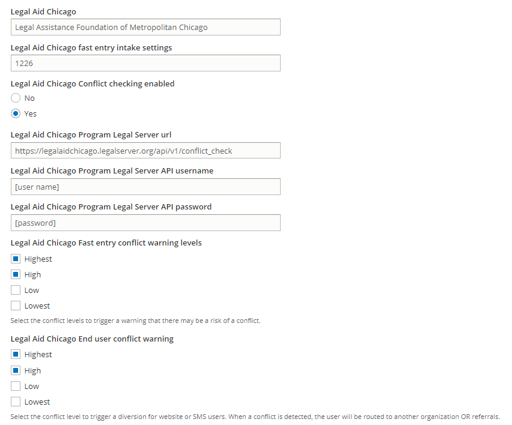
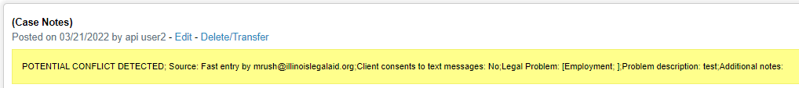
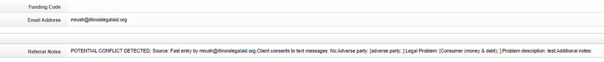

========================
Conflict API
========================

The conflict check API is accessible at https://[site].legalserver.org/api/v1/conflict_check and request basic authorization from the specific instance of Legal Server

LegalServer provides `documentation for the API <https://apidocs.legalserver.org/>`_.

Example JSON body
====================

.. code-block:: json

   {
  "first": "string",
  "middle": "string",
  "last": "string",
  "dob": "2020-10-15",
  "visa_number": "string",
  "phones": [
    {
      "number": "555-555-5555, 5555555555, (555) 555-5555",
      "type": "business"
    }
  ]
 }

Example call using Axios Node.js
==================================

.. code-block:: javascript

   var axios = require('axios');
   var data = JSON.stringify({
   "first": "string",
   "middle": "string",
   "last": "string",
   "dob": "2020-10-15",
   "visa_number": "string",
   "phones": [
    {
      "number": "555-555-5555, 5555555555, (555) 555-5555",
      "type": "business"
    }
   ]
   });

  var config = {
  method: 'post',
  url: 'https://legalaidchicago-demo.legalserver.org/api/v1/conflict_check',
  headers: {
    'Content-Type': 'application/json'
  },
  data : data
  };

  axios(config)
  .then(function (response) {
  console.log(JSON.stringify(response.data));
  })
  .catch(function (error) {
  console.log(error);
  });

Sample responses
=================

Lowest score example:

.. code-block:: json

   {
  "status": 200,
  "message": "conflict check completed successfully",
  "interval": "lowest",
  "score": 17
  }

Highest score example:

.. code-block:: json

   {
    "status": 200,
    "message": "conflict check completed successfully",
    "interval": "highest",
    "score": 100
  }

Integration with Statewide Website
=====================================

Each organization controls whether to support conflict checking within OTIS and at what level. Each participating organization must then provide appropriate credentials and set the level of conflict required to trigger a conflict warning.

Configuration
-----------------

ILAO staff enter the appropriate configuration settings under "Legal Server Configuration." This includes:

* Program LegalServer URL
* Program API username
* Program API password
* Conflict warning level: this is a multi-select of Highest, High, Low, and Lowest. An exact match is required. So selecting "High" will not cause a warning if the conflict check results in Highest but checking both would.

Fast Entry
-------------

When a conflict is detected, a warning appears to allow the submitted to pick a different organization. Notes for the e-transfer are updated to prepend "POTENTIAL CONFLICT DETECTED"

Referring Agency's Notes

Partner's Referral Notes

