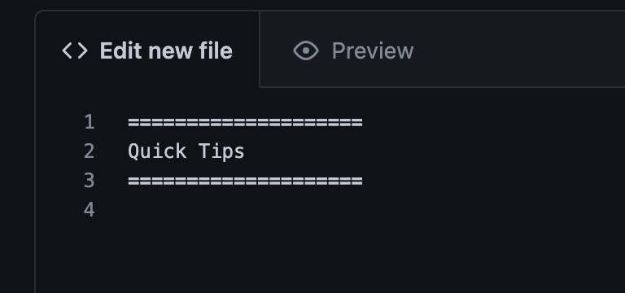
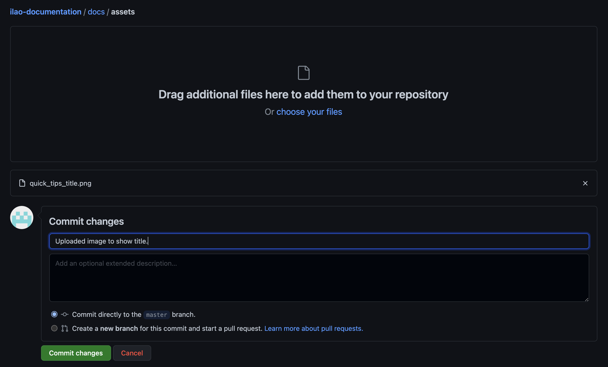

===========================
Creating new docs in Github
===========================

Authorized users can create new documents in the documentation repository directly in GitHub:

* Go to ilao-documentation/docs/source
* Create a new file. New files should be named with a .rst extension and with a meaningful file name.
* Save the file

In the file:

* Create your title. Title blocks should be sandwiched between 2 rows of equal length equal signs. See below.

* Add content
* Commit your changes by adding a commit message
* This will trigger a rebuild on readthedocs.  This will take a few minutes to run.

A similar process applies for editing existing pages. Make your change, commit, and the documentation will rebuild automatically.

Heading styles
================

Headings can be added to a RST as follows:

* Heading 1 is equal signs under the text
* Heading 2 is dashes under the text
* Heading 3 is ^ carots under the text

Links
==========
External links are added by creating text as follows:

.. code::

   `Link title<url>`_

Bulleted lists
=================

.. warning:: There must be a blank line at the start and end of each list.

Bulleted lists are added using astrerisks. Each level must be set off with a blank line and indented

  .. code::

   * This is list one

     * Item A
     * Item B

   * Next item

     * Item C
     * Item D

which will render as:

* This is list one

  * Item A
  * Item B

* Next item

  * Item C
  * Item D

.. warning:: Directives below must start at the far left margin.

Warnings, To-do and Notes
===========================

Warnings, to-do items, and notes can be added within the document using the appropriate directive.

.. code::

   .. warning:: This will show a warning

   .. todo:: This will show a todo

   .. note:: This is a note.

Images
========
Images can be inserted into a page by adding the image to the assets directory and then adding an image directive to the page.

* Create your image elsewhere. Save as a PNG file
* Navigate to ilao-documentation/docs/assets
* Go to upload files and drag your images to the folder.
* Commit your changes by adding a description why.

Then, in the rst file, add an image directive:

2 dots, space, the word image,2 colons, space 2 dots backslash, the word assets, backslash, the file name

.. code::

    .. image:: ../assets/adding-image-github.png

Table of contents
======================

If you are creating a new major section, you may want to add a table of contents. Maxdepth indicates the number of levels of headings to show. Ideally, this is one or two.

.. code::

   .. toctree::
   :maxdepth: 2
   :caption: Contents:

   design_guide
   block_management
   people_management

Code blocks
================
Code blocks can be added in multiple languages: PHP, JSON, javascript, html

.. code:: html

   .. code:: language
   
This is some html

