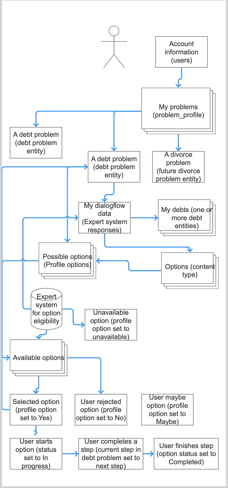

======================
User data structures
======================

Each visitor to the platform may have a profile associated with them. The profile will depend on a) whether they have an account and b) the type of problem(s) they have.

Overview of the workflow
===========================

**1. Account Creation and Initial Setup:**
- **Individual A** visits the platform and decides to create an account. After filling out the necessary information, their account is successfully created, and they are assigned **User ID 2**.
- Once logged in, Individual A is prompted to answer initial questions that help define their situation. They indicate they are facing a legal issue by selecting the problem type: **"I am being sued for a debt."** Additionally, they input their **zip code, 60603**.

.. note:: Because many users will create their accounts mid-flow, the system will save their problem profile ID for their initial problem in the browser's local storage. When the individual creates their account, the system will automatically update the problem profile record with the user ID to tie the records back together.

**2. Problem Profile Creation:**
- The platform takes the information provided and creates a **Problem Profile** associated with **User ID 2**. This profile includes:
  - **Problem Type:** Debt
  - **Zip Code:** 60603
- Recognizing the nature of the issue, the system also generates a **Debt Problem Entity Record**. This record is directly tied to the problem profile and stores crucial information:
  - **Problem Taxonomy Term:** 16, labeled **"I am being sued on a debt"**.
- The **Problem Profile** is updated to include a reference to the newly created **Debt Problem Entity**.

**3. Integration with DialogFlow:**
- As Individual A navigates through the platform, their **debt problem** and **zip code** are transmitted to **DialogFlow**. Here, the system identifies the appropriate flow, **"Debt lawsuit"**, to manage the conversation.
- At this stage, an **Expert System Response Record** is generated, capturing the JSON data sent from Drupal to DialogFlow. This record is vital for ensuring accurate tracking, troubleshooting, and analytics.

.. note:: DialogFlow is used as an example; we may use a different middleware.

**4. Processing Response Data:**
- When DialogFlow sends a response, it is logged in the existing **Expert System Response Record**. This response contains further details about Individual A’s debt situation.
- The platform’s **Processor Module** is activated to parse the response data. The module updates the debt problem entity by:
  - Creating additional **Debt Entities** if specific debts are identified, each tied back to the **Debt Problem Entity**.
  - Updating the **Debt Problem Entity** with new details, such as the current debt focus, credit score, and other debt-specific information.
  - Identifying potential solutions for Individual A. For each solution identified, a **Profile Option Entity** is created and linked to the **Debt Problem Entity**. Each solution is initially marked as **"Available"**.

**5. Interaction with Expert Systems:**
- As Individual A continues to interact with the platform, they may be presented with additional questions from the expert system.
- Each new interaction generates another **Expert System Response Record** to log the exchange and the response.
- If any potential solutions are deemed unsuitable by the expert system, the associated **Profile Option Entity** is updated to reflect a status of **"Unavailable"**.

**6. Review and Selection of Options:**
- When Individual A reviews the available options, they can mark each one with a status of **Yes, No, or Maybe** based on their preferences.
- The system records these choices and updates the **Profile Option Entity** with the current step and a timestamp reflecting their progress.

**7. Completion of Options:**
- As Individual A works through the steps of a selected option, the system continually updates the **Profile Option Entity** to reflect the current step and the time of the last change.
- Once all steps of an option are completed, the **Profile Option Entity** status is updated to **"Complete,"** signaling that Individual A has finished that particular path.

.. note:: Do we need to track a status for the problem profile (New, Active, Abandoned, Solved)? What would those statuses be?

Account or user profile
========================

The account or user profile is the standard Drupal user account profile. This profile contains the information necessary to log in. This includes:

* username
* UID (user id)
* password
* email
* mobile number
* created (date created)
* changed (date of last change)

It may also include data that is applicable across legal problems including:

* number of adults in household
* number of children in household
* total income
* zip code

.. note: Even visitors who use just a mobile number and passcode to log in will have a fixed UID associated with them

Problem Profile
====================
The problem profile is the container that contains core information about a user's problem. A user may have multiple problem profiles, depending on how many problems they identify and store in the system.

For example, a user may have a a problem profile for "Debts" and a problem profile for "Divorce"; the user may have multiple debt problems but the metadata in the problem profile is shared across all of these.

This custom entity contains the core problem profile information:

+----------------------+-------------------+--------------------------------------+
| Field name           | Type              | Description                          |
+======================+===================+======================================+
| profile_id           | Auto number       | Unique ID for the profile            |
+----------------------+-------------------+--------------------------------------+
| uid                  | integer           | User ID for the account associated   |
|                      |                   | with the profile                     |
+----------------------+-------------------+--------------------------------------+
| type                 | varchar           | Type of problem; this will be the    |
|                      |                   | entity name that contains more       |
|                      |                   | specific data about the problem      |
+----------------------+-------------------+--------------------------------------+
| zip_code             | varchar           | Zip code of the problem              |
+----------------------+-------------------+--------------------------------------+
| created              | timestamp         | Date problem profile created         |
+----------------------+-------------------+--------------------------------------+
| changed              | timestamp         | Date problem profile was last changed|
+----------------------+-------------------+--------------------------------------+
| changed              | timestamp         | Date problem profile was last changed|
+----------------------+-------------------+--------------------------------------+
| terms_accepted_time  | timestamp         | Timestamp when TOS was accepted      |
+----------------------+-------------------+--------------------------------------+
| privacy_policy       | timestamp         | Timestamp when privacy policy was    |
| _accepted            |                   | accepted                             |
+----------------------+-------------------+--------------------------------------+
| in_illinois          | integer           | 0 or 1 depending on whether person   |
|                      |                   | in Illinois                          |
+----------------------+-------------------+--------------------------------------+

.. note:: The problem profile contains only very high level information to identify the more specific entity that will contain the actual problem information. While we initially are building this platform for debt, we may expand to support other problem types. If the user has a debt problem, the type will be "debt" which would then invoke the debt_problem_entity which contains specific debt problem metadata. If they had a divorce problem, there would be a divorce_problem_entity.

Sample data:

+------------+-------+--------------+-----------+----------+------------+---------------+
| profileID  | uid   | type         | entity_id | zip_code |created     | changed       |
+------------+-------+--------------+-----------+----------+------------+---------------+
| 1          | 2     | debt problem | 21        |60603     |1723147452  |1723147452     |
+------------+-------+--------------+-----------+----------+------------+---------------+
| 2          | 2     | debt problem | 26        |60603     |1723147452  |1723147452     |
+------------+-------+--------------+-----------+----------+------------+---------------+
| 3          | 46    | debt problem | 36        |60603     |1723147452  |1723147452     |
+------------+-------+--------------+-----------+----------+------------+---------------+
| 4          | 2     | divorce      | 41        |60603     |1723147452  |1723147452     |
|            |       | problem      |           |          |            |               |
+------------+-------+--------------+-----------+----------+------------+---------------+

In the above, User 2 has 2 problem profiles, both for debt problems. Those debt problems can be accessed via the debt problem entities 21 and 26. User 46 has two problem profiles - 1 for debt and 1 for divorce (assuming a future expansion)

Expert system responses
==========================
This entity tracks data sent to and received back from any expert system (for example, the use of DialogFlow, Guided Navigation, or Landbot to perform filtering or triage)

+----------------------+-------------------+--------------------------------------+
| Field name           | Type              | Description                          |
+======================+===================+======================================+
| ID                   | Auto number       | Unique ID for the data record        |
+----------------------+-------------------+--------------------------------------+
| profile_id           | integer           | Problem profile the expert system    |
|                      | required          | data is associated with              |
+----------------------+-------------------+--------------------------------------+
| expert_system        | varchar           | name or url of the system            |
+----------------------+-------------------+--------------------------------------+
| expert_system_id     | varchar           | id of the expert system path used    |
+----------------------+-------------------+--------------------------------------+
| expert_system_uuid   | varchar           | unique id associated with the        |
|                      |                   | specific instance of the expert      |
|                      |                   | system                               |
+----------------------+-------------------+--------------------------------------+
| input                | JSON/text         | JSON representation of data sent to  |
|                      |                   | expert system                        |
+----------------------+-------------------+--------------------------------------+
| response             | JSON/text         | JSON representation of data received |
|                      |                   | from the expert system               |
+----------------------+-------------------+--------------------------------------+
| created              | timestamp         | Timestamp of when record created     |
+----------------------+-------------------+--------------------------------------+
| changed              | timestamp         | Timestamp of when record last changed|
+----------------------+-------------------+--------------------------------------+

Example JSON from initial triage (not debt prioritization)
-----------------------------------------------------------

.. code-block:: 

   {
  "id": 417400267,
  "problem_profile_id":6,
  "source": "https://cdn.landbot.io/landbot-3/preview.html?ts=1731011197195&config=https%3A%2F%2Fstorage.googleapis.com%2Flandbot.pro%2Fv3%2FH-2656275-4RASN8SAA0QV0NNO%2Findex.json",
  "debt_zip": 60130,
  "debt_type": "creditcard",
  "debt_stage": "creditor_contacting",
  "debt_creditor_name": "LVNV",
  "debt_creditor_type": "unknown",
  "debt_last_payment_date": "2024/08/07"
   }

Example JSON from initial triage (debt prioritization)
-----------------------------------------------------------
When debt prioritization is included, it returns the term IDs for the types of debts in the debt_prioritization array.

.. code-block::

   {
  "id": 417400267,
  "URL": "https://cdn.landbot.io/landbot-3/preview.html?ts=1731020055069&config=https%3A%2F%2Fstorage.googleapis.com%2Flandbot.pro%2Fv3%2FH-2646298-YIU9M453YSZ8TGVE%2Findex.json",
  "debt_prioritization": [
    "130006",
    "130016",
    "129996",
    "130101"
  ]
  }
  
  
User solution data
================================

This entity tracks the options for a specific problem.

+----------------------+-------------------+--------------------------------------+
| Field name           | Type              | Description                          |
+======================+===================+======================================+
| entity_id            | auto number       | Unique id for the data record        |
+----------------------+-------------------+--------------------------------------+
| nid                  | integer           | Node id of the option                |
+----------------------+-------------------+--------------------------------------+
| node_type            | varchar           | Type of the node                     |
+----------------------+-------------------+--------------------------------------+
| problem_id           | integer; required | Problem profile associated with the  |
|                      |                   | option                               |
+----------------------+-------------------+--------------------------------------+
| type                 | varchar; required | Problem type                         |
+----------------------+-------------------+--------------------------------------+
| status               | varchar           | Status of the solution               |
+----------------------+-------------------+--------------------------------------+
| created              | timestamp         | Timestamp of when record was created |
+----------------------+-------------------+--------------------------------------+
| changed              | timestamp         | Timestamp of when record was last    |
|                      |                   | changed                              |
+----------------------+-------------------+--------------------------------------+

Status
---------
Status options are:

* Available - the system thinks the option may apply
* Unavailable - the system thought the option might have applied but further filtering ruled it out
* Yes - the user has identified this as their preferred option
* No - the user has ruled it out
* Maybe - the user is not sure but wants to hold on to the option
* Complete  - the user has completed the specific option
* In progress - the user is actively working on the option

User option progress
========================

This entity tracks the specific step activity for an option referenced in the user solution data entity.

+----------------------+-------------------+--------------------------------------+
| Field name           | Type              | Description                          |
+======================+===================+======================================+
| entity_id            | number            | Unique id for the data record        |
+----------------------+-------------------+--------------------------------------+
| option_id            | integer; required | Entity ID of the option from user    |
|                      |                   | solution data                        |
+----------------------+-------------------+--------------------------------------+
| step_id              | integer; required | paragraph ID of the step block       | 
+----------------------+-------------------+--------------------------------------+
| status               | varchar           | Status of the solution               |
+----------------------+-------------------+--------------------------------------+
| created              | timestamp         | Timestamp of when record was created |
+----------------------+-------------------+--------------------------------------+
| changed              | timestamp         | Timestamp of when record was last    |
|                      |                   | changed                              |
+----------------------+-------------------+--------------------------------------+

Statuses here are:

* Not started
* In progress
* Completed

================================
Problem type specific entities
================================

While the platform is focusing on consumer debt, ILAO envisions replicating this to other types of problems. The entities defined above are generic while those below are tied to specific problem groups.

Consumer debt
=================

Debt problem entity
-----------------------

This entity contains all of the metadata for a user's specific debt problem but not information on specific debts. Specific debt information is in debt entities. A debt problem may have multiple debts attached.

.. note:: We currently envision a 1-1 relationship between debt problem and debts but the system is structured to accommodate the potential 1-many relationship in the future.

+----------------------+-------------------+--------------------------------------+
| Field name           | Type              | Description                          |
+======================+===================+======================================+
| entity_id            | auto number       | Unique entity id                     |
+----------------------+-------------------+--------------------------------------+
| profile_id           | integer           | Profile associated with the problem  |
+----------------------+-------------------+--------------------------------------+
| current_problem      | integer           | Term reference to the problem        |
|                      |                   | taxonomy                             |
+----------------------+-------------------+--------------------------------------+
| current_focus        | integer           | Entity id of the debt being focused  |
|                      |                   | on, if applicable                    |
+----------------------+-------------------+--------------------------------------+
| credit_score         | integer           | Credit score of the individual       |
+----------------------+-------------------+--------------------------------------+
| created              | timestamp         | Timestamp of when the record was     |
|                      |                   | first created in the system          |
+----------------------+-------------------+--------------------------------------+
| changed              | timestamp         | Timestamp of when the record was     |
|                      |                   | last changed in the system           |
+----------------------+-------------------+--------------------------------------+

.. note:: This entity type will likely need signficant fleshing out to add additional properties that we want to store.

Debt entity
-----------------

Debt entities are for specific debts. Different debt types may have different data associated with them. Debt entities are then tied to specific debt profiles.

+----------------------+-------------------+--------------------------------------+
| Field name           | Type              | Description                          |
+======================+===================+======================================+
| debt_id              | auto number       | unique identifier for the debt       |
+----------------------+-------------------+--------------------------------------+
| name                 | varchar           | Name of the debt, as defined by user |
+----------------------+-------------------+--------------------------------------+
| debt_problem_id      | integer; required | id of the debt problem entity        |
+----------------------+-------------------+--------------------------------------+
| created              | timestamp         | Timestamp of when the record was     |
|                      |                   | first created in the system          |
+----------------------+-------------------+--------------------------------------+
| changed              | timestamp         | Timestamp of when the record was     |
|                      |                   | last changed in the system           |
+----------------------+-------------------+--------------------------------------+
| amount               | float             | Amount of the debt                   |
+----------------------+-------------------+--------------------------------------+
| stage_of_debt        | varchar           | Problem_type taxonomy term id        |
+----------------------+-------------------+--------------------------------------+
| interest_rate        | float             | Interest rate, if known              |
+----------------------+-------------------+--------------------------------------+
| debt_type            | integer           | Term reference to debt type taxonomy |
+----------------------+-------------------+--------------------------------------+
| creditor_name        | varchar           | Name of the creditor, if known       |
+----------------------+-------------------+--------------------------------------+

Debt entities in prioritization
=================================

Debt prioritization does not factor in specific debt details but orders debt types based on general properties. As such, much of the problem and debt data is missing.

When a user completes prioritization, for each debt type included in the prioritization matrix:

* A debt_problem entity is created for each debt type in the prioritization matrix with:

  * profile_id added
  * created and changed timestamps set
  
* A debt entity is created:

  * debt_id is automatically generated
  * debt_problem_id is set to the debt_problem entity just created
  * created and timestamp are set
  * debt_type is set to the taxonomy ter
  * all other fields are ignored
  
* The debt_problem entity is updated to set the current_focus = to the debt entity ID

  

