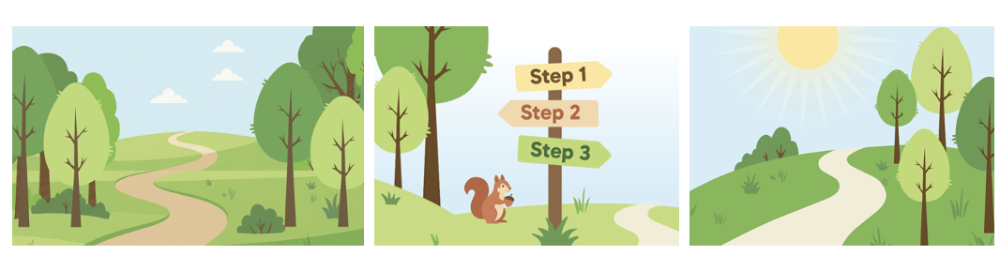
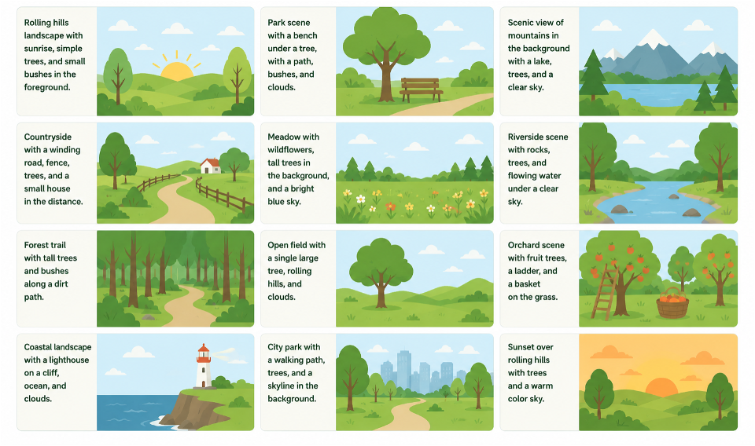

===========================
Design elements
===========================

Brand fonts
============

For print
----------------

* Heading font is `Montserrat <https://fonts.google.com/specimen/Montserrat>`_
* Body font is `Merriweather <https://fonts.google.com/specimen/Merriweather>`_

For web
-----------

* Heading font is `Manrope <https://fonts.google.com/specimen/Manrope>`_
* Body font is `Inter <https://fonts.google.com/specimen/Inter>`_

Typescale
=============

* Standard body font is 16px or 1rem.
* H1 is 48px or 3rem
* H2 is 40px or 2.5rem
* H3 is 33px or 2.0625rem
* H4 is 28px or 1.75rem
* H5 is 23px or 1.4375rem
* H6 is 19px or 1.1875rem
* Small is 13px or .8125rem
* Tiny is 11px or .6875rem

Color Palette
=================

Main colors

* Earthy Brown #5a3e1b
* Grass Green #3f6b3a
* Black 
* White

Medium colors (for graphics)

* Leafy Green #bfda6e
* Sunny Yellow #ffe599
* Dark sand beige #c8b99a

Used in: Illustrations. Leafy green is used in the favorite heart icon. Dark sand beige is used in the progress bar.

Background colors

* Sky Blue #d5f0f7
* Sand Beige #f2ead6

Call-to-action buttons
========================

Primary CTA
----------------

The primary CTA is:

* Grass green background
* White text

Rollover state:
* White background
* Grass green border
* Grass green text

Secondary CTA
----------------

* White background
* Grass green border
* Grass green text

Rollover state:
* Grass green background
* White text

Tertiary CTA
-----------------

* Sand beige background
* Earth brown text

Custom Styles
===================

Note styles
-----------------

Notes have a sky blue background, no border and black text.

Basic page heading styles
---------------------------

H3 headings used in content on basic pages are grassy greens

Illustrations
===============

Most illustrations are generated using AI tools. A sample prompt:

.. code-block:: html

   Create an image aligned with the attached (attach image below) that has an aspect ratio of 4:3 that shows a small town in the background with a park in the foreground.
   
Generative starter:

   

Sample images:

