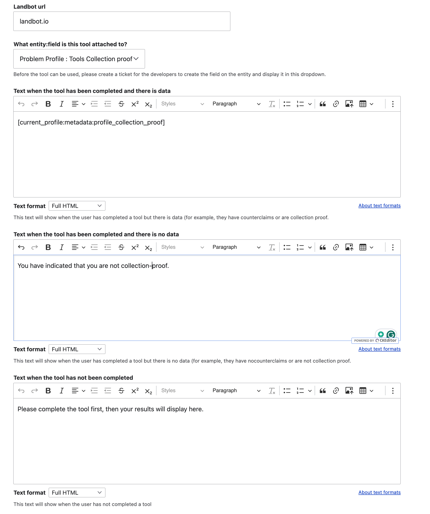
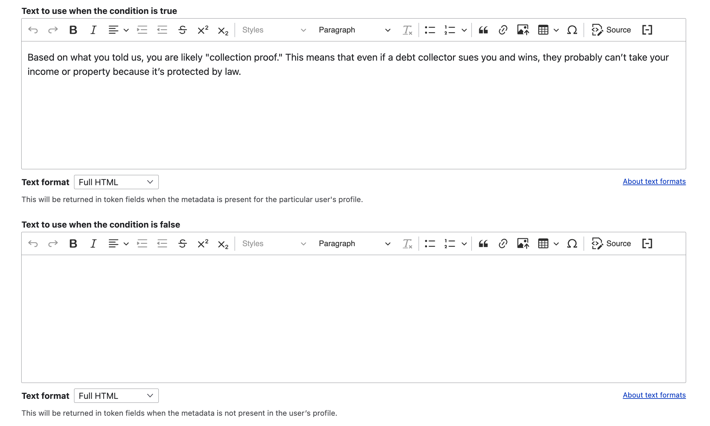

============================
Options & Tools Integration
============================

Each tool includes:

* A landbot URL. This URL is then used to 

  * Embed the Landbot in a step in an option when the [tool:nid:embed] token is used
  * Embed the Landbot in a legal resource standalone page
  
* A field name to store profile metadata term references for the tool. Each possible term that the tool can return should be added to the Problem Profile Metadata taxonomy
* The entity the field should be attached to (debt, debt problem, or problem profile)
* Three long text fields that are used to determine what displays when the [tools:nid:response] token is used in a step in an option. The three fields are:

  * Text when the tool has been completed and there is data. This will appear when the user has completed the tool and there is relevant metadata stored. For example, if someone has completed the collection proof tool and is collection proof, the is_collection_proof metadata will exist.
  * Text when the tool has been completed and there is no data. This will appear when the user has completed the tool but there is no relevant metadata stored. For example, if someone has completed the collection proof tool and is not collection proof, the is_collection_proof metadata will not exist.
  * Text when the tool has not been completed. This will appear when the user has not completed the tool.
  

.. warning:: The developers must create the actual field on the entity before data can be stored.
  
Example
===========================

For a tool "See if you are collection proof" with a node ID of 6 that is embedded in the first step of "Settle the case"

On the Tool side
--------------------

In the CMS, the tool is set up as:

* Landbot URL = "landbot.io"
* Field is Problem profile: Tools collection proof (which references the tools_collection_proof field attached to the problem_profile)
* Text when the tool has been completed and there is data: "[current_profile:metadata:profile_collection_proof]"
* Text when the tool has been completed and there is no data: "You have indicated that you are not collection-proof."
* Text when the tool has not been completed: "Please complete the tool first, then your results will display here."

When evaluated, the [current_profile:metadata:profile_collection_proof] token will:
* return "Based on what you told us, you are likely "collection proof." This means that even if a debt collector sues you and wins, they probably can’t take your income or property because it’s protected by law." if true
* return empty if false

In the option
-----------------

* Step 1 is set up as "Determine if you are collection proof. We can help guide you. [tool:6:embed]"
* Step 2 is set up as "Having claims you can raise can help you negotiate a better settlement than if you don't have claims. [tools:6:response]"

.. note:: The **[tools:nid:embed]** creates the embed code, passing in required debt entity, profile entity, and debt problem entity ID automatically. The **[tools:nid:response]** is used to evaluate and update narrative based on the user's response.

What the user sees
---------------------

When the user has not completed the tool:
^^^^^^^^^^^^^^^^^^^^^^^^^^^^^^^^^^^^^^^^^^^^

The user will see the embedded landbot if they have not yet completed the tool.

.. code-block:: html

   <h3>1. Determine if you have any claims<h3>
   
Embedded landbot

   <h3>2. Determine your negotiation strategy<h3>
   
Having claims you can raise can help you negotiate a better settlement than if you don't have claims. Please complete the previous step before continuing.

   
   
When the user has completed the tool:
^^^^^^^^^^^^^^^^^^^^^^^^^^^^^^^^^^^^^^^

* And they have a claim of "Wrong venue"
* And the Wrong venue taxonomy term has Text to show if true of "The creditor filed the case in the wrong venue; this means you can have it dismissed and they must refile in the right county."

.. code-block:: html

   <h3>1. Determine if you have any claims<h3>
   You've completed this step.
   <h3>2. Determine your negotiation strategy<h3>
   
Having claims you can raise can help you negotiate a better settlement than if you don't have claims. You have identified these potential claims: The creditor filed the case in the wrong venue; this means you can have it dismissed and they must refile in the right county.

   
* And they have no claims

.. code-block:: html

   <h3>1. Determine if you have any claims<h3>
   You've completed this step.
   <h3>2. Determine your negotiation strategy<h3>
   
Having claims you can raise can help you negotiate a better settlement than if you don't have claims. You did not identify any potential claims.

   
   
How the Landbot data is processed
===================================

Sample response:

.. code-block:: json

   { "debt_entity_id": 56,
   "profile_id": 100,
   "debt_problem_id": 64,
   "nid": "123",
   "tool_node_id":6,
   "debt_wrong_venue":"true",
   "tool_counterclaims":["debt_wrong_venue","debt_sol"] 
   }

When a user completes a Landbot tool, an API call is made to an endpoint. At the end of the endpoint:

* If the user is accessing the tool from a step in an option:

  * Updates that option's progress to indicate the tool was completed
  * Updates the debt and problem profile entity based on any returned data
  * Replaces the tool_ field that matches the tool on the entity determined by the tool
  * Reloads the page so that tokens re-evaluate
  
* If the user is accessing the tool from a standalone node:

  * Updates all options' progress associated with the debt to indicate the tool was completed
  * Updates the debt and problem profile entity based on any returned data
  * Replaces the tool_ field that matches the tool on the entity determined by the tool

  

