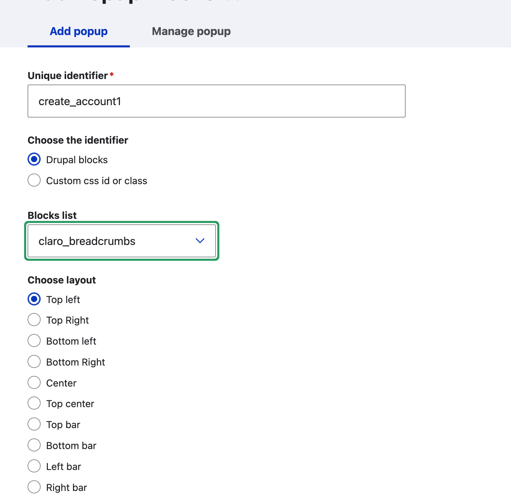
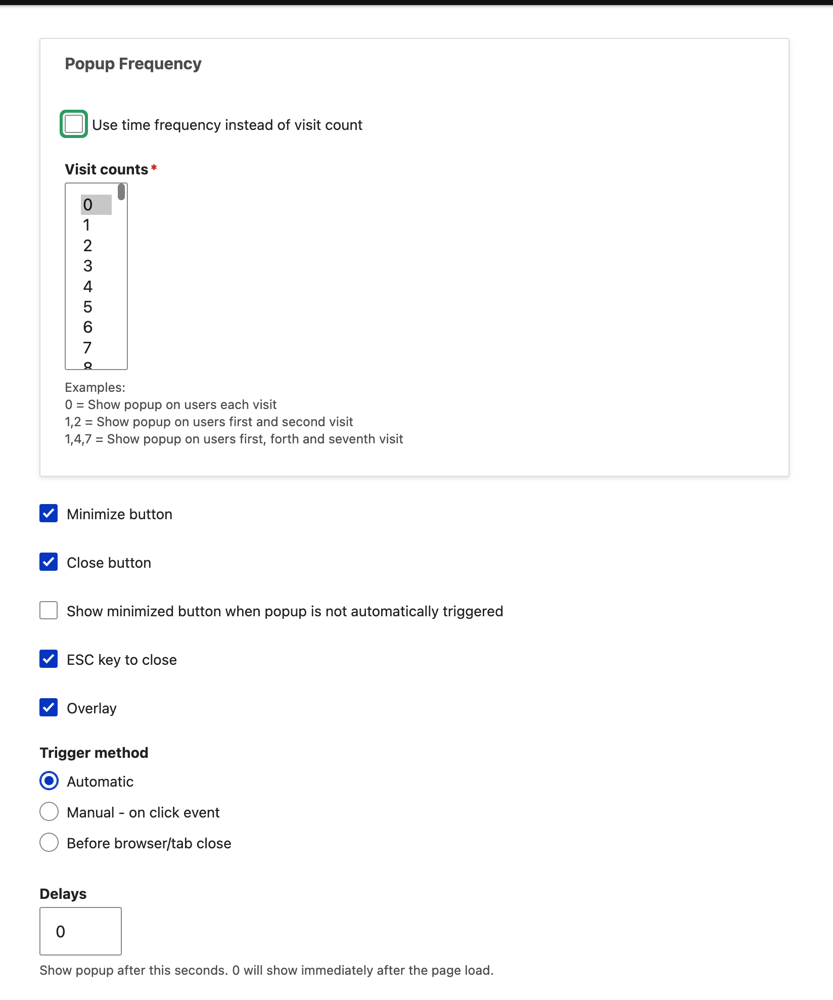

==============================
Using the pop up block module
==============================

To create a pop up block on DHI:

* Add basic block. Create a basic block on the site. 
* Place the block in the breadcrumbs region
* Configure the pop up block 
* Enable the pop up block

Configuring the pop up block
==============================

Pop up blocks are configured in Configuration -> Media -> Add simple popup blocks

* Create a descriptive unique ID for the popup block
* Pick the block to use for the pop up (note: blocks are prefixed with the name of the theme they are associated with)
* Determine where you want to place it. Most should be placed in the Center

* Determine the pop up frequency. There are 2 options:

  * Based on visit. For example, set the account creation block to 0 to have it appear on every visit but maybe we only want to fire a survey block every 5th visit, so set it to 5
  * Based on time. This allows one to set it hourly, daily, or weekly. For example, we may want a survey block to only fire once a day regardless of the number of visits.
  
* Set the trigger and other settings

  * Close button should always be checked
  * ESC key to close should always be checked
  * Overlay should usually be checked
  * Set the trigger method to automatic
  * Set the delay to:
    
    * 0 if you want the block to load when the page loads
    * A positive number if you want the block to load on a time delay.
    
.. warning:: Once saved, you must check the "Enable this as a popup" for the change to take effect and you must clear caches (or ask Gwen or Mike to do that).
    
    
.. note:: Once created, there is a set of classes defined in the adjustment class. Create a developer ticket to theme the block and hide the CSS if necessary.

    

