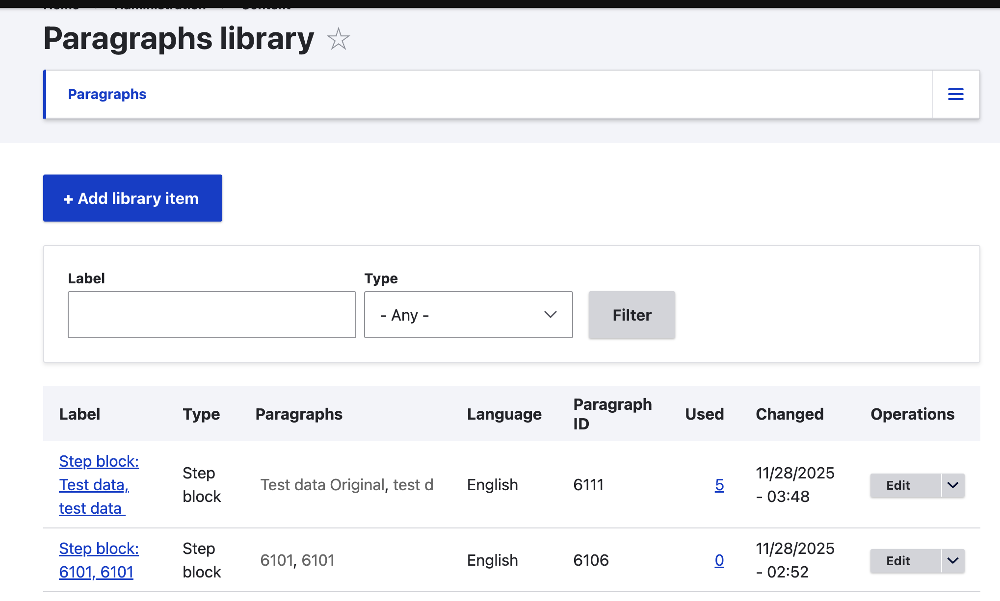
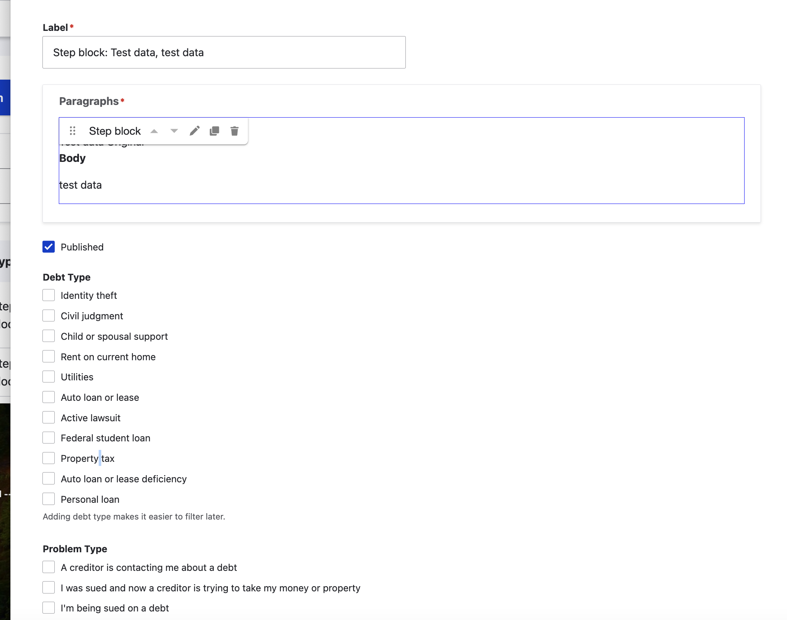
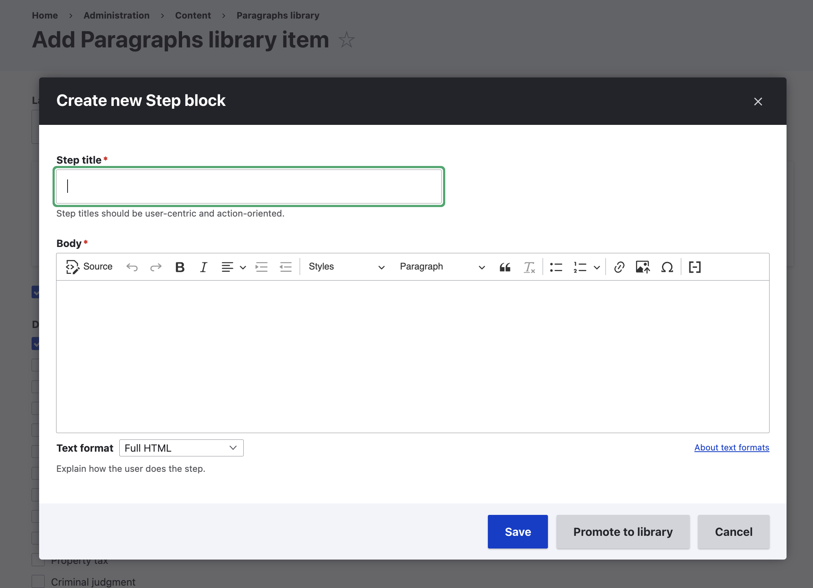
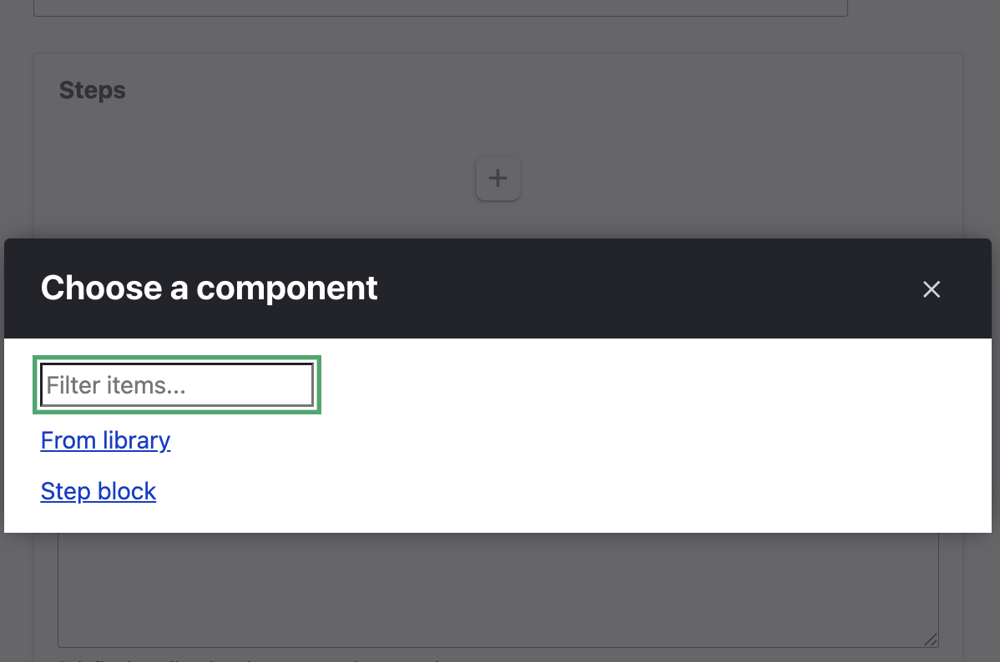
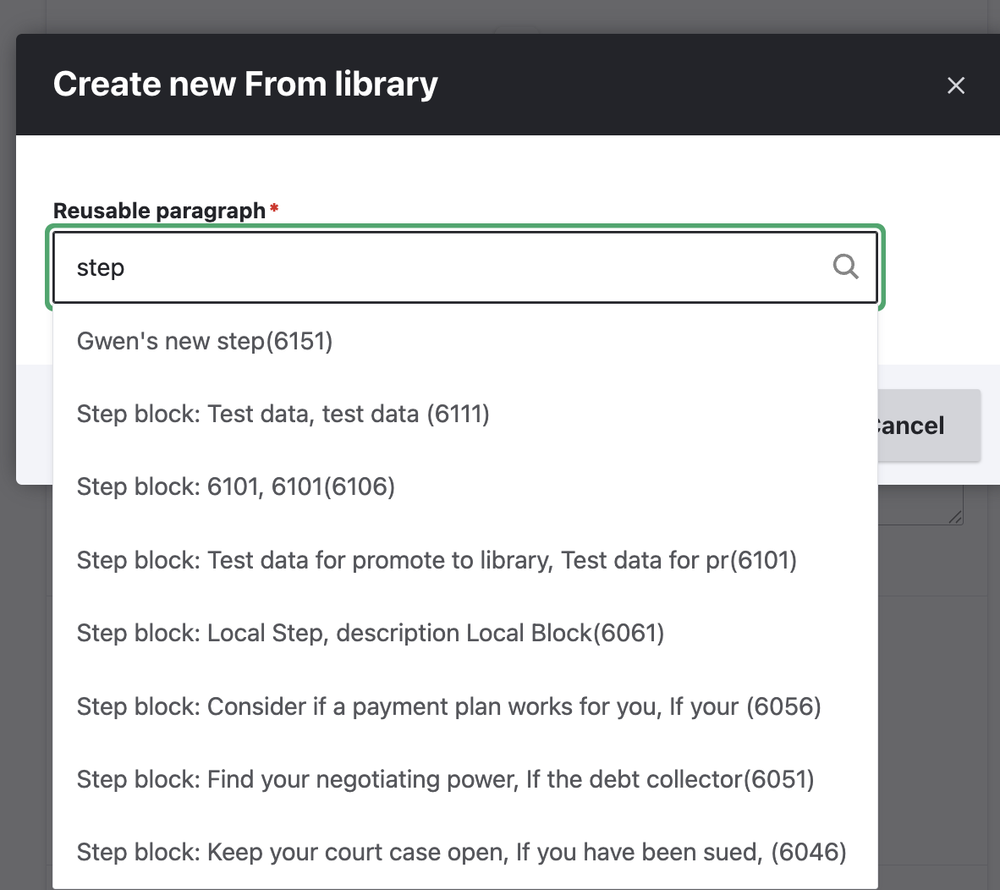
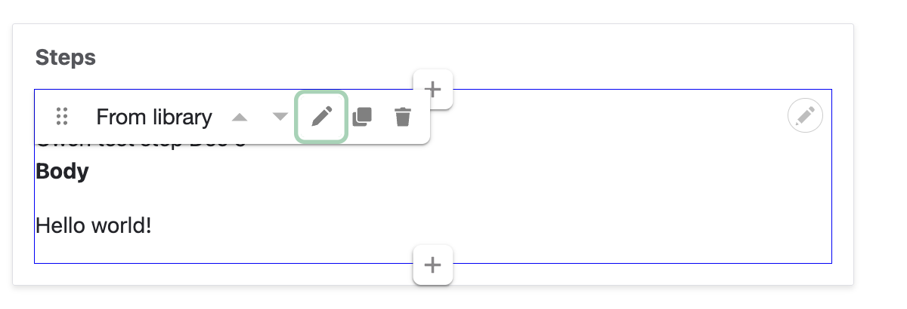
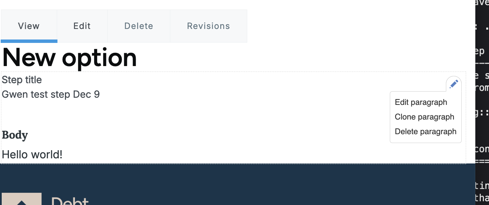

================================
Reusable content library
================================

.. note:: Debt Help Illinois uses a reusable content library to allow for reusing steps in options. It is currently being piloted independently of the live content model.

The reusable content library allows us to take paragraphs items that normally are limited to the specific node they are included in and re-use them in other nodes. In the case of Debt Help Illinois, the use case is to allow us to re-use steps across options where the step is exactly the same.

A change made to a step in the library is automatically reflected in any content that includes that step.

A change made to a step not in the library only impacts the Option it is included in.

Technical Architecture
===========================

Our reusable content library is built using these Drupal modules:

* Paragpraghs Library module - provides the ability to promote a paragraphs item to a reusable library
* Layout paragraphs - provides a more intuitive interface for editing paragraphs in content where reusable paragraphs are used. Includes layout paragraphs library submodule
* Entity usage - allows tracking which content a reusable content item is used.

Implementation
================
Currently, only steps can be promoted to the library. Once added to the library, they can be used in any option. The list of steps in the library can be found under Content -> Paragraphs.

Each step in the library:

* has a unique label. This is different than the step title and is used only in the library
* can be tagged to specific problems and debt types by editing the library item.

Creating a new library item
==============================

If the step does not yet exist
---------------------------------

* Go to Content -> Paragraphs
* Press Add library item
* Give the item a label
* Press the + button in the Paragraphs to pop up the Create new step block.
* Add the step title and body
* Press Save. This will create both the Step and promote it to the library

If the step already exists
-----------------------------
* Find the step in an existing Option
* Press Promote to library. This will convert it to a library item. 

.. warning:: Once promoted, any changes made to that step will be reflected everywhere it is used.

Building content that uses library items
============================================

When creating an option that uses library steps, the steps layout will have a plus button. Pressing that give the option of selecting an existing library step or creating a new standard step.

When adding a library step
-----------------------------

* Look up the reusable paragraph
* Press save

The step will populate in the layout with a menu with options to:

* Edit the item
* Duplicate the item
* Delete the item. This will delete the item from the content, not from the library.

Because library items are included by reference, to edit the item you can:

* Press the edit button and then Open
* On the front end, use the contextual filter to edit the paragraph.

.. warning:: Editing a library item edits it everywhere it is used.

When adding a "standalone" step
--------------------------------

Option 1: New standalone step
^^^^^^^^^^^^^^^^^^^^^^^^^^^^^^^^

* Select Step block from the menu when adding a step
* Complete the form to add a step title and body.

Option 2: Convert an existing reusable step to a standalone step
^^^^^^^^^^^^^^^^^^^^^^^^^^^^^^^^^^^^^^^^^^^^^^^^^^^^^^^^^^^^^^^^^

.. todo:: This is currently in testing. 

.. warning:: Doing this will break the connection between the step and the library. Changes made to this step instance wil only be reflected in this instance. It will essentially become a standalone step.

