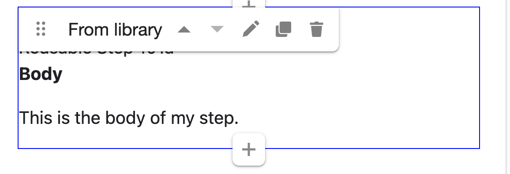
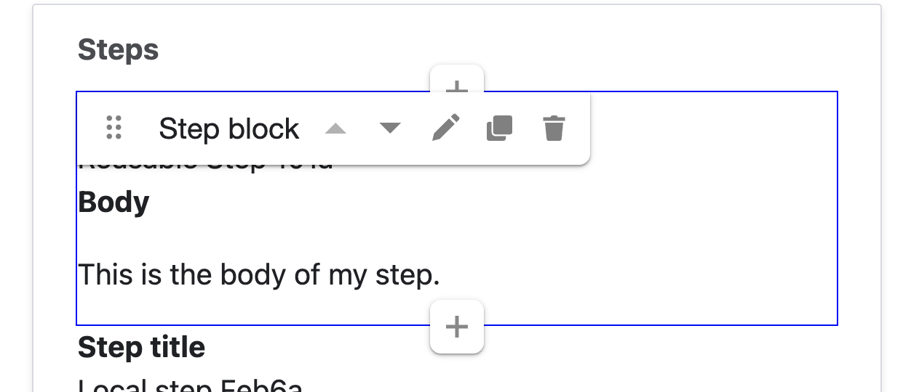

================================
Reusable content library
================================

.. note:: Debt Help Illinois uses a reusable content library to allow for reusing steps in options. It is currently being piloted independently of the live content model.

The reusable content library allows us to take paragraphs items that normally are limited to the specific node they are included in and re-use them in other nodes (**"Library steps"**).

In the case of Debt Help Illinois, the use case is to allow us to re-use steps across options where the step is exactly the same.

**A change made to a step in the library is automatically reflected in any content that includes that step.**

**A change made to a step not in the library only impacts the Option it is included in.**

When to use the library
==============================

Use the reusable content library when:

* a Step will appear in multiple Options
* the Step wording must remain consistent across the site
* you expect the Step will need future updates and want to update it in one place
* it serves as a base step for creating independent steps

Avoid using library steps when:

* the Step is unique to one Option
* the Step is similar to another step but needs different wording or details
* the Step includes content that might change depending on context

Technical Architecture
===========================

The reusable content library is built using these Drupal modules:

* Paragraphs Library – allows a Paragraph item to be promoted into a reusable library item
* Layout Paragraphs – provides a more user-friendly interface for editing Steps, including library items
* Entity Usage – allows tracking where a library item is being used

Implementation
================
Currently, only **Steps** can be promoted to the library. Once added to the library, it can be used in any option. The list of steps in the library can be found under Content -> Paragraphs.

.. image:: ../assets/paragraphs-library.png

Each library step:

* has a unique Label (used internally to identify it in the library)
* may also have a Step Title (displayed to users in the Option)
* can be tagged to specific debt types and problem types (to support filtering and organization)

.. image:: ../assets/paragraph-library-edit.png

Creating a new library item
==============================

If the step does not yet exist
---------------------------------

1. Go to Content → Paragraphs
2. Click Add library item
3. Enter a Label (This label is internal and should clearly identify the step for editors.)
4. Click the + button to open the Create new Step form
5. Add the Step Title and Body
6. Click Save

.. note:: Library items can also be then tagged to specific debt and problem types, to support additional filtering and helps with organization.

.. image:: ../assets/paragraphs-library-add-step.png

If the step already exists
-----------------------------

If a Step already exists inside an Option and you want to reuse it elsewhere:

1. Open the Option where the Step currently exists
2. Locate the Step in the Steps layout
3. Click Promote to library

** This converts the Step into a library step.

.. warning:: Once promoted, that step becomes shared. Any edits will affect every Option that uses it.

Building content that uses library items
============================================

When editing an Option, the Steps layout includes a + button for adding new Steps.

Clicking the + button gives you two choices:

* From library (shared reusable step)
* Step block (local step)

Step types
------------

**Library steps**

* shared across the site
* edits apply everywhere the step is used
* display as **From library** in the editing toolbar

**Standalone steps**

* exist only inside the Option where they are created
* edits only affect that Option
* display as **Step block** in the editing toolbar

Converting between library and standalone steps
-----------------------------------------------

Converting a library step into a local step
^^^^^^^^^^^^^^^^^^^^^^^^^^^^^^^^^^^^^^^^^^^

Sometimes you may want to start with a library step but customize it for a specific Option.

To do that:

#. Add the library step to the Option
#. Click **Duplicate**
#. Delete the original **From library** step from the Option
#. Edit the duplicated step

The duplicated step is now a standalone Step block.

.. note::

   The duplicated step is no longer connected to the library. Editing it will not affect other Options.

Converting a standalone step into a library step
^^^^^^^^^^^^^^^^^^^^^^^^^^^^^^^^^^^^^^^^^^^^^^^^

If you create a Step block and later realize it should be reusable:

#. Locate the Step block inside the Option
#. Click **Promote to library**

Once promoted, it becomes a shared step and edits will apply everywhere it is used.

Adding a library step to an option
-----------------------------------------

.. image:: ../assets/paragraphs-building-steps.png

When adding a library step:

#. Click the **+** button in the Steps layout
#. Choose **From library**
#. Search for the step using its label
#. Select the step
#. Click **Save**

.. note::

   Library steps will show **From library** in the editing toolbar.

Once added, the step menu allows you to:

* **Edit**
* **Duplicate** (makes a copy of it local to the Option)
* **Delete** *(removes it from the Option but does not remove it from the library)*

To edit a library step:

* Click **Edit**, then click **Open**
* OR use the contextual links on the front end to edit the paragraph directly

.. warning::

   Editing a library step updates it everywhere it is used.

Adding a standalone step
------------------------

Standalone steps show **Step block** in the toolbar.

Option 1: Create a new standalone step
^^^^^^^^^^^^^^^^^^^^^^^^^^^^^^^^^^^^^^

#. Click the **+** button in the Steps layout
#. Choose **Step block**
#. Enter the Step title and body
#. Save the Option

Option 2: Create a standalone step based on a library step
^^^^^^^^^^^^^^^^^^^^^^^^^^^^^^^^^^^^^^^^^^^^^^^^^^^^^^^^^^

#. Add the library step
#. Click **Duplicate**
#. Remove the original library step from the Option
#. Edit the duplicated Step block

.. note:: The duplicated step is now a local step and is not part of the library.

