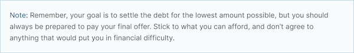
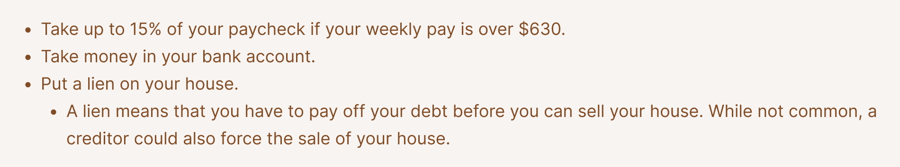

===========================
DHI Style Guide
===========================

Titles
==========

* Capitalization - use sentence case.

  * Yes: What is identity theft?
  * No: What is Identity Theft?
  
* Length - titles should be no longer than 60 characters in English

Description
=============

Good descriptions are short blurbs that describe accurately the content of the page. They are like a pitch that convince the user that the page is exactly what they’re looking for. They should provide additional “information scent” for the user to decide if this is the help they are looking for. While the content and meta description can be the same, they do not have to be. The meta description is especially important because it, along with the title, may be all the user sees to decide if this is the page they want to go to.

Ideal length is between 100 and 200 characters.

Headings
=========

Headings should be used as they are helpful to a user when scanning a page. There are 3 levels of headings:

* Heading 3 (h3),
* Heading 4 (h4), and
* Heading 5 (h5).

There must be atleast one h3 before an h4, and at least one h4 before an h5.

.. warning:: Headings should not be used solely for the purpose of style! They should be used to organize the legal information.

Bulleted and numbered lists
==============================

* Use bullets (unordered lists) when there is no sequence to the items
* Use numbers (ordered lists) when there is

Introduce bullets/numbers with a sentence or fragment followed by a colon.

* If it starts with a fragment, the items in the list should be fragments, and should complete the sentence.
* If it starts with a complete sentence, the items can either be fragments or sentences.

* use bullets when

  * the text of the items are 2-3 sentences or less, or
  * when it is a series of items in a list or sequence.

Punctuation & case
----------------------

When the bullet points are complete sentences:

* Each bullet should be written in sentence case
* Each bullet should end with a period

When the bullet points are not complete sentences:

* no punctuation is required at the end of bullet items when the items are short and simple
* Put a comma at the end of each item, even if there are commas within the item itself if the bullets are longer and more complex
* Use "and" or "or" as appropriate at the end of the second-to-last item. Put a period at the end of the last item.
* Each bullet should start be lowercase, unless starting with a proper noun.

Blockquote styles
===================

Note style
-----------

Use the note style to add a note within an article or step. Each note should begin with Note:

Highlight style
------------------

Use the highlight style to call out specific information that is not a note.

Default style
---------------
The default style should be used when quoting another source. 

  
Glossary terms/definitions
=============================
Try and avoid using terms that need to be defined.

If the word/term needs a definition:

* define it using plain language once in the content, if it is a short definition. If the word/term is used more than once in the content, make sure it is included in the glossary as we will rely on the glossary for the times it is used after it is first defined.
* consider making it a legal question that can be linked to, if the definition needs to be more than one sentence long. For example, the definition of economic abuse is multiple sentences and includes a bulleted list and is better suited as a legal question that can be linked to in articles rather than defined multiple times in individual guides or solutions.
* once content is published, check to see if Glossify is defining a term with a non-applicable definition and alter the language to use a different term if possible.

Point of view
=================
Use second person ("you") for almost all content, especially when providing information, guidance, or options that users can act on. This helps create a clear, helpful, and direct experience. However, it's acceptable to use third person ("they," "parents," "the applicant") for non-tailored, General Information (non-tailored) Articles when using "you" would be awkward or misleading.

Formatting
===============

Italics
----------
Italics should be used only for:

* Court form names. This includes shortened versions of their names. For example, if you refer to a Notice of Appeal  as "the Notice" later in the article, you would still italicize it.
* Editorial notes (like at the very beginning of a blog post where we give the author's byline).
* Legal citations, case law, and book titles.

Bold
-----------
Only bold individual words or phrases; never bold an entire sentence or paragraph. Use for the rare instance of subheadings in an article, or when there is an important deadline, alert or notice for the reader to note.

**Do not** bold within bulleted lists.

Underline
--------------
Don't ever use.

Underline is reserved to display hyperlinks.

ALL CAPS
-------------
Don't ever use.

Spacing
-----------
Between sentences us one space, not two.

Between paragraphs, use one hard return, not two.

Symbols and Emojis
---------------------

Symbols or emojis can be used sparingly:

* At the beginning of a step in an option
* At the start of a paragraph to highlight important information

Symbols or emojis should not conflict with other icons or interface elements.

Grammar and Usage
====================
Voice
--------

Use active voice as much as possible.

Verb tense
-------------
Use present tense as much as possible.

Contractions
----------------
Contractions are acceptable when used for plain language. Do not use informal contractions.

Formal contractions include: can't, won't, shouldn't. They use a single apostrophe.
Informal contractions include: gonna, watcha, wanna. They do not use a single apostrophe.

And/Or
----------
Do not use "and/or" where it will cause confusing ambiguity. Use it sparingly if it avoids confusion between two or more equally viable options.

He/She/Them
--------------
Do not use he/she or he or she. Use gender neutral terms (they, their, them).

**It is OK to use plural gender neutral pronouns for singular objects**, as in "The judge will make their decision.

Punctuation
=============
Colons
---------
Use at the end of a sentence or fragment that introduces a list.

Semi-colons
---------------
Do not use semicolons. Separate into two sentences with a period.

Commas
----------
A period is better than a comma, but a comma is better than no comma.

Use the oxford comma in a series consisting of three or more elements, separate each element with a comma.

Example: Diversity, equity, and inclusion. NOT: Diversity, equity and inclusion.

Double quotes
----------------
Double quotes should be used when introducing/defining a word for the first time.

Periods
------------
Use periods at the end of each sentence.

Do not use periods when items appear in bulleted lists. Instead, use commas. (see "bulleted lists" above)

Hyphen
--------
Hyphenate two or more words that precede and modify a noun as a unit if confusion might otherwise result. Do not hyphenate for adverbs ending in "ly."

Do not use
--------------

* Exclamation points
* Single quotes (use double quotes)
* Semi-colons (separate into two sentences with a period)
* Parentheses. Avoid using them. They are confusing to people with lower reading levels.
* Em dash
* Slash. Use 'and' or 'or' instead.
* Ampersand (&)

En dash
Use to indicate a range. Do not space on either side of an en dash.

Capitalization
=================

* Capitalize proper names
* Capitalize specific courts or judges but do not capitalize when speaking generally of court, judges, or clerk.  For example:

  * Judge Joe Smith
  * the judge on the case
  * The Illinois Supreme Court
  * the court in your county

* Criminal offenses are not capitalized.
* Organization names should use title case
* Circuit Clerk, Court Clerk, or Clerk should never be capitalized. Use 'circuit clerk', 'county clerk,' or 'clerk'.

Numbers & Currency
=====================

* Spell out 'zero' and 'one'; use digits otherwise.
* Use commas in numbers of 4 or more digits.
* Use dollar sign. Only use decimals if there are cents (not ".00").
* Fractions are preferred over decimals and should be written as 1/2, 1/4, 1/3. Avoid using the single fraction characters, like ½, as they do not render properly across all platforms. If they start a sentence, they should be spelled out:

  * One-third of the group have multiple convictions
  * In the group, 1/3 have multiple convictions

* If in doubt, follow the AP style guide.

Phone number format
======================

   "(555) 555-5555"

Phone numbers can also be hyperlinked. The correct way to link a phone number is <a href="tel:555-555-5555">(555) 555-5555</a>

Dates
========
Spell out month, xx day, xxxx year (American English); xx day, month, year (non-English).

Examples:

* May 7, 2021
* November 12, 1984

Hyperlinks
============
Don't hyperlink words like "click here" or "more."  Instead, hyperlink the specific words (preferably nouns) that describe the information on the page being linked to. For example: "Find more information on the Illinois Courts website."

Connecting to external resources
------------------------------------

.. note:: Always link when you can over downloading and storing on our website.

In other words, if there is a PDF we want to create content for, we should try to create a "link" form to the URL where that form is hosted on an external site like a circuit clerk's site, instead of downloading the form and re-uploading as a "download" form. This is so that if the form is updated we will be alerted because the link will break.

External links
------------------
External links should only be used to send users to forms or resources on pages that are run by government agencies or reputable non-profits.  Do not link users to private attorneys' websites, political websites, or generic informational websites (like ask.com or wikipedia).

Links to legal authority
---------------------------
When linking to Illinois statutes, link to the ILGA website's version. Bring people to the Article level, or Title level if Article is unavailable.

For federal statutes, link them to the LII website https://www.law.cornell.edu/.

For caselaw, link them to Google Scholar.

Links to Statewide Forms
--------------------------
When you refer to a Statewide Form, hyperlink the name of it to the AOIC page for that form suite (or that specific form) the first time you refer to it. After that, you don't need to hyperlink it each time.

.. note:: If ILAO has automated the statewide form, we should reference our Easy Form instead. The Easy Form landing page will have the link to the AOIC PDF version as well.

