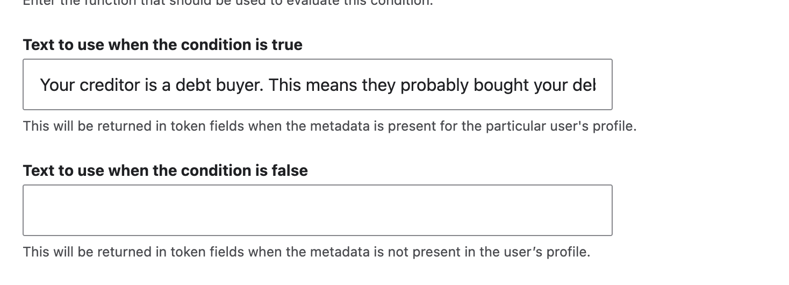

=====================
DHI Specific Tokens
=====================

The platform has these specific tokens defined for use in content generation.

General Drupal tokens
========================

By default, standard Drupal tokens are available for use in content. These include:

* node tokens such as [node:title] and [node:"field_name"].
* taxonomy tokens such as [term:name]
* entity tokens such as [debts:amount], [debt_problem:archived]
* other useful tokens like 

A full list of tokens is available via Help -> Token 

.. note:: These are specific to what is being viewed and are not specific to a user's debt. We have defined specific tokens when we need to address a user's specific situation.

Current debt tokens
======================
These will populate based on the specific debt the visitor is working on.

+----------------------+-------------------+--------------------------------------+
| Token                        | Is replaced with                                 |
+==============================+===========+======================================+
| [current_debt:debt_name]     | The name of the current debt                     |
+------------------------------+--------------------------------------------------+
| [current_debt:debt_type]     | The name from the debt type taxonomy that        |
|                              | matches the debt type of the current debt        |
+------------------------------+--------------------------------------------------+
| [current_debt:amount]        | The amount of the current debt                   |
+------------------------------+--------------------------------------------------+
| [current_debt:problem]       | The name from the problem type taxonomy that is  |
|                              | associated with the related debt problem entity  |
+------------------------------+--------------------------------------------------+
| [current_debt:creditor_type] | The creditor type from the creditor taxonomy for |
|                              | the specific creditor                            |
+------------------------------+--------------------------------------------------+
| [current_debt:creditor_name] | The creditor name associated with the debt       |
+------------------------------+--------------------------------------------------+
| [current_debt:interest_rate] | The interest rate associated with the debt       |
+------------------------------+--------------------------------------------------+
| [current_debt:last_payment]  | Date of the last payment, formatted as mmmm d,   |
|                              | yyyy (December 1, 2025 for example)              |
+------------------------------+--------------------------------------------------+
| [current_debt:county]        | County name for the debt; this may differ from   |
|                              | the user's county                                |
+------------------------------+--------------------------------------------------+
| [current_debt:courturl]      | Illinois court directory url for the specific    |
|                              | courthouse associated with the debt              |
+------------------------------+--------------------------------------------------+
| [current_debt:clerkphone]    | Phone number for the clerk in the specific       |
|                              | courthouse                                       |
+------------------------------+--------------------------------------------------+
| [current_debt:courtphone]    | Phone number for the specific courthouse         |
+------------------------------+--------------------------------------------------+

.. note:: If the user is in Cook County, the specific Cook courthouse is returned when we have the judicial district.
  

Current profile tokens
==========================

+----------------------+-------------------+--------------------------------------+
| Token                        | Is replaced with                                 |
+==============================+===========+======================================+
| [current_profile:city]       | The user's city                                  |
+------------------------------+--------------------------------------------------+
| [current_profile:county]     | The name user's county                           |
+----------------------+-------------------+--------------------------------------+
| [current_profile:zip   ]     | The name user's zip code                         |
+----------------------+-------------------+--------------------------------------+
| [current_profile:courturl]   | Illinois court directory url for the specific    |
|                              | courthouse associated with the user              |
+------------------------------+--------------------------------------------------+
| [current_profile:clerkphone] | Phone number for the clerk in the specific       |
|                              | courthouse                                       |
+------------------------------+--------------------------------------------------+
| [current_profile:courtphone] | Phone number for the specific courthouse         |
+------------------------------+--------------------------------------------------+

.. note:: If the user lives in one county and the debt is in another county, the court information may be different. If the user is in Cook County, the specific Cook courthouse is returned when we have the judicial district.
  

Problem profile metadata tokens
=================================

When any token in the format of [current_profile:metadata:[variable-name]] is included, it is replaced with:

* If the variable exists on either the debt entity or profile entity, with the True value from the problem profile metadata taxonomy
* If the variable does not exist on either entity, with the False value from the problem profile metadata taxonomy.

For example, [current_profile:metadata:debt_is_debt_buyer] would return "Your creditor is a debt buyer. This means they probably bought your debt for far less than you owe." if the debt_is_debt_buyer exists in the user's profile and would be empty if it does not.

