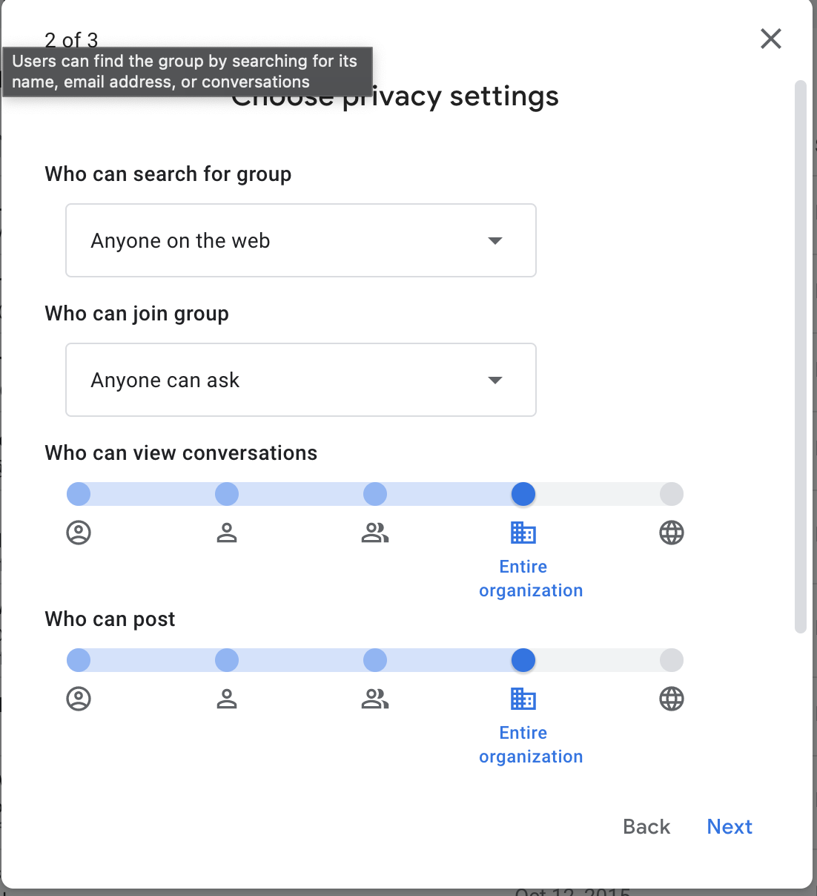
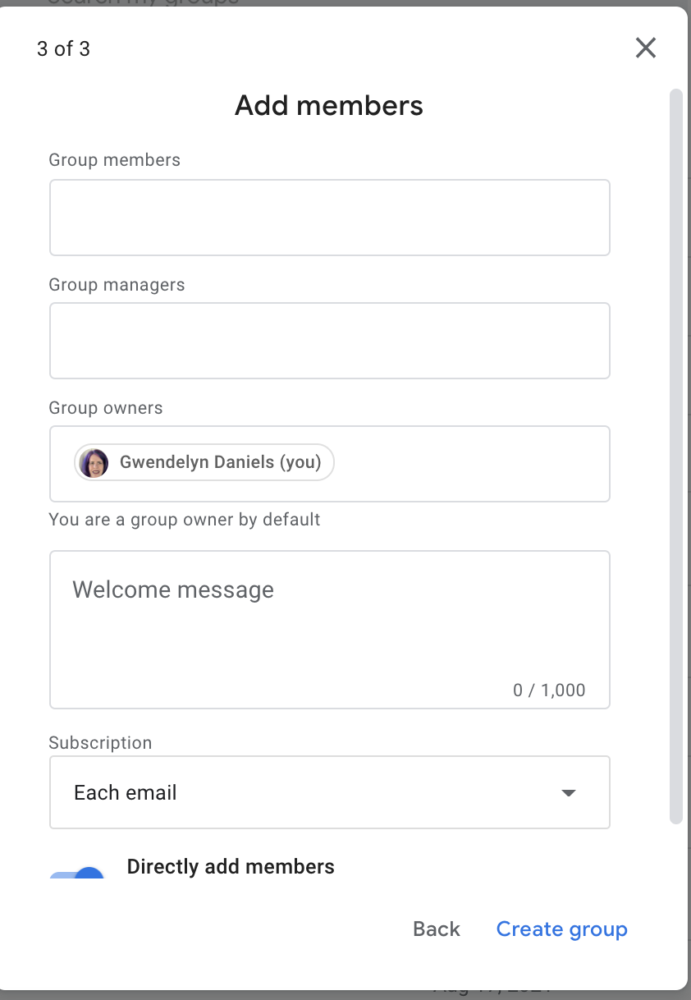

=====================
Discussion groups
=====================

Discussion groups are managed through Groups in Google. Substantive groups are managed by the respective content manager.

.. note:: Group urls are formatted as https://groups.google.com/a/illinoislegalaid.org/g/[group name]

Setting up a Google group
===========================

* Enter the group info:

  * Enter the group name; by default this gets appended to @illinoislegalaid.org to become the group email list name.  This can be overridden in the Group email address field; Review and edit if needed the group email address.  This email address must be unique to the IllinoisLegalAid.org domain.

  * Enter an optional description

* Set the privacy settings.  Privacy settings should be set to:

  * Anyone on the web can search for the group
  * Anyone can ask to join
  * Who can view should be set to organization.
  * Who can post should be set to organization

* Add initial members

  * At least one staff member should have the Group owners role.
  * The facilitator should have the group member role
  * All other members should have the group member role

* Add a welcome message

* Click create group

Configuring a Google group
=============================

Once a group is created, there are other settings that should be configured. Go to the group and go to Group Settings and then to Email Options.  Under email options:

* Set the subject prefix.  This should be formatted as [group name]. For example [HousingLaw] or [Foreclosure]
* Ensure a footer is selected. You should always include the default footer but may also add a custom footer.

Managing Members
===================

Group managers and owners will be notified when someone uses the Google group to request to join. To approve or deny:

* Go to the group page on Google Groups
* Click on the People section (if collapsed)
* Click on Pending members
* Approve or deny the request

.. warning:: Users should be approved only if they are employees of a legal aid organization. An exception exists on some lists for grantees of particular funders. Check with Gwen or Teri if you are unsure if someone should be approved.

Users without a Google account will create a Zendesk support ticket from the Contact US page to join a listserv. These will be added to the content team Jira board to be resolved by a content team member.
To add a member:

* Go to the group page on Google Groups
* Click on the People section (if collapsed)
* Click on Add member
* Add the email address of any new member(s) in the group section

On Our Website
=================
Information for discussion groups should be added to the Discussion Groups page linked to under For Legal Professionals.  For each group, it should contain:

* The email address to send messages to in the "How discussion groups work" section
* The name of the group (for example Foreclosure discussion group), linked to the landing page on Google groups
* The name, job title, organization and email address of the facilitator

