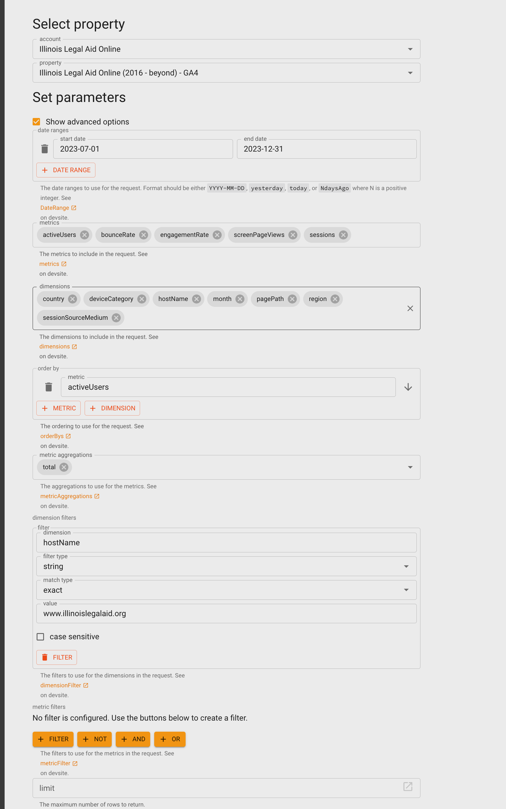

====================================
Google Analytics 4 primary dataset
====================================

The full set data set uses the following dimensions:

* country
* device category
* hostname
* month
* pagePath
* sessionSourceMedium
* region

and the following metrics:

* active users
* bounce rate
* engagement rate
* screen page views
* sessions

When pulled using GA-query explorer, the data should be filtered so that hostname = www.illinoislegalaid.org

The dataset is then run through Tableau prep builder to:

* Rename fields to match GA names
* Create a date field of month/day/year
* Splits source/medium into separate source and medium fields.
* Removes hostname field

