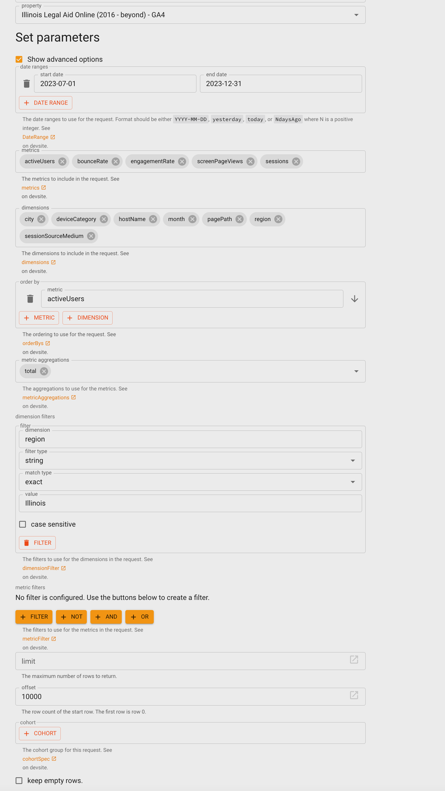

=================================
Google Analytics 4 Illinois data
=================================

The Illinois data set uses the following dimensions:

* city
* device category
* hostname
* month
* pagePath
* sessionSourceMedium
* region

and the following metrics:

* active users
* bounce rate
* engagement rate
* screen page views
* sessions

When pulled using GA-query explorer, the data should be filtered so that region = Illinois.

The dataset is then run through Tableau prep builder to:

* Rename fields to match GA names
* Filter hostname = www.illinoislegalaid.org
* Create a date field of month/day/year
* Splits source/medium into separate source and medium fields.
* Removes hostname field
* Removes region field

