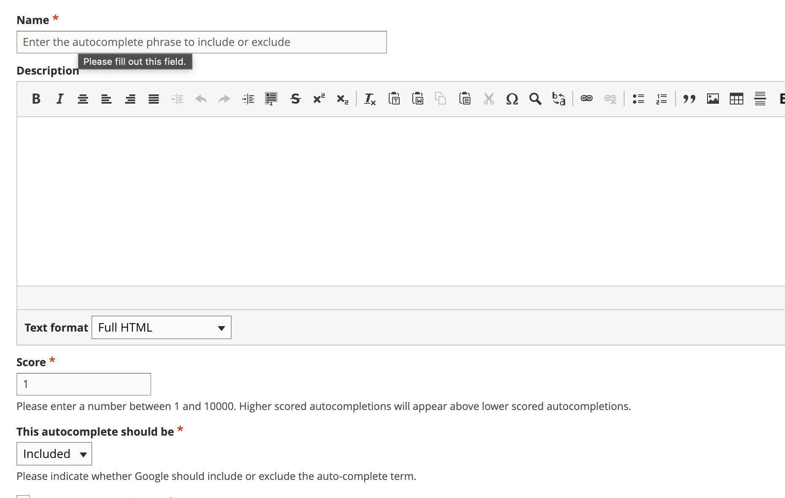

=====================
Custom autcomplete
=====================

Google manages the autocomplete terms that appear when a user searches our site based on our search corpus and searches that commonly map to our site. We can customize the autocomplete to:

* include additional specific autocompletes
* exclude specific autocompletes.

Autocomplete terms can be scored from 1 to 10000; higher scored terms will appear higher when they match the user's input. For example, if I indicate that divorce with children should have a score of 10000 and divorce and taxes should have a score of 5, divorce with children will appear higher up when the user starts to type divorce.

To make an autocomplete suggestion, use the `search autocomplete <https://www.illinoislegalaid.org/admin/structure/taxonomy/manage/search_autocomplete/overview>`_ taxonomy.

Use the add term to add:

* Name of the autocomplete to include or exclude
* Leave description blank
* Set the score
* Indicate if the autocomplete should be added to the autocomplete index or removed from the index.
* Select the relevant language (coming soon)

Example use cases
===================

Some use cases may include:

* An English term is showing in the Spanish autocomplete because of some bad prior translations. Use the search autocomplete to exclude the English term from the Spanish search index
* When a user types divorce, we want divorce with children to appear higher than it does. Add this to the  English autocomplete and give it a higher score than the default of 1.
* When a user starts typing car, we do not want to show the Carroll county LSHC or want to show it lower in the list. We can use the exclude from autocomplete to hide it completely or to weigh other terms like car repossession higher.

.. note:: These will be pulled weekly into the Google site search and may still take 48 hours for Google to process.

