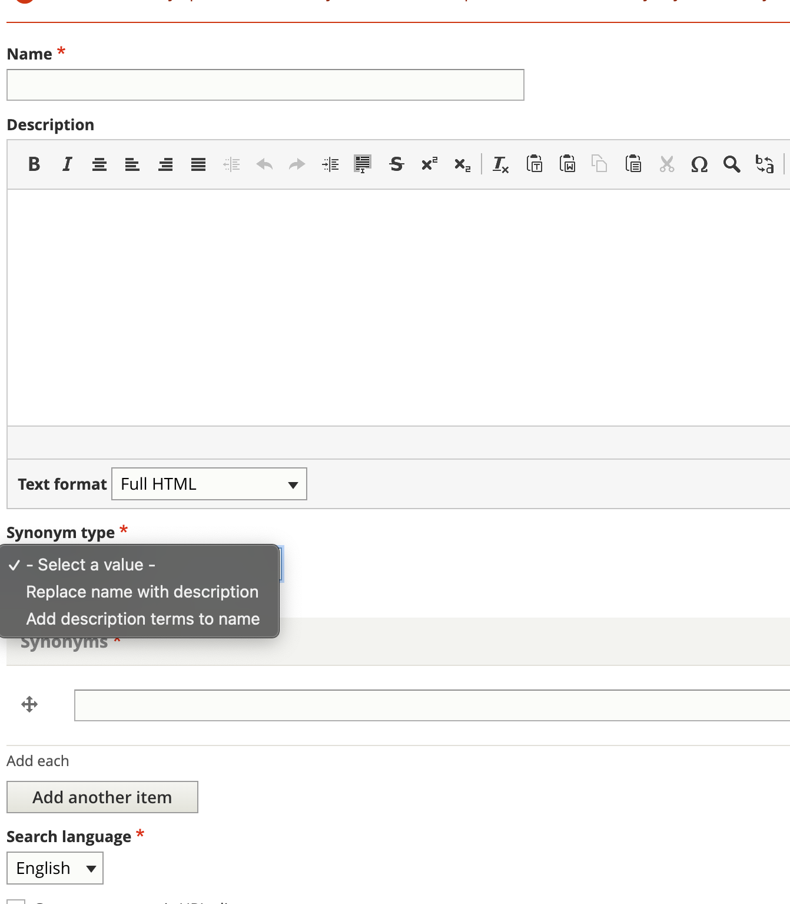

================
Synonyms
================

Google will automatically try to fix what it believes is a mis-entered search term. For example, if I type divoce, Google knows I meant divorce.

We can also provide our own synonyms for Google to use.

To create a synonym suggestion, use the `search taxonomy <https://www.illinoislegalaid.org/admin/structure/taxonomy/manage/search_synonyms/overview>`_.

Using the add form:

* In the name, enter the search term that should trigger synonym expansion
* Leave the description blank
* Select the synonym type (Replace or Add)
* Add up to 10 synonyms
* Select the applicable language. This will determine which search index we add the synonyms to.

If you select Replace, Google will treat these as keywords to better refine the search results. For example:

* Legal Self-Help Center may have synonyms of free legal forms and information, amenities, location as LSHC's tend to have those attributes on the page.
* forms may have keyword synonyms for produces documents

If you select Add, Google will treat these as additional search terms. For example:

* divorce may have synonyms of dissolution of marriage, separation
* forms may have additional synonyms of documents, letters, court forms

note:: While staff can create these in the website, product staff will still need to review and add them to the search engine on Google before they are effective. You will not immediately see changes.
