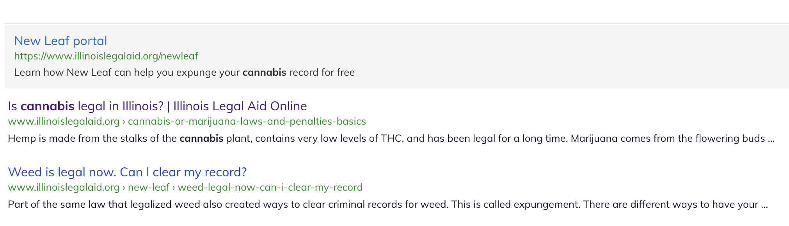
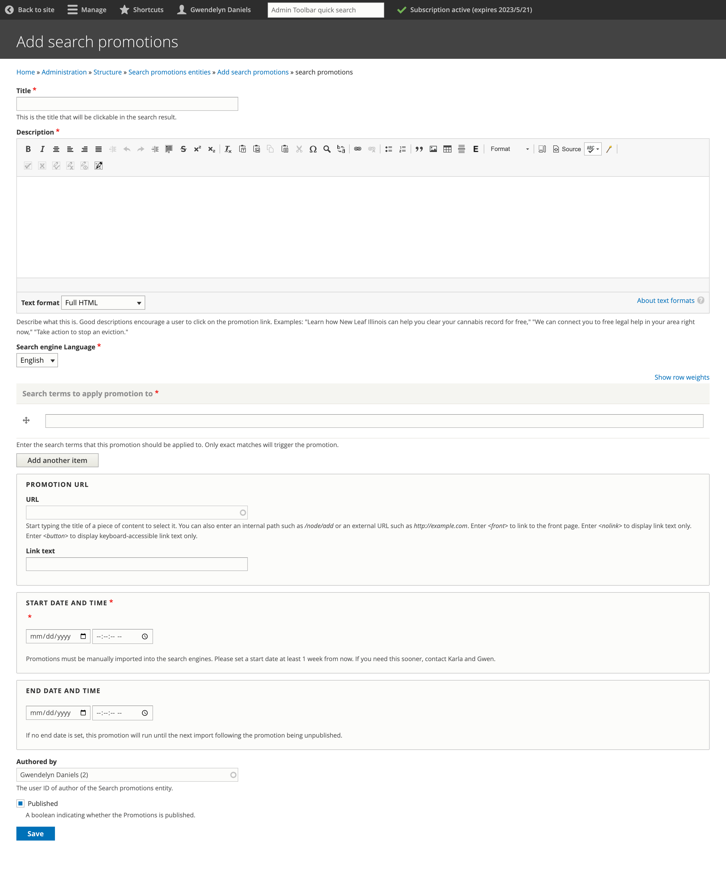

=======================
Search promotions
=======================

We can create one or more promotions to appear in search results when a user searches a specific query. This can be used for a variety of purposes:

* To promote a new resource before it is indexed by Google
* To guide uses to a specific resource that may not rank high enough or compete with other resources. For example, we want to direct users looking for eviction information to our Eviction Help Illinois page over other content.

Below is an example of the New Leaf Portal promotion when a user searches for cannabis:

Promotions can be added using the `Search promotion page <https://www.illinoislegalaid.org/admin/structure/search_promotions>`_.

For each promotion provide:

* Title - this is the heading that will appear in the search result
* Description - this will be the search snippet
* Language - language of the search index to add the promotion to.
* Search terms to apply the promotion to; these must be exact search terms
* Add the full url of the web page the promotion should link to
* Add the expected start date
* Add the expected end date, if applicable

.. warning:: These are not automatically created in the site search. The product team must pull these down and enter into the search index. If you need an immediate start, reach out to Gwen, Mike, or Karla for help.

