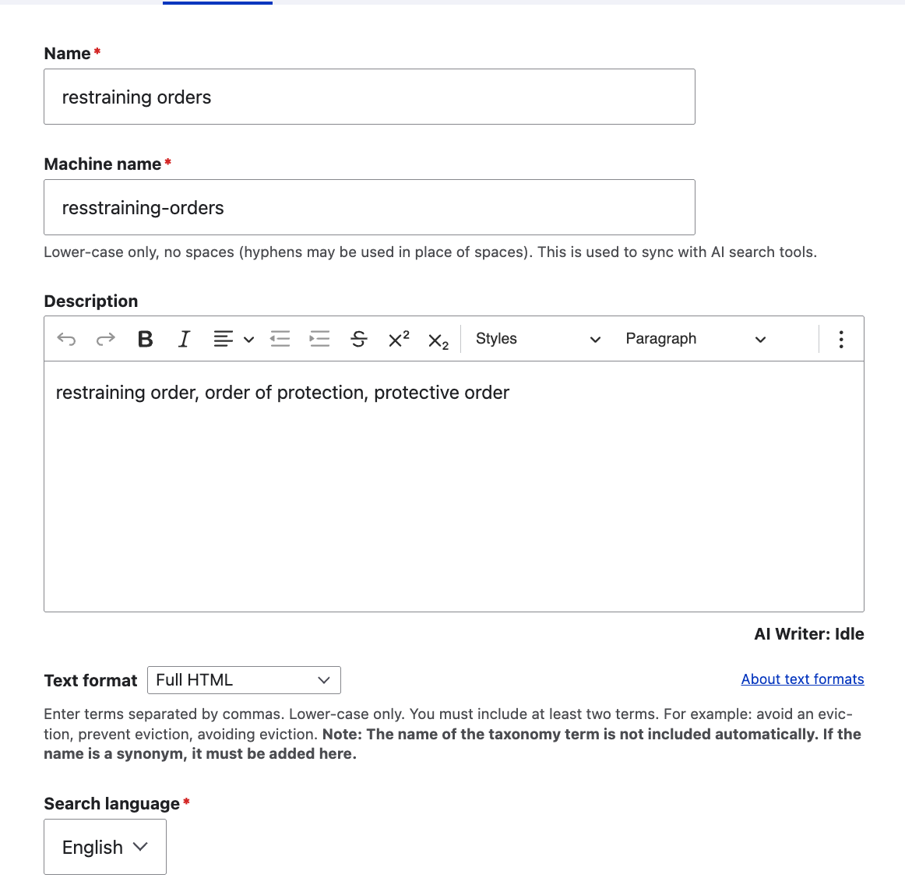
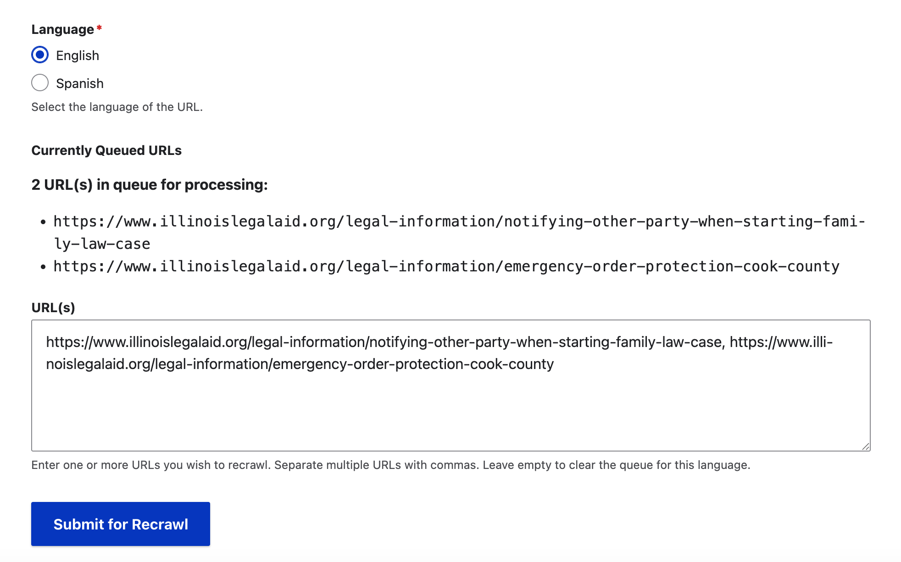

.. _custom_site_config:

==============================
General search configuration
==============================

Our site search is managed through `Google's API console <https://console.cloud.google.com/gen-app-builder/engines>`_ in the ILAO-primary account.

.. note:: Gwen and Mike have access to this property.

Search Englines
=================

ILAO has 2 search engines:

* ILAO-Search25 is used on our English language pages
* ILAO-ES is used on our Spanish language pages

English
----------

Includes all pages from www.illinoislegalaid.org except for:

* anything in the /sites/default folder. This typically includes file content and images.
* anything in the /proxy path. This excludes IICLE content but not the IICLE landing page
* anything in the form-library or form-search paths. These are primarily navigation pages that should not be returned
* anything in the legal-issues path as that is legacy from when the legal issues IA controlled navigation.
* Basic pages that are being used to expose guided navigation for translation

The English search results are delivered over an API call. This give us some limited control over the display.

Spanish
----------

Includes all pages from es.illinoislegalaid.org. Pages that ILAO has not exposed for translation are already excluded.

Synonyms
===========

Because Google Vertex AI doesn't offer the same level of semantic understanding and stemming that Google site search does (and Google custom site search was deprecated), we have built the ability to create synonyms within the website.

Adding a synonym
------------------

Synonyms are added in the `Search synonym taxonomy <https://www.illinoislegalaid.org/admin/structure/taxonomy/manage/search_synonyms/overview>`_.

To add a synyonym record:

* Give it a name that is easy for the content team to recognize when reviewing synonyms
* Get it a machine name for Google to use. Machines names **must be**:

  * all lowercase
  * may use hyphens
  * no other characters
  
* Use the description field to list the synonyms in a comma-delimited-list. Anything in this field will be treated as the same string.

  * A minimum of 2 terms is required
  * A maximum of 100 terms is allowed
  * **Lower case only**

* Search language - indicate if this synonym applies to the English or Spanish search index.

.. note:: Search results are not translated by Motionpoint. The Spanish site uses its own Spanish search index from translated content. Spanish-only synonyms can be created in the taxonomy.

Editing a synonym
-------------------
You can edit the name and description. Do not change the machine name.

Additional synonyms can be added by adding them to the description. Existing terms in the description may be deleted.

Deleting a synonym set
------------------------
To remove an entire synonym term, delete the term. That will remove it from the Google configuration.
  
Forced Re-crawls
==================
 
Google Vertex will update based on Google's crawling patterns. If there is a need to push changes sooner, staff can submit those changes thorugh the `site re-crawl<https://www.illinoislegalaid.org/admin/site-search-crawl>_ tool.

.. note:: The tool clears each night. If you are adding a URL and there are already URLs listed, add yours after. 

To add one or more URLs:

* First, select the language. Spanish uses a different search datastore than English.
* Add the URLs you want Google Vertex to recrawl. Any previously submitted URLs that have not been processed will appear.
* Submit the form.
* Wait. The queue runs once a night due to Google API limits. Recrawls may take 24-48 hours to be effective.

You can clear the queue entirely by leaving the URL field empty. This will remove anything that has been previously queued.

