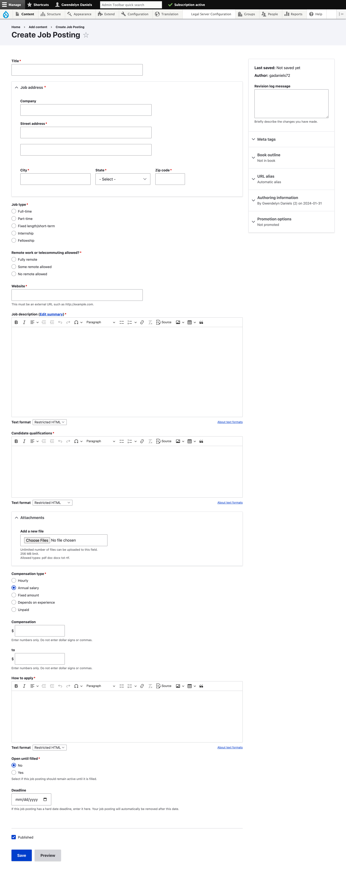
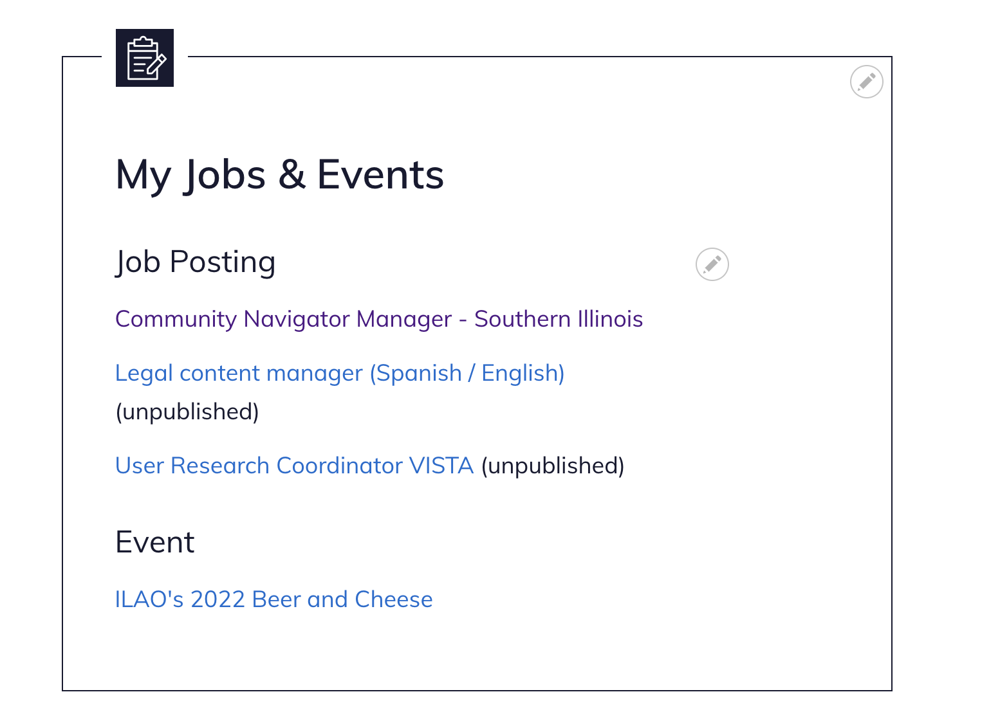

=======================
Job postings
=======================

Anyone with the legal advocate, pro bono, or legal self-help center role can post a job on IllinoisLegalAid.org

To create a job posting
===========================

* Enter a title for the Job
* Enter the address for the organization
* Indicate the job type - full-time, part-time, fixed length/short-term, internship, or fellowship
* Indicate whether remote work or telecommuting is allowed
* Describe any remote work rules
* Add the organization's website address URL
* Add the job description. Click the "Remove format" icon (T with a subscript x) to remove any random formatting
* Add the candidate qualifications
* Upload any attachments, such as a PDF of the job posting
* Add the pay scale and benefits
* Provide information on how to apply
* Set a deadline or mark "open until filled" to Yes
* Ensure the "Published" box is checked
* Click Save

Editing, unpublishing, or republishing a job
==============================================

* Log into your account on the website
* On the My account page and look for the My Jobs & Events block
* Click on the job posting you want to change
* Click the "Edit" button
* Check or uncheck the Published checkbox
* Click Save

