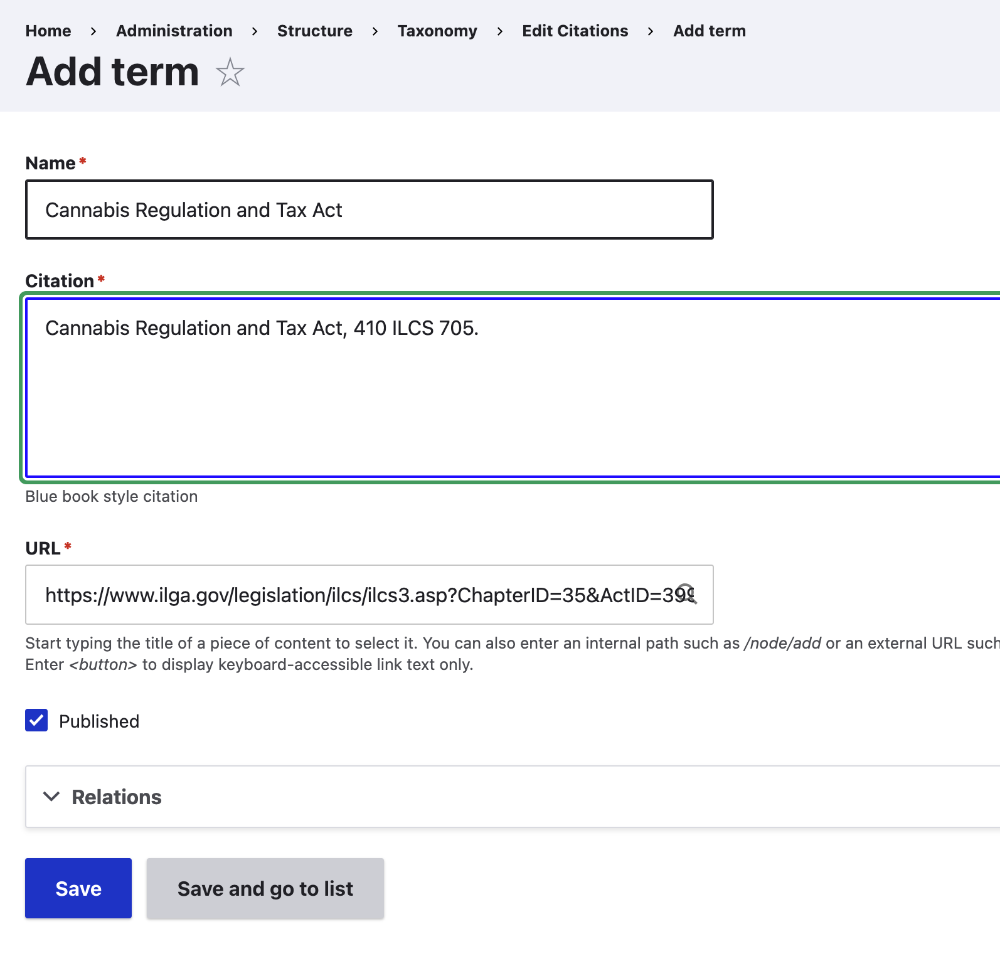
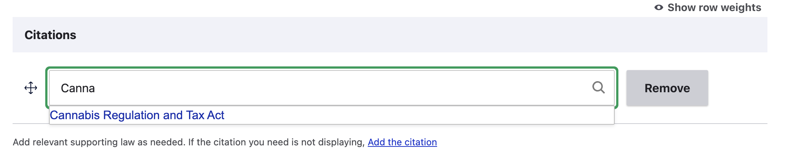

==============================
Adding and managing citations
==============================

Citations to legal sources can be added to legal content through a shared taxonomy `<https://www.illinoislegalaid.org/admin/structure/taxonomy/manage/citations/overview>"Citations."`_

Adding a citation to the taxonomy
====================================
To add a new citation to the citations taxonomy, go to the taxonomy and click Add term.

On the add form:

* Give the citation a name; this should be the name of the legislation or case. This will be what appears in the autocomplete look up.
* Provide the citation, in full blue book format. This will display to website visitors.
* Provide the url to the citation

Referencing a citation in legal content
=========================================

On legal content, beneath the jurisdiction field is a citations field. Use the autocomplete to find the relevant citation (there is also a link to add if it is not listed). Select it and save the content.

Viewing the citation in legal content
========================================

When legal content has one or more citations listed, the "Supporting law" block displays.

