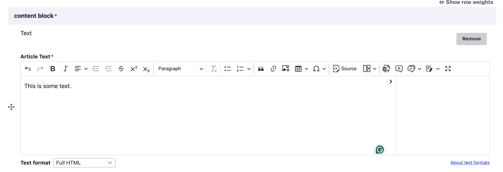
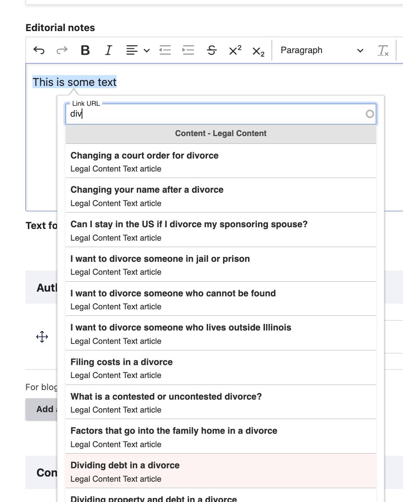
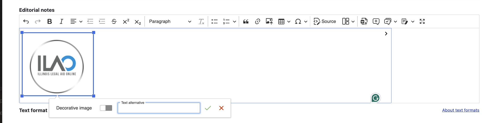
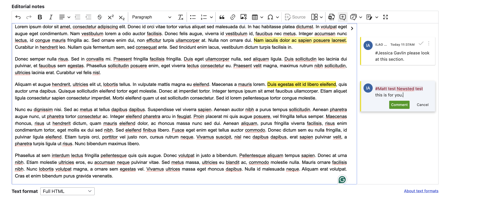
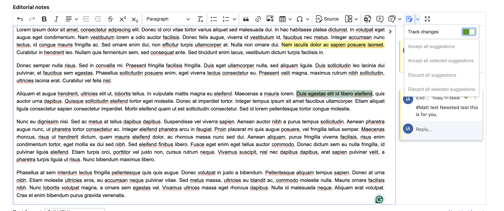
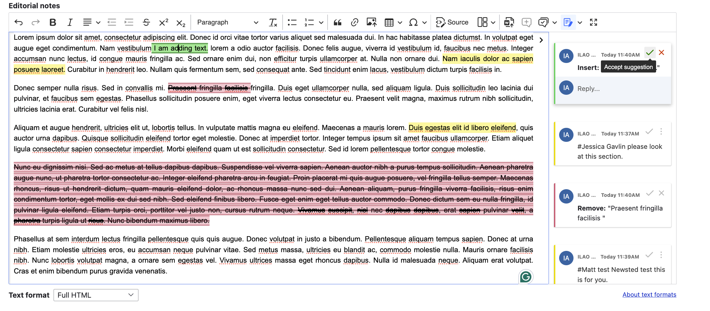

====================================
Working with CKeditor5
====================================

Drupal 10 introduced CKeditor5. This changes some of the functionality from CKeditor4 and Drupal 9.

We lost:
* Integrated spellchecker. You can use the built-in browser spell check or the Chrome Grammarly plug in.
* Support for localized content

We changed:
* Track changes changed between versions. Unapproved track changes from Drupal 9 must be cleaned up in source
* Different editors for different content types. Jobs and events use a basic editor compared to legal content and basic pages

We added:
* Ability to leave comments in the document
* Ability to create templates for WYSWIYG windows
* Notifications

.. note:: Notifications are rendering as plain text email that look bad. We are working on this.

Full editor
==============

The full editor is used for legal content and basic pages. This is typically limited to staff, interns, and subject matter experts.

From left to right, the editor supports:
* Undo, redo, bold, italics, text alignment, indent, outdent, strikethrough, superscript, and subscript
* Styles (paragraph, heading 3 - 6) [Headings 1 and 2 are reserved for interface elements]
* Remove format
* Bulleted lists
* Ordered lists
* Block quotes
* Insert Link
* Upload image
* Table
* Insert special characters
* View and edit source
* Insert templates
* Import from word (supports a direct import from a Word document without copy/paste)
* Add comment
* View comment archives
* Track changes
* Full screen mode

Specific features
===================

Insert link
---------------

When inserting a link, if you start to type a content title, it will automatically pull up content that matches. When selected, it will insert the /node/[nid] version which works across languages.

Press the green checkmark to insert. Use the red X to remove the link.

Insert image
---------------

Images can be uploaded into content. Decorative images should almost never be added within a WYSIWYG field. All images uplodaed into a WYSIWYG should have appropriate text alternatives that describe the image.

Comments
-------------

Comments can be added by highlighting text and pressing the comment button.

You can include other users by using #[username]. If the user has notifications enabled, they will be notified of the comment. See notifications below.

You can see the history of comments by clicking the Comment archive button.

Track changes
----------------

By default, track changes is not enabled on an article. To enable, use the track changes drop down.

When tracked changes are present, they will appear in green when inserted and red/strikethrough when deleted.

You can accept one change at a time using the right sidebar OR you can accept/reject all using the drop down in the track changes button.

Notifications
=================

.. warning:: This is currently in beta. The emails come through as plain text, despite being created as HTML.

Notifications are set to go out when:

* Someone is mentioned in a comment
* When a new comment is added
* When there is a reply to a comment

.. note:: Only the content team and Gwen (primarily for testing) have notifications turne d on in their profile as it is unclear if everyone will get an email whenever any comment is added or replied to versus just if the staff member is an author of the content.

Staff can enable or disable notifications in their profile.

