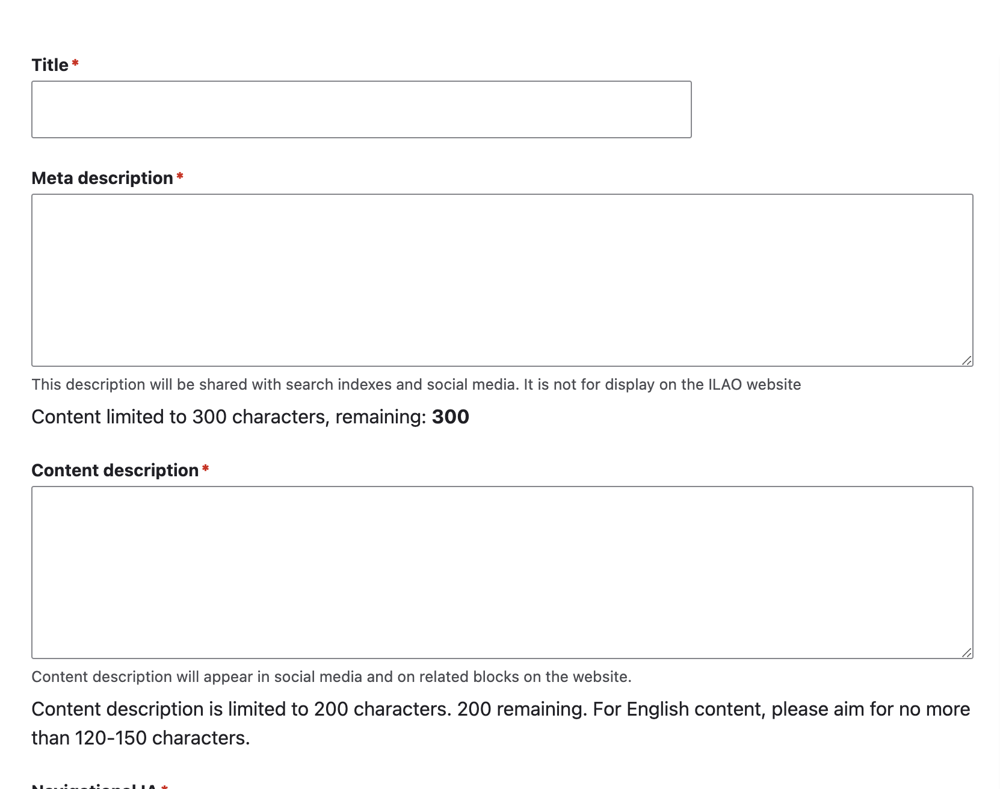
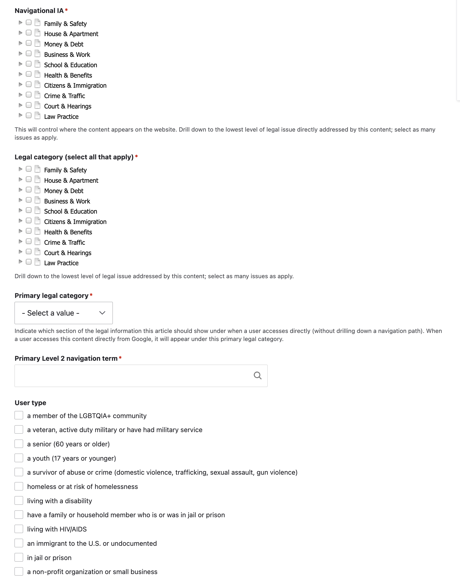

====================================
Legal content common metadata
====================================

This information applies to all types of legal content.

Title and description
=======================

* Requires a title
* Requires a meta description and is limited to 300 characters. The meta description is used on communications outside of the website, including:

  * social media posts
  * eUpdates
  * RSS and API feeds
  * SERP snippets in our sitemap XML files

* Requires a content description and is limited to 200 characters. The content description is used on the website for search results and related blocks.

Taxonomy tagging
==================

* Requires one or more selections in the Navigational IA. This is not on the website navigation through category/sub-category and form library pages.
* Requires one or more selections in the legal category. This is used  for relating content and for linking content with OTIS/Get Legal Help.
* Requires a single selection for primary legal category. This is where breadcrumbs should generate from when a user lands on a page directly. This should also match any content spreadsheet maintained externally.
* Requires a single selection for primary Level 2 navigation term.  This should also match any content spreadsheet maintained externally.
* Optionally, add a user type. This will add the specific article to the "I am a ..." pages.

Best practices
-----------------

* Tag the content to the best category you can find. One is the goal - only tag multiple categories if the content truly fits both places.

* If you tag a piece of content to a taxonomy tag that starts with "another" or "other," **do not tag that piece of content to any other taxonomy tags**

We can also tag legal content by user role, using the taxonomy used for online intake. Content should be tagged to a user role when:

* The content is specifically written for that audience OR
* the content is especially relevant to that audience (more so than the general website visitor population)

Additional Metadata
======================

* Add an image. Images are not required but should be added as this is used for social media. If the image is not added, a default image from the page (usually the contact us or fundraising icons will be used).
* Select zero or more annual updates.
* Select the appropriate jurisdiction for the content.
* Select the legal position: Neutral, Plaintiff/petitioner, or Defendant/respondent depending on the content.
* Requires one or more content blocks. See the individual format links above. The types of content blocks used will determine the content format.
* Add content level selection. Advanced content will appear in practice resources. Basic resources will be included in public-facing RSS feeds.
* Optionally, restrict the content to legal aid members or pro bono members or both. This will add an access layer to the content, requiring the user to be logged in with the correct role to view.
* Optionally, set up to 3 recommended/related content nodes. See previous page.

* Indicate whether you want the content to be translated. This defaults to no.

* When editing English content, you can flag the translation as outdated. This defaults to no.

Dates
==========

**Last revised by staff** : defaults to the created date/time. When editing content, this should be updated whenever staff user makes a substantive change to the content.

* Does not include typos, grammatical fixes, or style changes.
* Does include anything that adds or removes information, especially law changes.

**last full review by a subject matter expert date/time** When creating content, this will default to the current date/time. The last reviewed date when a subject matter expert has done a substantive review of the content to ensure legal accuracy, even if no changes are made.

Content Management Fields
===========================

There are additional fields available to allow the content team to better manage workflow:

* Editorial notes can be used to add or append specific notes
* Author/subject matter expert can be used to indicate who the best SME is for a piece of content
* Content management tags are a taxonomy that allows the staff member to tag for segmenting on a grant, topic, etc.
* The word count will automatically update.

Publishing
=============
* Set the status. When creating content, it defaults to draft/revise. Until published, it will not be visible on the website to users.

* A revision log message is required.

