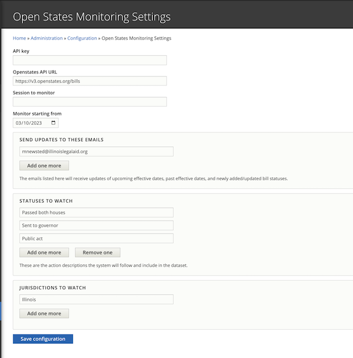
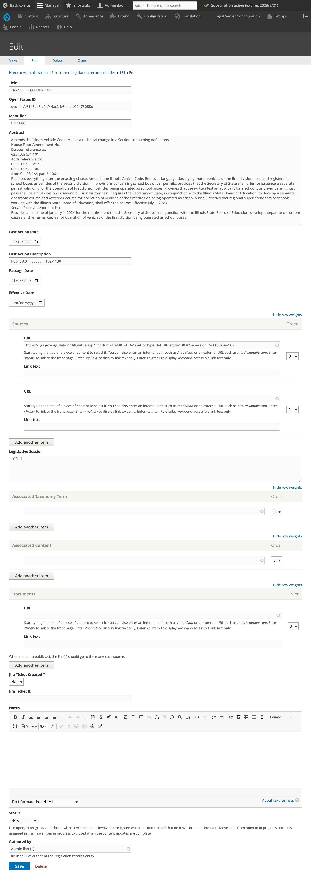
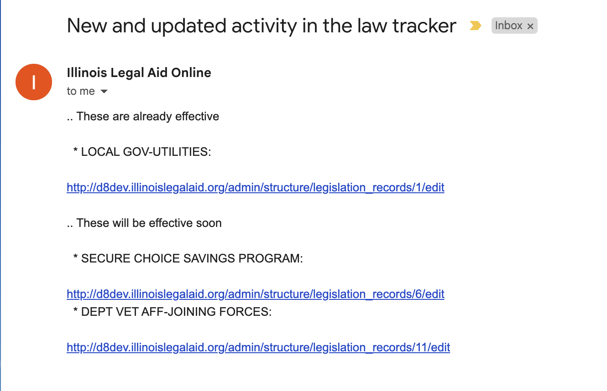
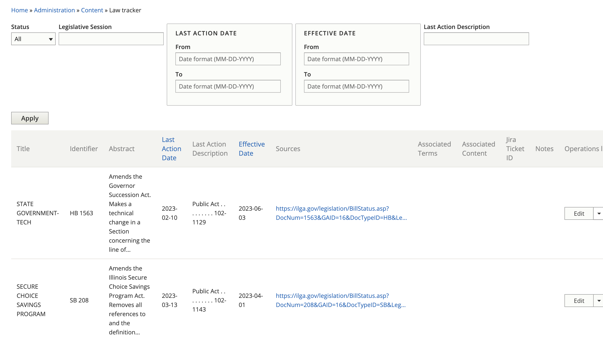

===================================
Automated Law Tracker
===================================

The law tracker helps ILAO's content team track pending and recent legislation.

Configuration
==============

.. warning:: Please do not change the configuration without clearing it with Gwen or Matt.

To allow flexibility and potential re-use beyond ILAO's website, the law tracker has a `configuration page <https://www.illinoislegalaid.org/admin/config/ilao_legislation_records/statesmonitoringsettings>`_ for storing settings related to the law tracker. This includes:

* API key for OpenStates.org
* URL for OpenStates API requests for bills
* Session to monitor. If left empty, session will be ignored.
* A date field for initial launch to track when to pull data from. As this becomes a nightly task, this will prevent us from pulling in all data with each request.
* An email field to add emails of those who should receive update notifications
* A statuses to watch field to track which action descriptions should be included in the database
* A text field for the jurisdiction to track

Legislative records
=====================

The law tracker stores each legislative record as its own entity. This entity includes the following data from OpenStates:

* Title; this is the title of the legislation
* OpenStates ID; this is the unique identifier from OpenStates. This is used to control new vs updates to records
* Identiifier; text field that stores the identifier by the legislature (for example, HB1500)
* Abstract
* Last action date
* Last action description. Only last action descriptions that match the statuses to watch in the configuration will be included in our data set
* Passage date, if it exists
* Sources; these are the sources for the legislation from the ILGA website
* Legislative session
* Documents; this pulls any documents associated with the bill. This will often include the marked up version.

It also includes these fields to allow ILAO to manage their workflow:

* Effective date. This is the date the legislation becomes effective.
* Associated taxonomy term (term reference to navigational IA, unlimited cardinality)
* Associated content (entity reference, using autocomplete, unlimited cardinality)
* Jira ticket created (yes/no), defaults to no, required
* Jira ticket id (text field)
* Notes (WYSIWYG, no summary)
* Status:

  * New - this is a newly created item that has not been looked at by the staff
  * Open - this is an item that has been looked at by the staff and impacts our content
  * In progress - this is an item that has been looked at by the staff, impacts our content, and is being worked on. Notifications will not be sent for these.
  * Ignore - this is an item that has been looked at by the staff and does not impact our content. It will be hidden in reports.
  * Closed - this is an item that has been looked at by the staff, impacts our content, and changes have been completed.

.. todo:: In a future iteration, direct integration with Jira would be nice.

Automated Updates
===================

The system automaticallys check each night for updated data. It will pull in any data that has a last_action_date greater than or equal to the configuration's track from date. This date is updated with each data pull to limit the number of requests we have to make.

Once pulled, the system will loop through the data and:

* Create a record for anything that matches the "Statuses to match" field. It is enough if there is a partial starting match. This is necessary as last action description that begin with Public Act change act numbers.
* Update a record for anything that matches the Statuses to match field and the OpenStatesID already exists. This is necessary to preserve changes made by staff.

Notifications
================

On a nightly basis, the system will send an automated email to anyone listed in the configuration. The notification will include:

* Any bill that has a status of New or Open and either a past or upcoming (+60 days) effective date
* Any bill that is New

Reporting
=============

A report exists at /admin/content/law-tracker that shows details of the current law tracker:

Filters
----------

  * Status (defaults to New and Open)
  * Legislative session (equals)
  * Last action date (between)
  * Effective date (between)
  * Last action description (contains)

Includes
----------

* Title
* Identifier
* Abstract
* Last action date
* Last action description
* Effective date
* Sources (as links)
* Associated navigational IA terms (with links)
* Associated content (with links to edit)
* Jira ticket ID
* Notes

The report can also be exported to CSV.

