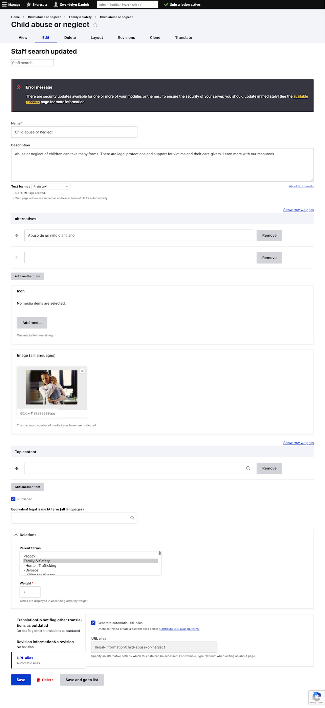

===============================
Managing Navigational IA terms
===============================

The navigational IA controls the layout of topic landing pages on the website. The exact implementation depends on the current state of the legal topic.

Adding or editing terms to the taxonomy
==========================================

Legal content managers can add taxonomy terms through the `taxonomy interface <https://www.illinoislegalaid.org/admin/structure/taxonomy/manage/navigational_ia/overview>`_.

For each term added:

* Add the name. This is what appears as the label for the term
* Add a description. Ideally, this is under 400 characters. This is used for the meta description on the page for SEO and may be displayed to users on top level, 2nd level, and 3rd level landing pages.
* Add any alternative keywords. These may be used to train AI models. These were previously used for Spanish and site search 
* Skip the icon field.
* Add an image.
* Optionally, identify the top content to appear on the page. This allows for ordering (see the ordering documentation)
* Decide whether to publish the term
* Tag the term under relations to the parent term. For example, if adding a term under Family & Safety, tag it to Family & Safety.

  * If there is no content associated with the term, it wil appear empty on the landing page and should not be published
  * The term must be published in order to associate legal content with it

Individual terms can also be **edited** by clicking the Edit button on the landing page.

.. warning:: If a top level term is added, please reach out to Gwen or Mike as that will require additional design, layout, and menu changes. They will also need to add an icon.

Ordering terms in the taxonomy
================================
Legal content managers can re-order terms through the `taxonomy interface <https://www.illinoislegalaid.org/admin/structure/taxonomy/manage/navigational_ia/overview>`_.

For most topics, they should be able to drag and drop to re-order and then save the page.

See also :ref:`manual_reordering`

Deleting terms in the taxonomy
================================

Only administrators can delete terms. Please reach out to Gwen or Mike to have a term deleted from the system. We need to verify that the term ID is not in use anywhere else on the website.

