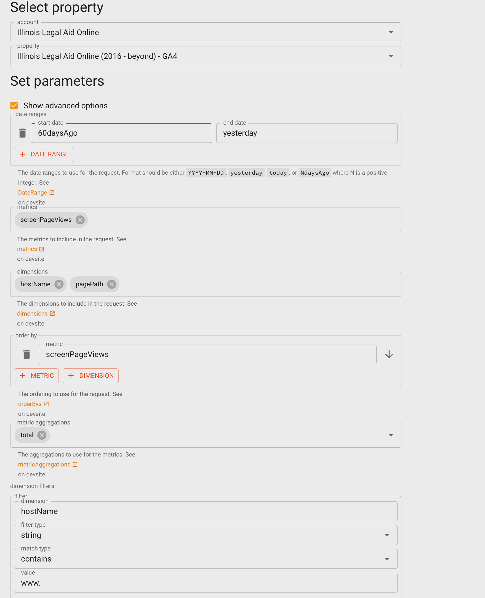

=========================================
Updating pageviews for ordering content
=========================================

Pageviews is the default sort order for legal content.

Updating the page views is a multi-step process:

* Pull pageviews from Google Analytics
* Pull node ID/UUID data from the CMS
* Pull the legal content report from the CMS
* Run these 3 files through the Tableau GA-pageviews-import to create a single CSV file
* Upload the CSV file on the website
* Wait for the queue manager to run or manually run the queue task.

Pull Pageviews from Google Analytics
=====================================

Pull CMS data
================

There are 2 reports that need to be run and exported to CSV to update the page views from the CMS:

* Download the Legal Content UUID report as a CSV file. This includes all published legal content node IDs, their unique UUID, and page path. This report can be found at https://www.illinoislegalaid.org/admin/legal-content-uuid

* Download the full Find Legal Content report

Combine the data
===================

* In Tableau prep builder:

  * Update the legal-content-uuid data source to use the recent export
  * Update the ga-data-global data source to use the most recent ga-data-global file used to do Tableau content metrics reporting
  * Run the flow
  * Open the resulting CSV file and sort by page views descending
  * Save the CSV
  * Upload the CSV to the website.

.. note:: Once imported, this will set up the queue manager to update page views on a scheduled basis. It may take time for this to take effect. If you need a more immediate run, please reach out to Gwen or Mike.

The resulting CSV to import should look like:

.. image:: ..assets/pageview-flow.png

Upload the CSV
=================

The file should be uploaded to the google-analytics-pageviews path.

.. note:: Once imported, this will set up the queue manager to update page views on a scheduled basis. It may take time for this to take effect. If you need a more immediate run, please reach out to Gwen or Mike.

