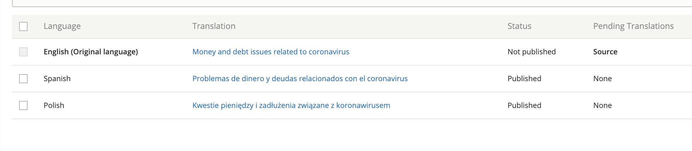

=====================================
Legal content workflows
=====================================

Workflow States
====================

Legal content type has the following workflow states:

Published - This is the live version on the website. Anyone can view published versions. Only one revision can ever be published at a time.

"In progress" states
-----------------------

* **Draft/revise.**  This is a workflow state where the revision is not published and can be further edited by any of the following:

* **Ready to review.**  This is a workflow state where the revision is not published but has been "turned in" for the content team to review. An email is sent to anyone with the content manager role when content is moved into the ready to review state.

"Unpublished" states
---------------------------
* **Unpublished.** This is the default unpublished state.

* **Archived.** This is a workflow similar to "Unpublished" but is used to indicate that we do not intend to bring the content back on the site and expect to ultimately delete it.

Unpublishing
======================

Selecting the unpublished state will unpublish the content for the language currently being edited. For example, if I unpublish or archive from the English edit form, the English translation will be unpublished. Spanish and Polish will still be published.

Viewing the English edit form will show a current moderation state of "Unpublished" but Spanish and Polish will show "Published."

.. warning:: To unpublish the content completely, you must go to the translate tab to edit and unpublish Spanish and Polish translations individually. This applies to both the "Unpublished" and "Archived" states.

Permissions
==============

* Anyone can view Published content
* Staff and interns can view content in any state. If there is a version other than Published:

  * If there is also a published revision, there will be a "Latest version" tab to view the not-live version.
  * If there is only a not-live revision, the article will appear with a purple background.

* Staff, interns, and subject matter experts can edit legal content. Subject matter experts can only move content from Published to Draft/Revise and Ready to Review states.

A note about redirects
-----------------------

Redirects from a path alias will only redirect that path alias (so a url of /legal-information/english-title to /node/1 will only redirect the English title but will not impact /es/legal-information/spanish-title).

A redirect from /node/2 to /node/1 will redirect for all languages.

