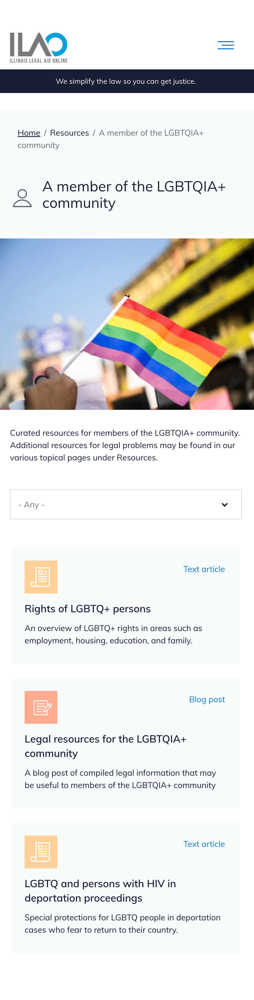

===========================
Legal info by population
===========================

We can also provide legal information targeted to specific user populations, based on our intake populations taxonomy. This includes users who are:

* a veteran, active duty military or have had military service
* a senior (60 years or older)
* a youth (17 years or younger)
* a survivor of abuse or crime (domestic violence, trafficking, sexual assault, gun
* homeless or at risk of homelessness
* living with a disability
* have a family or household member who is or was in jail or prison
* living with HIV/AIDS
* an immigrant to the U.S. or undocumented
* in jail or prison
* a non-profit organization or small business

Individual pieces of legal content can now be tagged to one of these populations and will then be available in the resources tab under a "I am ..." with the taxonomy terms listed.

.. note:: It is not necessary to tag every piece of content to user types. These should be used when the article is particularly tailored for that population or especially relevant. Specifically tailored are more likely to be blog posts, videos, or text articles. Especially relevant are more likely to be guides and legal problems.

Sample page (mobile view)
===========================

