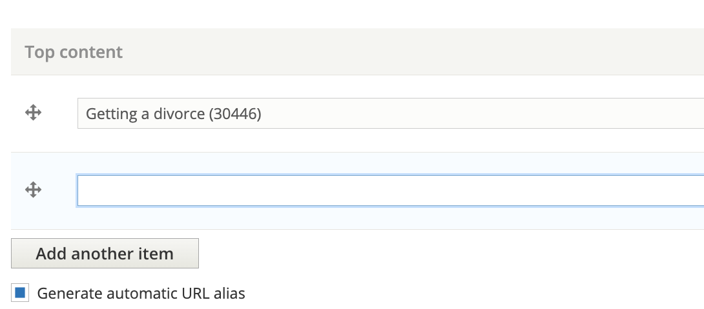

======================================
Legal information navigation ordering
======================================

Tagging Content to Navigation Terms
=======================================
Content team members may prioritize certain content to show up higher than other content.
This is done by editing the taxonomy term(s) and adding content to the Top Content field.

Each language can have it's own top content, reflective of different priorities for different audiences. The easiest way to edit a taxonomy term is to browse to the page on the site and click "Edit".

.. note:: Please work with the Legal Content Director on how to prioritize what content to show first. We do not yet have standards developed.

Default Ordering
===================

On top-level category pages like "Family & Safety", the results are ordered by:

* Top content within each subcategory
* Page views descending
* Last substantive revision descending

As an example, on Family & Safety, if we we tagged "Random article" and "Random article 2" as the top two articles and the top 4 articles in terms of page views were Getting a divorce, Divorce, Responding to a divorce, and What if I can't find my spouse, viewers would see:

* Random article
* Random article 2
* Getting a divorce
* Divorce

On subcategory pages, it follows the same approach, except each section is broken out. For example, on the Divorce subcategory page, in the Forms section, it would show:

* Divorce (because it was market as top content and is a form)
* any other divorce forms ordered by page views

