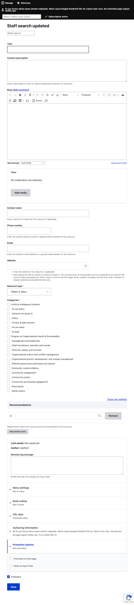
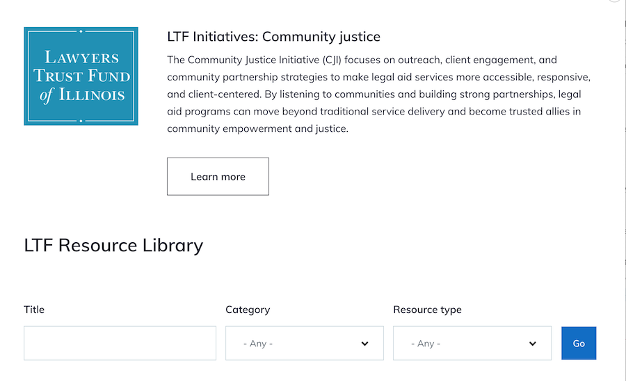
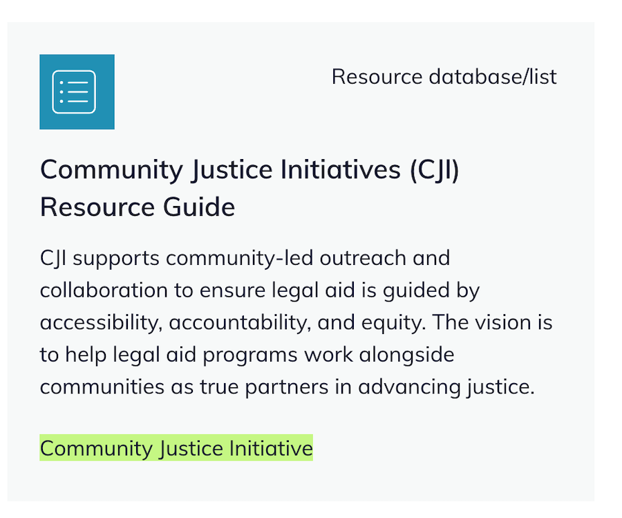

=========================
LTF Resources
=========================

Permissions
================
Content of type "LTF resources" are accessible based on two roles:

* LTF Manager has the ability to view, create, edit, and delete LTF resources. This role is limited to LTF staff. Registered users with an LTF email are automatically given this role.

* LTF Grantee has the ability to view any LTF resources. Registered users with an email domain that is on LTF's grantee list are automatically given this role except for law school clinics. Because law school clinics have a university domain, ILAO must assign the role to those individuals manually.

Content type
================

The LTF content type:

* Requires a title
* Ideally includes a description; the description appears on the cards in the directory page for an initiative
* Ideally includes a body; this appears on the resource page. 
* May include one or more file attachments
* May include contact information about the resource, including:

  * Contact name
  * Phone number
  * Email
  * Website

* Requires a resource type. Each resource is limited to a single type. These are maintained in the LTF Resource Type taxonomy.

* Requires one or more categories. These are maintained in the LTF Categories taxonomy. The categories determine:

  * On which initiative page a resource appears (child terms under Artificial Intelligence Initiative for example show on the AI Initiative page)
  * Which additional resources appear on the resource's page
  
* Optionally, one or more organizations that recommend ("Liked by") the resource.

Display
=========== 

Each LTF initiative has:

* A directory page that lists all of the resources associated with that initiative
* A landing page that describes the initiative
* Optionally, an associated webform that allows LTF grantees to suggest resources.

Directory page
----------------

Each directory page includes:

* The title of the initiative
* An overview of the initiative
* A Learn more button that goes to the landing page
* Filters for:

  * Title
  * Category
  * Resource type
  

For each associated resource, there is a card that includes:

* Resource type name and icon
* Title
* Description
* Category label.

Resource pages
----------------

Each resource page includes:

* Title
* Body
* Contact information
* Attached files

Each resource page includes:

* A block of related resources defined as those that share the same category
* The associated webform block (if applicable)
* A Liked by block that shows which organizations liked a resource (if applicable)

Landing page
---------------

Each landing page is a resource page. The page also includes a block that lists each LTF initiative and links back to that initiative's directory page.

Webforms for suggestions
=============================

For initiatives that are accepting suggestions, there is a custom webform that:

* Collects the resource information
* Is accessible by any LTF grantee
* Sends an email upon submission to the LTF point of contact to review and add or update an existing resource.

Airtable Integration
=============================

Coming soon! For the AI initiative, resources are managed in an Airtable and imported and updated via API.

