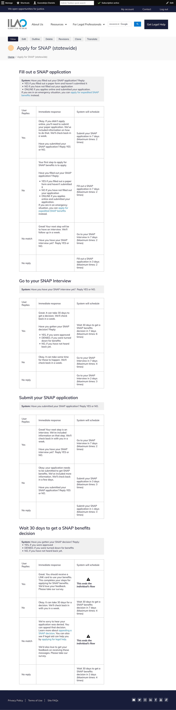

=======================
NextStep Flows
=======================

NextStep Flows are an extension of ILAO's strategic goal to (virtually) accompany individuals along their legal journey. Most legal processes have multiple steps and NextStep flows are designed to follow up with individuals with reminders, ask them about their progress, encourage them to return to ILAO legal content and resources as needed, and better track outcomes and ILAO's impact.

Overview
==========
A NextStep flow is a single set of messages for a specific legal problem based on the process steps in a How-to. A single How-to may have one or may have multiple NextStep flows.  For example, the Being evicted how-to may support a NextStep flow specific to Cook County, one for other jurisdictions or it may have one specific to being evicted for non-payment of rent versus being evicted for lease violations.

They provide essentially a time-based conversational interface (or Chatbot) for steps in our How-to content. We can link to legal content, or where available, include specific content by reference. In ending steps, we also may include a link to another process (for example, if the subscriber indicates that they were denied public benefits after appealing, we can include a link to filing a lawsuit if they want to evaluate that option)

The NextSteps functionality does not calculate deadlines. Subscribers will need to determine for themselves if they are within the timeline to apply/appeal or take action. We may send them legal questions or steps that help them to evaluate that and then guide them to the next step.

NextStep flows are maintained alongside OTIS and in consultation with our OTIS partners. ILAO's Director of Product Innovation maintains these with input and support from the legal content team, who maintain the underlying legal information.

Phase 1 (2023 - 2024)
-----------------------
Phase 1, funded under a Technology Initiative Grant awarded to Legal Aid Chicago, NextSteps were created and launched as a plug-in to LegalServer instances of our OTIS partners building on our initial structured content model.

During the phase, the tool is only available to caseworkers at program partners. They place individuals who opt-in into the correct "last completed step" when providing limited advice or when they can't provide services. This then triggers the flow of interactive "flows" over SMS.

Phase 2 (2024 - 2026)
------------------------

Phase 2 is funded under an expansion TIG grant awarded to Legal Aid Chicago between 2024 - 2026 envisions expansion:

* increasing the number of legal problems available through NextStep flows
* an expansion to include delivery over e-mail
* an expansion to IllinoisLegalAid.org in addition to LegalServer, where individuals who are viewing process content (How-to) where a NextStep flow is available can subscribe themselves to the service.

Documentation
================
.. toctree::
   :maxdepth: 2

   next_steps_interim
   next_steps_content_type
   next_steps_signup_form
   next_steps_sms_delivery
   next_steps_tracking
   next_steps_entity_definitions

