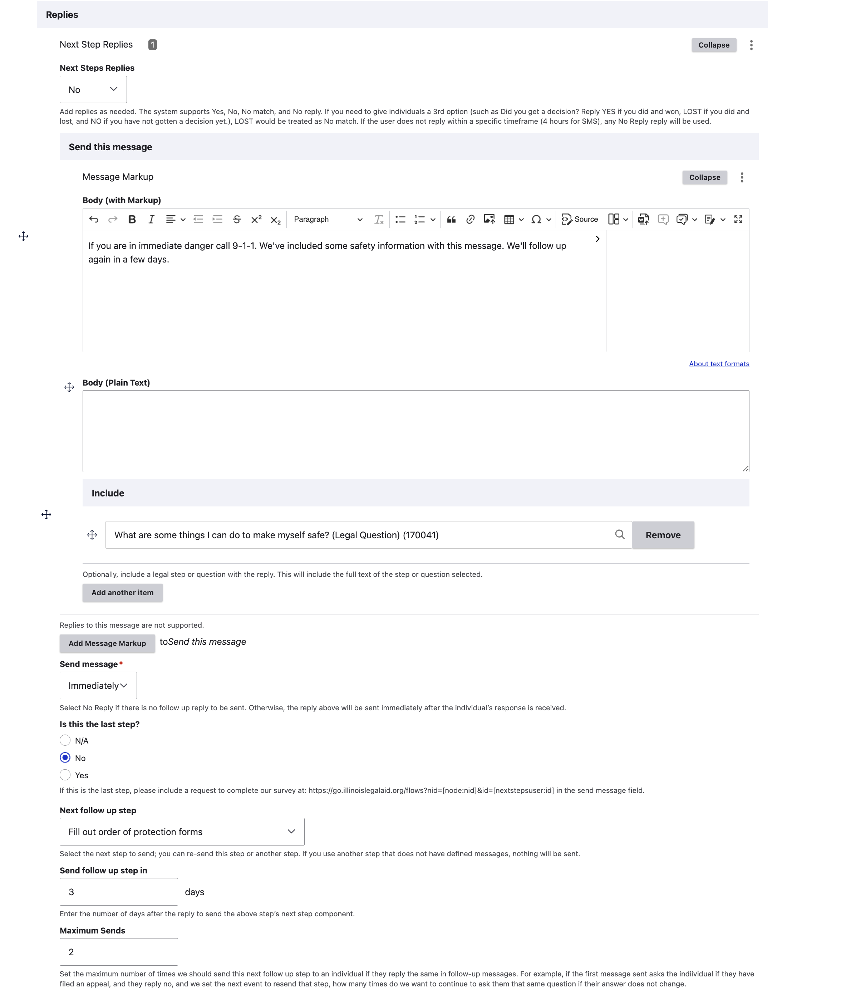

=======================================
Authoring NextStep Flows
=======================================

The Next Steps Flow content type is where ILAO staff can create a specific flow for a specific process. This is then used to send scheduled follow-up messages.

A Next Steps Flow must be attached to a single Legal How-to. Once the Legal How-to is selected, a staff member can create messages attached to 1 or more steps associated with that Legal How-to.

.. note:: Legacy "How-to" content can not be used for this. Only COPE-based Legal How-to's can be used. The system supports both published and unpublished Legal How-tos and Legal Steps while ILAO works through our legal information redesign process.

Creating a Next Steps Flow
===============================

For each next step flow, you must:

* Give the flow a title. This title should reflect the how-to; it will be displayed in widgets partners use to subscribe people to NextSteps.
* Tie the flow to an LSC problem code. This is required to align with OTIS partners' systems and allow them to easily filter available flows.
* Attach the appropriate Legal How-to

Create the first message
===========================

Once the Legal How-to is attached, the Step dropdown will populate with the list of steps. Always start the flow with the first step.

To create the message:

* Pick the step
* Create a short message. Ideally, messages should be less than 160 characters but can not be more than 1600.
* Select the message type:

  * Send and wait for reply - this tells the system to expect a reply from the individual. You'll need to then add replies.
  * Send, no reply - this tells the system to ignore any replies as we don't expect them. This is typically used only on the last step.

.. image:: ../assets/next-step-component.png

.. note:: This is the message a subscriber will recieve when they are ioitially placed in the step.

Add replies
================

If your message has a message type of "Send and wait for reply," you must add reply handlers. Reply handlers are limited to processing replies of:

* Yes (will also handle various ways someone may reply Yes, such as Y, Yep, yeah)
* No (will also handle various ways someone may reply No, such as N, nope, not)
* No match, for cases where someone replies with something the system can't handle
* No reply, for cases where someone was sent a message but does not reply within Twilio's time out.

For each reply:

* Creata a follow-up message. For example, if a user replies No, you might want to reassure them, remind them of the next step, and schedule another reminder.
* Do not use the include field.
* Schedule when to send the message; 99% of the time, this should be set to immediately.
* Indicate if this is the last step in the flow.
* Schedule a next step follow up:

  * Pick the step to follow up with next (this can be the current step or a future step)
  * Schedule when to send the follow up message, in days.
  * Set a maximum number of times to resend the reply follow up.

* Repeat for each type of reply the system needs to handle.

.. warning:: Do not attach the text of a legal step or legal question(s) using the Include field since those are not currently being used. If you need to include specific legal information, it must go in the message.

Additional Steps
====================

Repeat the "Create the first message" and "Add Replies" for each step in the flow. When you add the last step, set the Is last step to Yes.

Maximum retries
=================
Each step with a send with reply option must have a maximum number of times to retry so we are not continually leaving flows open and sending messages to individuals.

In the Example case:

* If a user replies No to Pre-appeal conference message, the question will resend in 7 days. If the user replies No again, it will send one more time in 7 days. If the user still replies No, it will stop sending further messages.

.. note:: If someone replies "Stop" to a text message, they will be unsubscribed and will not receive additional messagss.

Example Flow
===============

.. image:: ../assets/next-step-flow-edit.png

For example, in the above example, the step "Pre-appeal conference for TANF appeal" will be triggered:

* immediately, if a caseworker selects Pre-appeal conference for TANF appeal in LegalServer
* 7 days after an individual receives the File an appeal for TANF benefits and replies Yes
* 7 days after an individual recieves the Pre-appeal conference for TANF appeal and replies No, up to two times

