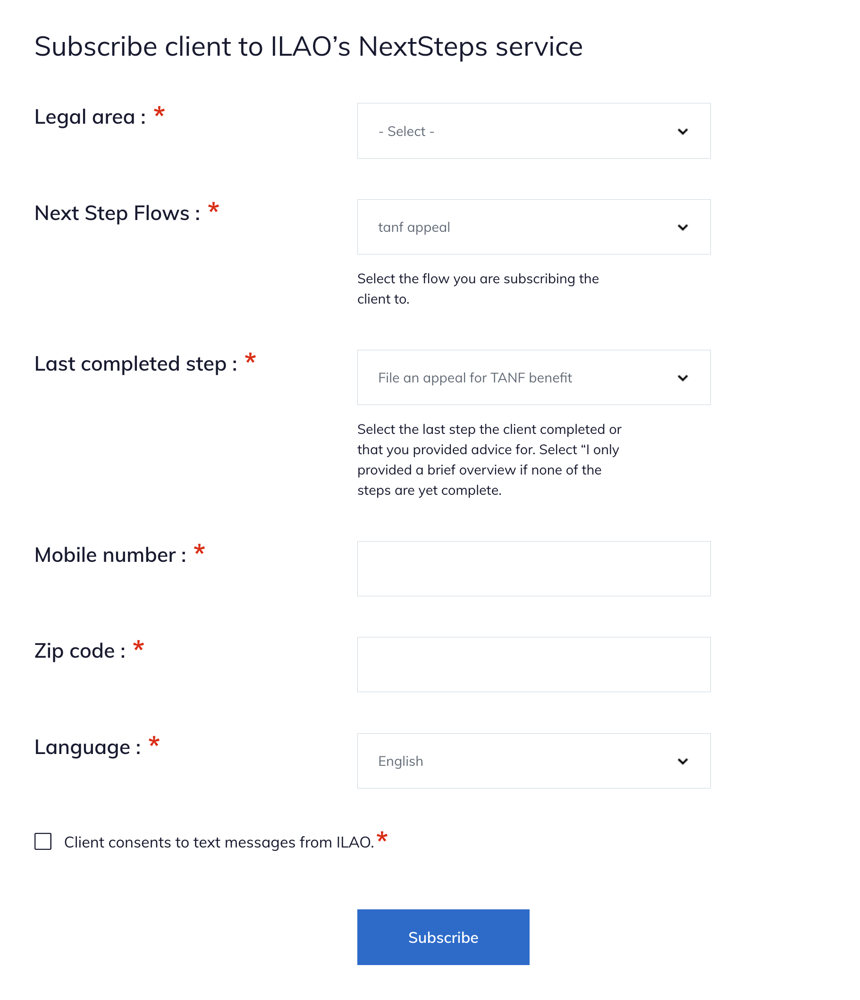

=========================================
Subscribing individials via LegalServer
=========================================

The Legal Server implementation anticipates having 2 pieces:

* An iFrame from our website to subscribe the user
* An API post to update the subscribed users data

IFrame Form
===============

ILAO will provide an iFrame url to partners for inclusion in their instance of LegalServer. The iframe code is listed on the edit organization form for the organization in the website.

The form includes:

* List of LSC problem codes, to make it easier for caseworkers to filter
* List of published NextStep Flows
* List of available steps
* A field to collect the client's mobile-number
* A field to collect tthe client's zip code
* Language preference of the client
* Opt in field
* Hidden organization ID as a query parameter

When submitted this will create a nextStepsUserEntity within ILAO's website and store:

* The client's mobile number
* The client's zip code
* The client's language preference
* The referring organization
* The node ID of the Next Step Flow the user is subscribed to
* The initial step the client was subscribed to.

The website will then send the initial message on the next scheduled task run.

API Post
==============
ILAO will work with partners to implement an API block that will post back to ILAO. This API call will include these parameters from Legal Server:

* The user's mobile phone number
* The uuid from legal server
* The user's zip code

Once posted, the website will:

* Find the relevant NextStepUser entity
* Update the NextStepsUser entity with the uuid based on the phone number where the uuid is empty
* Query the otis_triage_user table to check for the uuid; if found will add the triage user id to the NextStepsUser entity

The purpose of this step is to track OTIS vs non-OTIS cases and make this information available in our OTIS dashboard.

