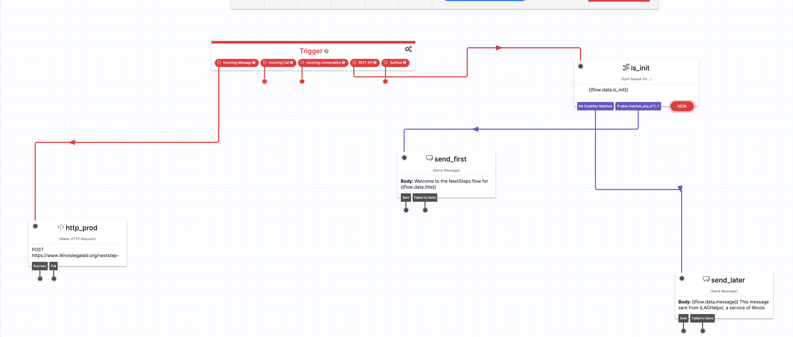

=================================
NextSteps Flows Delivery System
=================================

Tracking & Logging
====================

When a user is subscribed to a NextSteps flow, a record is created in the website database that stores:

* the user ID of the subscriber, if known
* if the user was subscribed from LegalServer, the unique global identifier provided by LegalServer
* if the user was an OTIS applicant, their triage user ID
* the date they were subscribed
* the source of their subscription. For OTIS partners, this is the ID in their unique iFrame.
* mobile phone number
* notification type, set to SMS
* whether the subscriber is tied to an OTIS application
* the user's zip code
* the language subscirbed to
* the node ID of the Next Step flow
* the initial step ID the person is subscribed to.

Once subscribed, the website will automatically push out the initial message to the step the individual is subscribed to.

With each message sent, the website database will be updated to create a record that tracks:

* When the message was sent
* Which message was sent
* Who it was sent to
* Any reply received
* The next scheduled step, if applicable
* the next scheduled step due date
* updates the resent count

See :ref:`NextStepTech` for the technical specification.

.. note:: This logging allows us to integrate NextSteps data with the OTIS dashboard, catch errors and time outs, and evaluate the use of NextSteps flows.

SMS Delivery
=============

The NextSteps Twilio flow manages SMS delivery. When a request from the website is received, it sends the message out. When a reply is received, it sends the reply back to the website to process. This usually results in sending out another message from the website.

