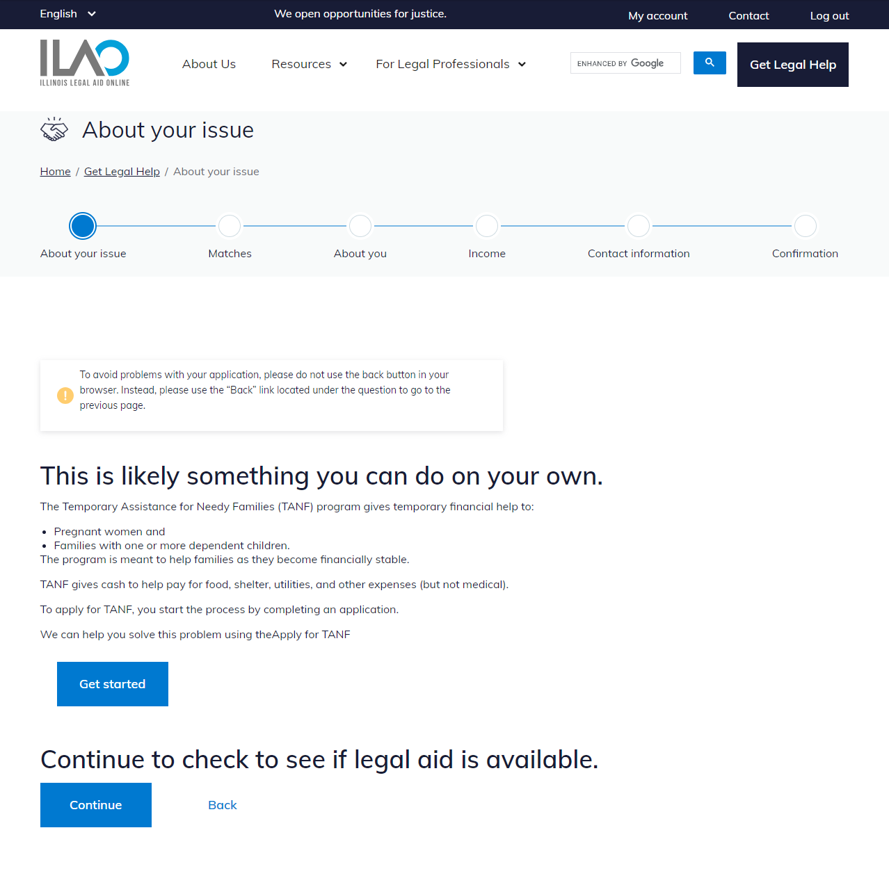

====================
COPE integration
====================

Basic concepts:
================
The COPE (Create Once Publish Everywhere) content model is designed to allow for content re-use across channels. Content is maintained and updated by ILAO's content team in one central location. Using this model, we can bring up-to-date chunks of legal information into OTIS to help educate applicants as they continue their triage journey.

Trigger:
=========
* An API call is performed whenever the custom LegalServer field "ilao_cope_option" is included in the guided navigation path
* The API call uses the value (the node id for a particular piece of legal content) for the custom field to determine which content to display

Adding to OTIS:
====================
* a custom field (ilao_cope_options) was created in LegalServer that has the "text" option.
* the custom field is added to a guided navigation path as an "Action: set a fields value" where the content needs to be displayed
* the node id for the legal content is added as the text value for the field
* instruction elements can be added to provide the user specific context to the legal content

OTIS applicant sees:
=====================
* **Instructions:** Any instructional elements provided are displayed to provide context for the legal content.
* **Legal content:** The content from the specified node id appears seamlessly within the same theme as other guided navigation text.
* **Links:** Any links provided in the content (e.g., links to apply for TANF benefits) are shown to the applicant.
* **Instruction for continuing OTIS application:** Clear instructions informing the applicant they can still continue their OTIS application after reviewing the legal content can be provided.
* **Navigational controls:**
 * **Continue button:** A "Continue" button allows the applicant to proceed with their application for legal help.
 * **Back link:** A "Back" link allows the applicant to navigate back to the previous step, if needed.

