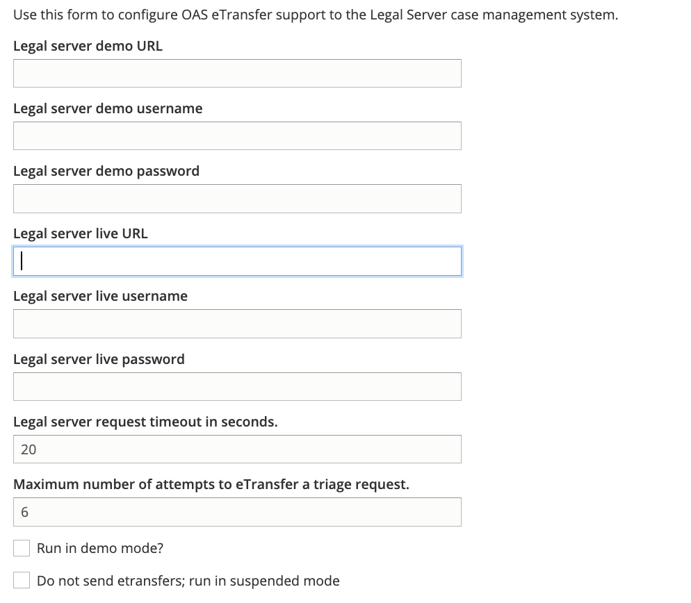
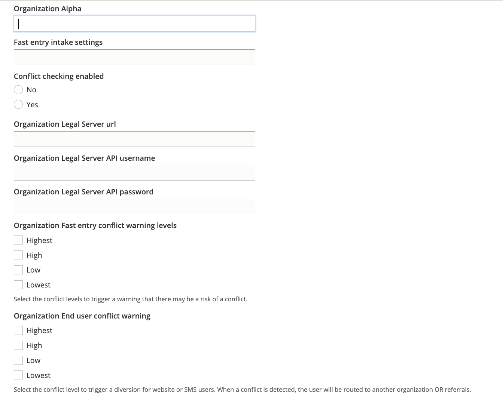

===============================
Legal Server Configuration
===============================

Settings to connect the website to Legal Server are managed through our `Legal Server Configuration page <https://www.illinoislegalaid.org/admin/intake/legal-server>`_

General settings
=================
In the general settings, we link to the end point for etransferring an intake from ILAO to the statewide instance of Legal Server.

We can include both the demo server and live server. We also include our API-enabled usernames and passwords to use the REST-based etransfer.

If the "Run in demo mode" checkox is checked, etransfers will go to the Legal server demo URL.

If the "Do not send etransfers; run in suspended mode" is checked, no etransfer will be sent.

Per organization settings
==========================
Each organization that has a service set to accept intakes via IllinoisLegalAid.org have a profile setting. This setting includes:

For each organization, we include:

* The Legal Server instance name. This may differ from the organization's name and should be pasted directly out of LegalServer.
* An intake settings id to associate with Fast Entry
* Whether to enable conflict checking

If conflict checking is enabled, we must also include:

* The url to the organization's LegalServer instance
* API credentials for that organization's instance. This account should be limited by the organization to only allow API access to the conflict check
* The levels that should flag a warning for conflict in Fast Entry. When a conflict check returns a checked response, a note will be added to the etransfer and a warning will appear before the application is submitted.
* The levels that should flag a conflict in regular intakes.

.. todo:: Currently the conflict in regular intakes does not exist.

