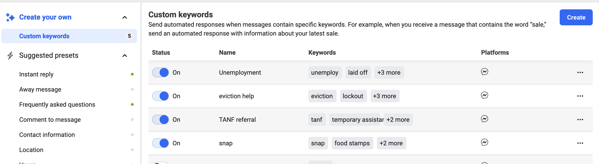
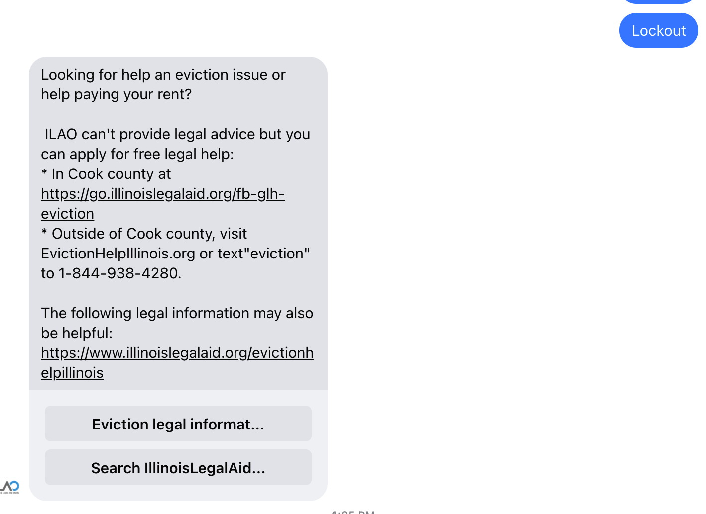
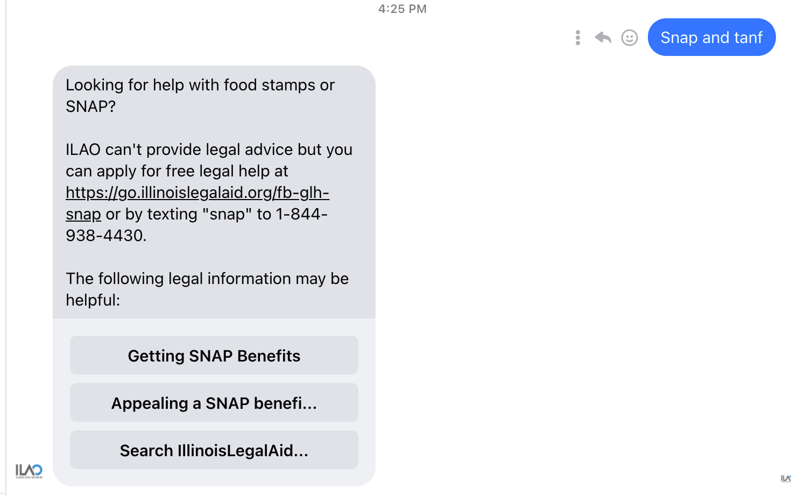

==========================
Facebook Integrations
==========================

OTIS is integrated into Facebook Messenger using keywords to deliver specific messages when the user's initial message contains one or more of those keywords.

.. note:: Only ILAO's Facebook admins can configure these messages.

Custom keywords are found under Facebook Messenger => Automated responses. Each response is limited to 5 phrases or keywords. Partial matches work (for example, unemploy as a keyword will work for unemploy, unemployment, unemployed).

As of November 2021, we have custom keywords set up for:

* Unemployment - keywords of unemploy, laid off, fired, quit job, ides
* Eviction - keywords of tenant, landlord, rent, evict, lockout
* TANF - keywords of tanf, temporary assistance, welfare, cash assistance
* SNAP - keywords of food, snap, hungry, food stamps

Each custom response includes:

* One or more ways to get legal help, with a custom url to Get Legal Help with the issue prefilled
* One or more pieces of legal information as a button
* A button to search IllinoisLegalAid.org which goes to the home page

.. note:: Facebook will only return 1 response and appears to pick the first one from the bottom up on the keywords list.

